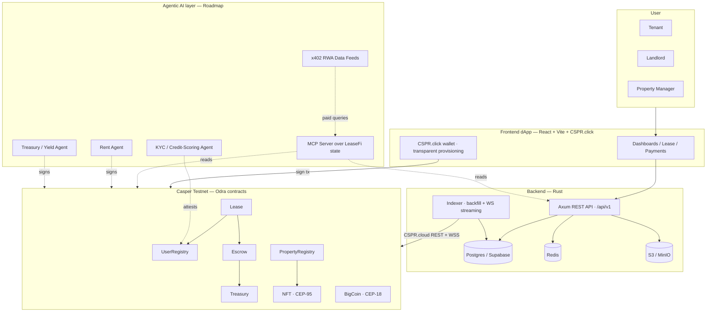
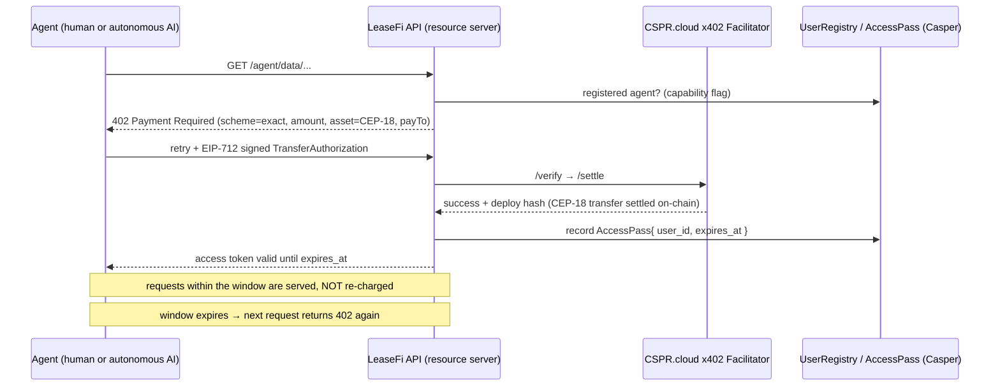
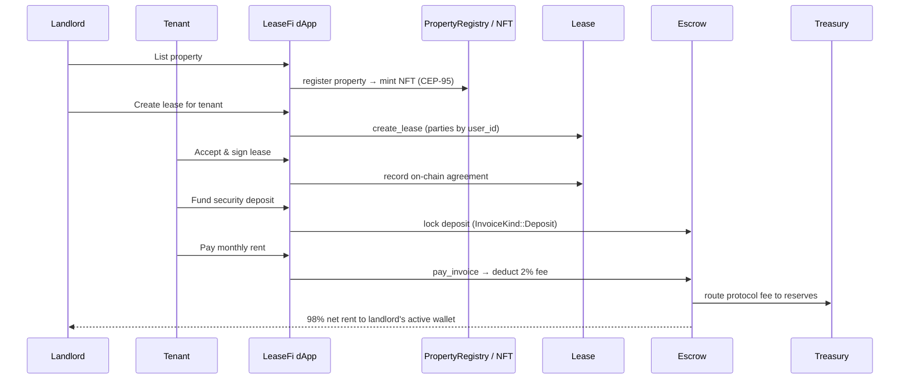

<div align="center">

# 🏠 LeaseFi

### The On-Chain Trust Layer for Real-World Rentals

**Tokenized leases. Trustless deposit escrow. Transparent rent. Built on Casper — engineered for the agent economy.**

[](https://testnet.cspr.live/)
[](https://odra.dev)
[](#)
[](#)


**Casper Agentic Buildathon 2026 — Qualification Round Submission**

</div>

---

## ⚡ One-line thesis

> **LeaseFi turns a paper lease into programmable, on-chain real-world value.**
> Leases become NFTs, deposits sit in trustless escrow, rent settles on-chain with a transparent protocol fee — and the whole stack is designed to be **driven by autonomous AI agents** through an MCP server, x402-metered data feeds, and Casper-native transaction signing.

This is **not** a mock or a slide deck. **Eight smart contracts are live on Casper Testnet**, a production-grade Rust backend indexes them in real time, and a React dApp lets tenants and landlords transact on-chain today.

---

## 🧭 Table of Contents

- [Why LeaseFi](#-why-leasefi)
- [What judges should notice](#-what-judges-should-notice)
- [Live on Casper Testnet](#-live-on-casper-testnet)
- [System architecture](#-system-architecture)
- [Monorepo layout](#-monorepo-layout)
- [Smart contracts](#-smart-contracts)
- [Backend service & indexer](#-backend-service--indexer)
- [Frontend dApp](#-frontend-dapp)
- [The Agentic AI layer](#-the-agentic-ai-layer-the-buildathon-thesis)
- [DeFi mechanics](#-defi-mechanics)
- [RWA mechanics](#-rwa-mechanics)
- [End-to-end demo flow](#-end-to-end-demo-flow)
- [Getting started](#-getting-started)
- [Tech stack](#-tech-stack-at-a-glance)
- [Roadmap](#-roadmap)
- [Security & compliance](#-security--compliance)
- [Submission checklist](#-buildathon-submission-checklist)
- [Team & links](#-team--links)

---

## 🌍 Why LeaseFi

The global rental market moves **trillions of dollars a year** through the most opaque, intermediary-laden plumbing in finance:

- **Security deposits** are held in landlord-controlled accounts. Tenants have no proof the money exists, and "I'm keeping your deposit" disputes are settled by whoever has the better lawyer.
- **Rent** flows through ACH, checks, and property-management middlemen — slow, fee-laden, and invisible to the people who actually need the audit trail.
- **Leases** are PDFs in an inbox. There is no canonical, tamper-proof source of truth for "who agreed to what."
- **Trust** between strangers (tenant ↔ landlord ↔ property manager) is manufactured by credit bureaus, brokers, and paperwork — none of which the renter controls or benefits from.

**LeaseFi rebuilds this on Casper.** A lease is an NFT. A deposit is funds locked in a smart-contract escrow that *cannot* be unilaterally drained. Rent is an on-chain invoice that settles with a transparent, fixed protocol fee. Identity is a stable on-chain `user_id` that survives wallet rotation and stores **zero PII**. Every dollar of protocol revenue is auditable on-chain.

This is **Real-World Assets (RWA)** — actual residential leases and deposits — settled through **DeFi** primitives (escrow, a fee-bearing treasury, a staking-rewarded protocol token), with an **Agentic AI** layer designed to let autonomous agents perceive, decide, and act on this on-chain state.

---

## 👀 What judges should notice

| Buildathon signal | What is already working in this repo |
|---|---|
| **Working smart contracts on Casper Testnet** | **8 Odra/Rust contracts deployed** with concrete package hashes (table below), **183 passing tests**, CEP-18 / CEP-95 / CEP-96 compliant. |
| **Transaction-producing on-chain component** | The dApp signs and submits real testnet transactions via CSPR.click: `create_user`, property→NFT mint, lease recording, escrow deposit, rent payment with 2% fee. |
| **Real-World Assets (RWA)** | Residential **leases as NFTs**, a **PropertyRegistry** as on-chain source of truth, **deposit escrow** that blocks unilateral release, IPFS document hashing, statutory-compliance hooks. |
| **DeFi** | **BIG** CEP-18 protocol token, a fee-bearing **Treasury**, a **2% universal protocol fee** computed atomically in `Escrow`, staking-rewards routing, and an indexed ICO/vesting/staking economy. |
| **Agentic AI (the thesis)** | A documented, contract-anchored agent layer: an **MCP server** over LeaseFi state, **autonomous rent / treasury / risk-scoring agents**, and **x402-metered RWA data feeds** — see [The Agentic AI layer](#-the-agentic-ai-layer-the-buildathon-thesis). |
| **Production engineering** | Rust **Axum** API + **Rust indexer** (CSPR.cloud REST backfill + WebSocket streaming), Postgres/Redis/S3, k3s deploy, **628 components / 273 pages** React dApp on Vercel. |
| **Real launch plan** | Multi-phase roadmap (Pre-ICO → mainnet → vendors → STR → tokenized equity), state-by-state compliance, and a CLARITY-Act decentralization path. |

> **Honesty note (read this).** The Qualification-Round prototype is the **deployed on-chain leasing protocol + dApp + indexer** described above — all real, all on testnet. The **agentic AI layer is the project's near-term roadmap**, designed directly on top of these live contracts and the Casper AI Toolkit. Throughout this README, anything not yet shipped is explicitly labeled **`[Roadmap]`** or **`[Designed]`**. We would rather show judges a working RWA+DeFi protocol with a credible agent thesis than fake an agent demo.

---

## 🔗 Live on Casper Testnet

All eight core contracts are deployed and verifiable on the Casper Testnet (snapshot `2026-03-30`, source: [`smart_contracts/resources/casper-test-contracts.toml`](smart_contracts/resources/casper-test-contracts.toml)). Paste any hash into **[testnet.cspr.live](https://testnet.cspr.live/)** to inspect deploys, state, and events.

| Contract | Role | Testnet package hash |
|---|---|---|
| **BigCoin (BIG)** | CEP-18 protocol token | `hash-f7d94fd8670fdc69aabd07c214ab8d52c3fc1fd839f0cc7713e1574cdfd899ec` |
| **NFT** | CEP-95 lease & property certificates | `hash-ace4693ddf7b06251a1960ce7e296b01e64352cc74dd6ba0b574eefdf7dec781` |
| **UserRegistry** | On-chain identity (no PII) | `hash-29cd2d0ae790bed5feca98b5f0b725f8a8dda423726bcfbd06b81278e91d5482` |
| **PropertyRegistry** | Property records & lifecycle | `hash-dfc5d21eb4e2eb9098019c810d774805a43af8a56bba8c9c6fd47b4d4043de4e` |
| **Lease** | Lease lifecycle & coordination | `hash-8b3aa0f467c80fd632e2ca3f662ab93dfb3c66f2886ebbf016bee67244790524` |
| **Escrow** | Conditional fund locking (rent + deposits) | `hash-4f3473f114ad9bedee0e1e760807a3c43c40f40d82761c7ca46e175639526b3a` |
| **Treasury** | Protocol fee reserves & withdrawals | `hash-81c0761d2fbb4ce30e1a3ddf4f19c52ce70837757b8b182351693fa36f0c59b3` |
| **Roles** | Legacy RBAC (backward compat) | `hash-37a0253a37f16dbea63dbc6b46f5874215a42b55a3e5920d14a48e2a4604a565` |

> A broader **BIG token economy** — ICO, Staking, and Vesting contracts — is also deployed on testnet and indexed by the backend (the dApp references e.g. Staking `hash-8e0336540c15073cb2e181d01615dde8e1cd405c51526b8a9b985b12c1f5e345`). Those modules live on the `master` branch and are archived from the leasing-focused `dev` branch under git tag `archive/ico-staking-vesting-v1`. See [DeFi mechanics](#-defi-mechanics).

**Network:** `casper-test` · RPC `https://node.testnet.casper.network/rpc` · Explorer `https://testnet.cspr.live`

---

## 🏗 System architecture



**Source of truth is on-chain.** The Rust indexer continuously mirrors contract events into Postgres so the API can serve fast, rich reads without trusting an off-chain database for money-movement state. The dApp signs value-bearing actions directly against the contracts via CSPR.click.

---

## 📦 Monorepo layout

```text
LeaseFi/
├── smart_contracts/                 # 🦀 Smart contracts (Odra / Rust → WASM on Casper)
│   ├── src/                         #    8 contract modules + constants/common
│   ├── tests/                       #    183 tests across 9 files (~5.6k LOC)
│   ├── bin/cli.rs                   #    deploy + interactive CLI
│   ├── env/                         #    casper-testnet / casper-livenet env
│   ├── resources/                   #    deployed contract hashes + ABIs
│   └── notes/                       #    whitepaper, PRD v2.4.4, architecture specs
│
├── backend/                         # ⚙️ Rust backend (Axum API + blockchain indexer)
│   ├── crates/api/                  #    Axum 0.8 REST service (/api/v1/*)
│   ├── crates/indexer/              #    CSPR.cloud backfill + WebSocket streaming
│   ├── supabase/migrations/         #    89 Postgres migrations
│   └── deploy/                      #    k3s / Traefik / GitHub Actions
│
└── frontend/                        # 🖥 React dApp (Vite + CSPR.click + shadcn/ui)
    ├── src/pages/                   #    273 pages (tenant / landlord / auth / token)
    ├── src/components/              #    628 components (shadcn/ui + feature)
    ├── src/services/                #    backend + CSPR.click + on-chain services
    └── api/                         #    Vercel edge proxies (CSPR.cloud / RPC / email)
```

> The three folders are published together as one monorepo for this submission. Each folder keeps its own component-level README with deeper setup notes.

---

## 🦀 Smart contracts

Built with the **[Odra](https://odra.dev) 2.5** framework (Rust, toolchain `nightly-2024-12-30`), compiled to WASM, deployed via the Odra livenet integration. Rather than the gas-prohibitive "one contract per lease" pattern, LeaseFi uses **singleton contracts that hold state in mappings** — the idiomatic, gas-efficient Casper/Odra approach.

### The eight contracts

| Contract | LOC | What it does |
|---|---:|---|
| `BigCoin` | 55 | **CEP-18** fungible protocol token (`BIG`, 18 decimals). Primary currency for payments & treasury. |
| `NFT` | 651 | **CEP-95** non-fungible token. Mints lease certificates & property assets; supports authorized transfer, freezing, and forced transfer for compliance. |
| `UserRegistry` | 451 | Canonical **on-chain identity**. Stable `user_id` ↔ opaque backend `identity_hash` (no PII), active wallet, additive capability flags (tenant / landlord / property-manager), lifecycle status. An `IDENTITY_MANAGER` rotates wallets & suspends users without rewriting lease records. |
| `PropertyRegistry` | 425 | On-chain property records with a `Draft → Active` lifecycle. Property managers are authorized through `UserRegistry`; the source of truth `Lease` validates against. |
| `Lease` | 656 | Core lease lifecycle: creation, validation of periods & schedules, party authorization by `user_id`, integration with `Escrow` for invoices, event emission. |
| `Escrow` | 789 | Conditional fund locking for **rent invoices and deposits** (unified via `InvoiceKind`). Computes and deducts the **2% protocol fee atomically** at payment — no fee-bypass surface. Resolves parties to their *current* active wallet at call time. |
| `Treasury` | 253 | Holds protocol fee revenue as reserves, accepts BIG reward deposits, manages authorized withdrawals, routes staking rewards. |
| `Roles` | 103 | Legacy keccak256-hashed RBAC (LANDLORD / AGENT / MANAGER). Retained for backward compatibility; leasing flows now use `UserRegistry`. |

### Standards & conventions

- **CEP-18** — `BigCoin` fungible token.
- **CEP-95** — `NFT` lease/property certificates (with freeze + forced-transfer for regulated assets).
- **CEP-96** — *all 8 contracts* expose on-chain `contract_name` / `contract_description` named keys (prefixed `BIG LeaseFi …`) for explorer & indexer discoverability.
- **Error codes** are allocated in blocks of 100 per contract within the Odra-mandated `u16` range (`0–32767`); see the contracts README for the allocation table.
- **Protocol fee** — `LEASEFI_TRANSACTION_FEE_BPS = 200` (2%), denominated against `ONE_HUNDRED_PERCENT_BPS = 10_000`.

### Testing

**183 `#[test]` functions** across 9 files (~5,568 LOC) run on Odra's mock VM — no live network required.

```bash
cd smart_contracts
cargo odra build      # compile all contracts → WASM
cargo odra test       # run the full suite on the mock VM
cargo odra schema     # generate contract ABIs (JSON schema)

# deploy to testnet (requires a signing key PEM)
ODRA_CASPER_LIVENET_ENV=env/casper-testnet \
  cargo run --bin leasefi_contracts_cli deploy
```

---

## ⚙️ Backend service & indexer

A high-performance **Rust** workspace (edition 2024) with two crates.

### `crates/api` — Axum REST service

| Layer | Choice |
|---|---|
| Framework | **Axum 0.8** (+ multipart, macros) on **Tokio** |
| Database | **PostgreSQL** via **sqlx 0.9** (Supabase-managed; 112 migrations) |
| Cache / sessions | **Redis** |
| Blob storage | **S3 / MinIO** (`rust-s3`) for avatars & documents |
| Auth | **JWT** (`jsonwebtoken`) — Casper wallet signature challenge-response, 15-min access + 14-day rotating refresh, per-session revoke |
| Docs | **utoipa** OpenAPI + Swagger UI at `/swagger-ui` |
| Hardening | `tower_governor` rate limiting, CORS, structured tracing |

**API surface** (`/api/v1/*`) — the full rental lifecycle plus the BIG token economy: `auth` (nonce / wallet & password login / refresh / sessions / email-verify), `users` (profile / avatar / role / on-chain registration), `properties` (dedup upsert / geo search / registration hash), `listings` (search / lifecycle / media / provenance / Fair Housing screen), `applications` (submit / review / scoring / background checks), `viewings`, `favorites`, `leases` (draft / Casper-consent signing / on-chain commit / document), `renewals` (offer / respond / negotiation), `invoices` (list / settlement / receipt / dashboard summary), plus `transactions`, `ico`, `vesting`, `staking`, `tax`, `analytics`, `health`.

External dependencies sit behind swappable provider traits (KYC, IPFS pinning, Fair Housing screen, lease-document renderer, on-chain lease reader): fake/stub impls for local dev, real backends in production via one config line — handlers never change.

### `crates/indexer` — blockchain event indexer

Two concurrent pipelines keep Postgres in lockstep with the chain:

1. **Backfill** — historical sync via **CSPR.cloud REST** (`/ft-token-actions` for CEP-18) and **Casper Node RPC** (`state_get_dictionary_item` for CES events).
2. **Streaming** — real-time **WebSocket** subscription to the **CSPR.cloud Streaming API**, with per-contract event cursors persisted for crash-safe resumption.

Indexed events span the full protocol: ICO (`TokensPurchased`), CEP-18 (`Transfer` / `Mint` / `SetAllowance`), Vesting (`ScheduleCreated` / `TokensClaimed`), Staking (`Staked` / `UnstakedInitiated` / `UnbondedWithdrawn` / `RewardsDeposited` / `RewardsClaimed`), UserRegistry (`UserCreated`), Property (`PropertyCreated`), Lease (`LeaseAgreementCreated` / `LeaseAgreementFinished` / `LeaseAgreementProlonged` + equity-eligibility), and Escrow (`InvoiceCreated` / `InvoicePaymentApplied` / `InvoicePaid` / `SecurityDepositReleased`) — all routed through the same trait-based dispatch (`IndexableEvent`).

> This indexer is exactly the substrate the **MCP server** ([roadmap](#-the-agentic-ai-layer-the-buildathon-thesis)) reads from — agents get a fast, queryable, finality-aware view of on-chain state instead of polling nodes directly.

```bash
cd backend
make env-up     # Supabase (Postgres/Auth/Storage) + Redis + MinIO
make migrate    # apply migrations
make run        # API at http://localhost:8080  (Swagger at /swagger-ui)
make index      # backfill + stream Casper events
```

**Deployment:** Docker (cargo-chef multi-stage) → **k3s** on bare metal, **Traefik** ingress + cert-manager, GitHub Actions CI/CD. Live API base: `https://leasefi.testingservernginx.win/api/v1`.

---

## 🖥 Frontend dApp

A large, production-leaning SPA — **628 components, 273 pages, 55 hooks** — built for a mass-consumer renter audience.

| Layer | Choice |
|---|---|
| Core | **React 18.3** + **TypeScript 5.6** + **Vite 6.4** |
| UI | **Tailwind 4** + **shadcn/ui** (Radix primitives), Framer Motion, Recharts |
| Data | **TanStack Query** + a typed `api-client` against the Rust backend |
| Forms | React Hook Form + **Zod** |
| Wallet / chain | **CSPR.click** SDK (`csprclick-react`, `csprclick-ui`) + **casper-js-sdk 5** |
| Payments | Stripe (feature-flagged), fiat rail for Phase 1+ |
| Quality | Vitest + Playwright, ESLint, Prettier, Husky; PWA via `vite-plugin-pwa` |
| Hosting | **Vercel** (edge proxies for CSPR.cloud / Casper RPC / email) |

### Invisible wallet, real transactions

LeaseFi's product principle is **"the wallet is invisible."** Renters sign up with email/social; CSPR.click **transparently provisions a Casper wallet** — no "connect wallet" CTA. On signup the dApp calls `UserRegistry::create_user` on-chain, and value-bearing actions are signed directly against the deployed contracts. The Phase-0 (hackathon) on-chain flows are:

1. **Property listing → NFT mint** (`PropertyRegistry` + `NFT`)
2. **Lease agreement → on-chain recording** (`Lease`, both-party)
3. **Security deposit → escrow** (`Escrow`)
4. **Rent payment → Treasury with transparent 2% fee** (`Escrow` → `Treasury`)

> The dApp is mid-rebuild onto the Rust backend: **auth + profile are live against `/api/v1`**, while richer dashboards currently render against typed mock fixtures behind feature flags until each backend endpoint lands. Status per surface is tracked in the frontend's `docs/FRONTEND_MVP_TASKS.md` (🟢 REAL / 🟠 MOCK / ⛔ BE-BLOCKED).

### On-chain integration layer

A dedicated **`src/lib/casper/`** module is the bridge between React and the deployed Odra contracts — pure, framework-agnostic Casper `bytesrepr` encoders and CES event decoders, so the dApp builds and reads real deploys directly (no backend round-trip for money-moving actions):

| File | Responsibility |
|---|---|
| `leaseAgreement.ts` | Encodes `create_lease_agreement(params)` — tenant `user_id`, rent-distribution terms, **on-chain `property_id`**, rent/deposit `CurrencyAmount`, term, invoice validity — plus gas estimation and revert-reason mapping. |
| `escrow.ts` | Builds `pay_invoice(invoice_id, amount)` for deposit/rent settlement; maps Escrow **and** UserRegistry revert codes to friendly copy. |
| `propertyRegistry.ts` | Encodes `create_property` + status/metadata setters for landlord-signed property registration. |
| `cep18.ts` | CEP-18 `approve` (escrow allowance) + balance reads. |
| `leaseAgreementEvents.ts` | Decodes CES events from a confirmed deploy (`LeaseAgreementCreated`, NFT `Mint`, `InvoiceCreated`) to recover the on-chain lease id, NFT token id, and invoice ids. |
| `signature.ts` | Casper message signing for the gasless lease-consent signature. |

**Signed flows** (all via CSPR.click; each signing surface mounts its own hidden SDK host):

1. **Property registration** — landlord signs `create_property` (+ NFT mint).
2. **Lease consent** — both parties sign the canonical consent message → `POST /leases/{id}/sign`.
3. **Lease recording** — landlord signs `create_lease_agreement`, then the parsed on-chain ids (read from the deploy's CES events) are reported to `POST /leases/{id}/commit`.
4. **Payments** — tenant pays deposit/rent → CEP-18 `approve` (only if the allowance is short) → `Escrow.pay_invoice` (2% fee deducted atomically).

**Real-time freshness.** Money-moving views use narrowly-scoped, self-terminating TanStack Query polling: the lease page polls while a lease awaits the **counterparty's signature** and (after commit) until the **indexer** writes the on-chain ids; payment views refetch on settlement. Every contract revert is surfaced as a human message (e.g. *"the property isn't Active on-chain yet"*, *"a party to this lease isn't fully registered on-chain"*) rather than a raw `User error: <n>`.

> **Dev note:** open the dApp at **`https://lvh.me:5173`** (and `localhost`) — the CSPR.click app id is whitelisted for the `lvh.me` origin.

---

## 🤖 The Agentic AI layer (the Buildathon thesis)

> **Status: `[Designed / Roadmap]`.** This layer is specified in the product docs (the PRD calls out *"Deploy MCP server for agentic operations"* and *"AI-Driven On-Chain Credit Scoring"*) and is architected directly on the live contracts and indexer above. It is the project's immediate next build, not a shipped feature — we flag it honestly so judges can weigh the **thesis** (Final-Round criterion: *Use of AI / Agentic Systems*) separately from the **working prototype** (Qualification criterion).

**Why rentals are the killer app for on-chain agents.** A lease is a long-lived financial relationship with recurring, rule-bound money movement (rent on a schedule, deposits released after statutory windows, fees, late penalties, disputes). That is *exactly* the kind of deterministic-yet-tedious workflow autonomous agents should run — and LeaseFi already encodes the rules on-chain. We turn a passive lease into a **self-driving agreement**.

### Components

**1. LeaseFi MCP Server** — exposes LeaseFi's on-chain state to any LLM through the **Model Context Protocol**. Tools/resources include `get_lease(user_id)`, `get_outstanding_invoices`, `get_escrow_status`, `get_treasury_metrics`, `get_property(id)`, and `propose_payment(invoice_id)`. It reads from the **CSPR.cloud-backed indexer** (fast, finality-aware) and the Casper Node RPC, and returns structured, agent-ready JSON. *Maps to Buildathon Build Direction #1.*

**2. Autonomous agents** built on the Casper **CSPR.click AI Agent Skill** for wallet signing:

| Agent | Job | Acts on |
|---|---|---|
| **Rent Agent** | Watches invoice schedules; pays rent on time from a tenant-authorized allowance; nudges before due dates. | `Escrow.pay_invoice` |
| **Treasury / Yield Agent** | Monitors `Treasury` reserves and Casper DeFi yields; routes idle reserves & staking rewards when thresholds are met. | `Treasury`, `Staking` |
| **Risk / Credit Agent** | Runs the planned **AI on-chain credit-scoring** model over historical on-chain rent behavior; issues a privacy-preserving score and KYC/risk attestation. | `UserRegistry` (attestation, no PII) |
| **Deposit / Dispute Agent** | Tracks statutory release windows; auto-releases deposits when no dispute is open; assembles evidence packets for arbitration. | `Escrow` |

**3. x402 paid data access for agents** `[Designed]` — LeaseFi's verified, on-chain rental data becomes a **paid, machine-callable data product**, monetized through Casper's native **x402** standard via the [CSPR.cloud x402 facilitator](https://docs.cspr.cloud/x402-facilitator-api/reference). This turns LeaseFi into a trust-minimized **RWA data oracle** that AI agents can query and pay for autonomously. *Maps to Buildathon Build Direction #2.* See the design below.

### x402 access for registered real-estate agents `[Designed]`

Real-estate agents (and their AI agents) need LeaseFi's verified data to do their jobs — but that data must be paid-for and gated. We implement this with Casper x402 as a **time-boxed access pass**, not per-click metering.

**The constraint (from the facilitator docs):** Casper's facilitator supports a single scheme — **`exact`** — where each call settles a precise **CEP-18 token** amount on-chain via an EIP-712-signed `transfer_with_authorization` (the facilitator submits the tx and pays gas, returning a Casper deploy hash). There is no native subscription/metered scheme, and the `validAfter`/`validBefore` fields only bound the *signed payment's* validity — not an access window.

**So access duration is an application-layer grant on top of `exact`.** Because every settlement is a real on-chain transfer, charging per document would mean a transaction per click — slow, gas-heavy, and a paywall on discovery. Instead, **one x402 payment buys a time-window pass**, amortizing settlement across a whole session (exactly how MLS-style data access already works):



**Two gates, in order:** (1) the caller must be a **registered/authorized agent** — enforced by the existing `UserRegistry` capability flag (identity & permission); (2) x402 then handles the **payment** for a data pass. Recording the pass on-chain against the agent's `user_id` keeps entitlement **verifiable and composable** (the agent's own MCP tools can prove it) and feeds usage history — squarely the buildathon's "verifiable on-chain identity" angle. An off-chain JWT is the faster fallback.

| Payment model | Best for | Example |
|---|---|---|
| **Time-window pass** *(primary)* | Browsing / exploratory data access | A 24h or 30-day pass to LeaseFi's verified rental dataset. |
| **Per-record pull** *(complementary)* | Discrete, individually valuable items | One payment → one tenant-consented, **PII-free verified rent-history report**. |

**What agents pay for:** tenant-screening signals (PII-free on-chain rent/credit history), verified property ownership & lease status (`PropertyRegistry`), landlord/property reputation (deposit & dispute history), anonymized market data (rent indices, vacancy, dispute rates), and verified IPFS-hashed document bundles. Both models use the same `exact` scheme — only *what a payment grants* differs.

### Built on the Casper AI Toolkit

| Toolkit component | How LeaseFi uses it |
|---|---|
| **CSPR.cloud APIs** | ✅ *Already integrated* — the indexer's backfill + streaming pipelines run on CSPR.cloud REST + WebSocket. |
| **CSPR.click (+ AI Agent Skill)** | ✅ *Already integrated* for transparent wallet provisioning & signing; the Agent Skill is the signing rail for autonomous agents. |
| **Odra (llms.txt)** | ✅ Contracts authored in Odra — AI-discoverable ABIs via `cargo odra schema`. |
| **MCP servers** | `[Roadmap]` LeaseFi MCP server exposing contract state to LLMs. |
| **x402 micropayments** | `[Designed]` Time-boxed data **access passes** for registered agents via the CSPR.cloud x402 facilitator (`exact` scheme, CEP-18 settlement) — agent-to-protocol commerce. |

### Alignment with Buildathon build directions

- **#1 Autonomous yield-routing via MCP** → Treasury/Yield Agent + LeaseFi MCP server.
- **#2 RWA oracle agents with on-chain identity** → x402 access passes over LeaseFi's verified rental data + `UserRegistry`-gated agent identity & attestations.
- **#4 AI-driven compliance/KYC** → Risk/Credit Agent issuing attestations to `UserRegistry` with **no PII on-chain** (the registry stores only an opaque `identity_hash`).

---

## 💸 DeFi mechanics

**The BIG token (`BigCoin`, CEP-18, 18 decimals)** is the protocol's value layer.

- **Universal 2% protocol fee** — applied transparently to value-bearing actions and computed *atomically* inside `Escrow` at payment time (no router indirection, no fee-bypass surface). Net/gross is shown to the user pre-signature.
- **Treasury** — accrues fee revenue as reserves and routes a configurable share to staking rewards (design: 40% staking / 60% reserves in Phase 1).
- **Staking & dynamic rewards** `[Phase 2]` — lock tiers (0 / 90 / 180 / 365-day) with 1.0×–2.0× multipliers and a 48-hour unbonding period. A **Dynamic Fee Allocation** model scales the staker share of the 2% fee with total participation (e.g. ~2.5% APR as staking approaches 80%).
- **Token economy** — designed max supply **5,000,000,000 BIG** with allocations across public/private sale, ecosystem/staking reserve, treasury, team, and advisors (cliff + vesting schedules). ICO, Vesting, and Staking contracts are deployed on testnet and indexed by the backend.

> Per the project's Clarity-Act guardrails, LeaseFi deliberately avoids "investor"/securities framing for the consumer rental product — BIG is a utility/payments token for the leasing protocol, and tokenized-equity (fractional ownership) was intentionally deferred to a later, legally-gated phase.

---

## 🏘 RWA mechanics

LeaseFi represents genuine real-world assets — residential leases, deposits, and properties — as on-chain objects:

- **Leases as NFTs** — each agreement is minted (CEP-95), creating a unique, transferable on-chain representation of the contract.
- **PropertyRegistry** — the canonical on-chain record of each property and its `Draft → Active` lifecycle; `Lease` validates that a property is active and owned by the landlord before creating an agreement.
- **Trustless deposit escrow** — `Escrow` holds deposits non-custodially. A landlord **cannot** unilaterally drain a deposit; releases follow lease conditions, and an open dispute blocks auto-release until resolved.
- **On-chain rent** — every rent invoice and payment is an immutable, auditable transaction.
- **Identity without PII** — `UserRegistry` stores an opaque `identity_hash` only; KYC documents never touch the chain.
- **Document integrity** `[Roadmap]` — lease documents pinned to IPFS with on-chain hashes for tamper-proof verification.
- **Statutory compliance** `[Roadmap]` — per-state deposit-return windows (e.g. FL 15-day, TX/TN 30-day, VA 45-day) and state-specific lease templates.

---

## 🎬 End-to-end demo flow

A complete tenant ↔ landlord cycle, every money-moving step on Casper Testnet:



Every arrow into a contract is a real signed transaction, verifiable on [testnet.cspr.live](https://testnet.cspr.live/).

📹 **Demo video:** _TODO — paste public walkthrough link_
🌐 **Live dApp:** _TODO — paste deployed URL_

---

## 🚀 Getting started

### Prerequisites
- **Rust** (toolchain `nightly-2024-12-30` for contracts; 1.94+ for backend) · **Node 20.19+** + **pnpm** · **Docker** · Supabase CLI · a Casper Testnet key + faucet CSPR

### 1) Smart contracts
```bash
cd smart_contracts
cargo odra build && cargo odra test
ODRA_CASPER_LIVENET_ENV=env/casper-testnet cargo run --bin leasefi_contracts_cli deploy
```

### 2) Backend
```bash
cd backend
cp .env.example .env        # add CSPR_CLOUD_API_TOKEN, JWT secret, CORS origin
make env-up && make migrate
make run                    # API → http://localhost:8080  (Swagger: /swagger-ui)
make index                  # in a second shell: index Casper events
```

### 3) Frontend
```bash
cd frontend
cp .env.example .env        # VITE_BACKEND_URL, CSPR.click app id, network = casper-test
pnpm install && pnpm run dev    # → http://localhost:5173
```

---

## 🧰 Tech stack at a glance

| Layer | Stack |
|---|---|
| **Contracts** | Rust · Odra 2.5 · Casper · CEP-18 / CEP-95 / CEP-96 |
| **Backend API** | Rust · Axum 0.8 · Tokio · sqlx/Postgres · Redis · S3/MinIO · JWT · utoipa |
| **Indexer** | Rust · CSPR.cloud REST + WebSocket · Casper Node RPC · trait-based event dispatch |
| **Frontend** | React 18 · TypeScript · Vite · Tailwind 4 · shadcn/ui · TanStack Query · CSPR.click · casper-js-sdk |
| **Infra** | Docker · k3s · Traefik · GitHub Actions · Vercel · Supabase |
| **Agentic (roadmap)** | MCP · x402 · CSPR.click AI Agent Skill · CSPR.cloud |

---

## 🗺 Roadmap

| Phase | Focus | Agentic milestone |
|---|---|---|
| **Phase 0 — Buildathon** | 8 contracts on testnet, dApp on-chain tx flows, indexer | MCP server + agent layer **specced** on live contracts |
| **Phase 1 — Core MVP** | Tenant / Landlord / PM, KYC, rent automation, transparency dashboard | Rent Agent + Risk/Credit Agent pilots |
| **Phase 2 — Protocol activation** | Vendor marketplace, BIG governance & staking, fee distributor, decentralized disputes | Treasury/Yield Agent live; **MCP server deployed** |
| **Phase 3 — Short-term rentals** | STR host/guest flows, occupancy-tax automation | Booking & tax-filing agents |
| **Phase 4 — RWA + AI maturity** | Tokenized equity (ERC-3643), agent quality index, 1031, intl. expansion, CLARITY-Act decentralization | **AI on-chain credit scoring** + **x402 RWA data feeds** GA |

---

## 🔐 Security & compliance

- **No PII on-chain** — `UserRegistry` stores only an opaque `identity_hash`; KYC docs stay off-chain.
- **No unilateral deposit drain** — `Escrow` enforces release conditions and blocks auto-release while a dispute is open.
- **Atomic fees** — the 2% protocol fee is computed inside `pay_invoice`, eliminating fee-bypass and partial-payment exploits.
- **Reentrancy guards** — Odra `#[odra(non_reentrant)]` on critical entry points.
- **Wallet rotation safe** — contracts resolve `user_id → active wallet` at call time, so a rotated/recovered wallet never breaks in-flight leases.
- **Auth hardening** — wallet-signature login, short-lived access JWT + rotating refresh, per-session revoke, nonce TOCTOU protection, rate limiting.
- **Audit path** — independent smart-contract audit planned pre-mainnet; CLARITY-Act maturity (no admin keys / pause / upgrade backdoor) targeted for Phase 4.

---

## ✅ Buildathon submission checklist

- [x] **Working prototype on Casper Testnet** — 8 contracts deployed (hashes above)
- [x] **Transaction-producing on-chain component** — `create_user`, NFT mint, lease, escrow deposit, rent payment with fee
- [x] **Open-source repository with README** — this monorepo (contracts + backend + frontend)
- [x] **Production engineering** — Rust API + indexer, React dApp, CI/CD, deploy infra
- [x] **183 passing contract tests**
- [x] **Demo video**

---

<div align="center">

**LeaseFi — paper leases become programmable real-world value, ready for autonomous agents to run.**

*RWA × DeFi × Agentic AI, on Casper.*

</div>
