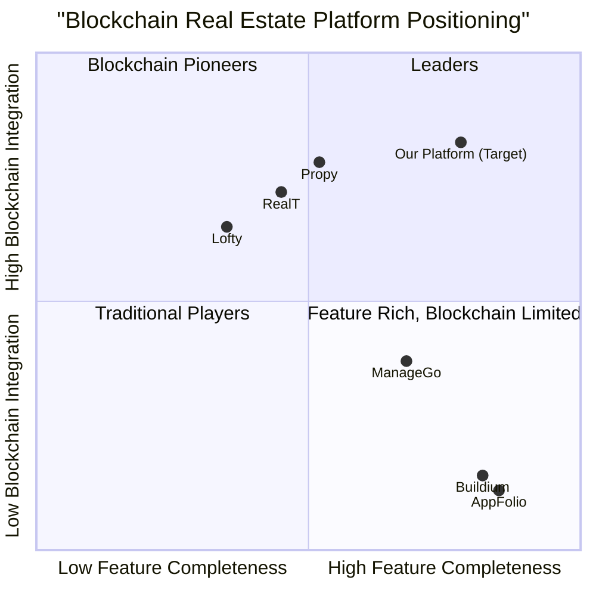
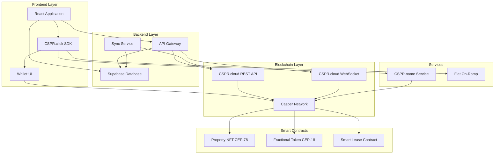

# Product Requirements Document: Casper Network Integration for Real Estate Management Platform

## 1. Project Information

### 1.1 Language & Technical Stack
- **Document Language**: English
- **Programming Language**: TypeScript
- **Frontend Framework**: React with Shadcn-ui components
- **Styling**: Tailwind CSS
- **Backend Service**: Supabase + Casper Network Blockchain
- **Project Name**: casper_real_estate_integration

### 1.2 Original Requirements
Integrate Casper Network ecosystem services (CSPR.cloud, CSPR.click, and CSPR.name) into the existing Real Estate Management Platform to enable:
- Blockchain-based property records management using token standards (CEP-18, CEP-47, CEP-78)
- Web3 wallet authentication and identity management
- Transparent transaction tracking and financial operations
- Decentralized property ownership and lease management
- Enhanced security and immutability for real estate transactions

### 1.3 Backend Architecture
**Hybrid Backend Approach**:
- **Supabase**: Traditional database for user profiles, application state, and off-chain data
- **Casper Network**: Blockchain layer for property tokenization, ownership records, lease agreements, and financial transactions
- **CSPR.cloud**: Middleware for blockchain data indexing and API access
- **Integration Layer**: Synchronization service between Supabase and Casper Network

## 2. Product Definition

### 2.1 Product Goals

1. **Enable Blockchain-Based Property Management**: Transform traditional property records into tokenized digital assets on Casper Network, providing immutable ownership history, transparent transactions, and fractional ownership capabilities.

2. **Streamline Web3 Onboarding**: Implement seamless wallet authentication and identity management through CSPR.click and CSPR.name, reducing friction for users transitioning from Web2 to Web3 property management.

3. **Automate Financial Operations**: Leverage smart contracts for automated rent collection, security deposit management, and transaction settlements, reducing administrative overhead by 40-60% while ensuring transparency and trust.

### 2.2 User Stories

**As a Property Agent**, I want to tokenize property listings on the blockchain so that I can offer fractional ownership opportunities and attract a broader investor base with transparent ownership records.

**As a Landlord**, I want to use smart contracts for lease agreements so that rent collection is automated, security deposits are held securely, and lease terms are enforced without manual intervention.

**As a Tenant**, I want to authenticate using my Web3 wallet and human-readable blockchain name so that I can manage my rental payments, view my lease history, and build an on-chain rental reputation.

**As an Investor**, I want to purchase fractional ownership tokens of properties so that I can diversify my real estate portfolio with smaller capital investments and receive automated rental income distributions.

**As a Property Manager**, I want real-time blockchain transaction tracking so that I can monitor all financial operations, verify payment histories, and generate transparent reports for stakeholders.

### 2.3 Competitive Analysis

#### 2.3.1 RealT
**Strengths**:
- Established fractional ownership platform with 6-16% rental yields
- Proven token distribution mechanism for rental income
- Strong track record with multiple tokenized properties

**Weaknesses**:
- Limited to investment-focused use cases
- No comprehensive property management features
- Restricted geographic coverage

#### 2.3.2 Propy
**Strengths**:
- Specialized in international transactions
- Smart contract-based escrow system
- Cryptocurrency loan integration

**Weaknesses**:
- Primarily transaction-focused, limited ongoing management
- High complexity for average users
- Limited wallet integration options

#### 2.3.3 ManageGo
**Strengths**:
- 10+ years property management experience
- All-in-one platform for landlord-tenant relationships
- Integrated payment processing and credit checks

**Weaknesses**:
- Blockchain features are supplementary, not core
- Limited tokenization capabilities
- Centralized architecture

#### 2.3.4 Lofty
**Strengths**:
- Low entry barrier ($50 minimum investment)
- Daily rental income distribution
- User-friendly interface for fractional ownership

**Weaknesses**:
- Investment-only platform
- No comprehensive property management tools
- Limited blockchain transparency features

#### 2.3.5 Traditional Property Management Software (Buildium, AppFolio)
**Strengths**:
- Mature feature sets
- Established user bases
- Comprehensive property management tools

**Weaknesses**:
- No blockchain integration
- Centralized data storage
- No tokenization or fractional ownership
- Manual financial processes

#### 2.3.6 Our Platform Advantages
**Strengths**:
- Comprehensive property management + blockchain integration
- Multiple Casper Network services (CSPR.cloud, CSPR.click, CSPR.name)
- AI-driven insights combined with blockchain transparency
- Existing user base and feature-rich platform
- Flexible wallet integration via CSPR.click

**Weaknesses**:
- New to blockchain integration (implementation risk)
- User education required for Web3 features
- Dependency on Casper Network ecosystem maturity

### 2.4 Competitive Quadrant Chart



## 3. Technical Specifications

### 3.1 Requirements Analysis

The Casper Network integration requires a multi-layered architecture that bridges traditional property management with blockchain technology:

**Layer 1: Blockchain Infrastructure**
- Casper Network mainnet integration for production
- Token standard implementation (CEP-18 for fractional ownership, CEP-78 for property NFTs)
- Smart contract deployment for lease agreements and automated payments
- CSPR.cloud middleware for efficient blockchain data access

**Layer 2: Web3 Authentication & Identity**
- CSPR.click SDK integration for wallet connectivity
- Support for all major Casper wallets (Casper Wallet, Ledger, WalletConnect, MetaMask Snap)
- Social login options (Google, Apple) for Web2-to-Web3 onboarding
- CSPR.name integration for human-readable blockchain identities

**Layer 3: Application Integration**
- Synchronization service between Supabase and Casper Network
- Real-time blockchain event monitoring via WebSocket streaming
- Hybrid data model (off-chain metadata in Supabase, on-chain ownership/transactions)
- Backward compatibility with existing platform features

**Layer 4: User Experience**
- Progressive Web3 adoption (optional blockchain features for existing users)
- Transparent blockchain operations with user-friendly interfaces
- Fiat on-ramp integration for CSPR token purchases
- Mobile-responsive blockchain interactions

### 3.2 Requirements Pool

#### 3.2.1 CSPR.cloud Integration (P0)
- **REQ-CC-001** [P0]: Integrate CSPR.cloud REST API (https://api.cspr.cloud) for blockchain data access
- **REQ-CC-002** [P0]: Implement WebSocket streaming API (wss://streaming.cspr.cloud) for real-time updates
- **REQ-CC-003** [P0]: Support CEP-78 token standard for property NFT minting and management
- **REQ-CC-004** [P0]: Support CEP-18 token standard for fractional ownership tokens
- **REQ-CC-005** [P0]: Implement smart contract event monitoring using Casper Event Standard (CES)
- **REQ-CC-006** [P1]: Integrate CSPR exchange rate data for fiat conversions
- **REQ-CC-007** [P1]: Implement account information retrieval and balance tracking
- **REQ-CC-008** [P2]: Add historical data analysis for CSPR rates and transaction trends
- **REQ-CC-009** [P0]: Implement robust event stream resiliency using `start_from` parameter with the last processed event ID
- **REQ-CC-010** [P0]: Ensure event processing logic is idempotent to handle duplicate event delivery without data corruption
- **REQ-CC-011** [P1]: Implement transaction TTL (Time-To-Live) handling to detect expired transactions and prompt users for re-signing
- **REQ-CC-012** [P0]: Implement standard CLValue serialization/deserialization for all on-chain data interactions

#### 3.2.2 CSPR.click Integration (P0)
- **REQ-CK-001** [P0]: Integrate CSPR.click SDK for unified wallet connectivity
- **REQ-CK-002** [P0]: Implement wallet connection UI with support for all Casper wallets
- **REQ-CK-003** [P0]: Add transaction signing capabilities for blockchain operations
- **REQ-CK-004** [P1]: Integrate social login options (Google, Apple) for simplified onboarding
- **REQ-CK-005** [P1]: Implement fiat on-ramp for CSPR token purchases via card/wire transfer
- **REQ-CK-006** [P1]: Add CSPR.cloud proxy connection for direct API access
- **REQ-CK-007** [P2]: Implement wallet connection persistence across sessions
- **REQ-CK-008** [P2]: Add multi-wallet support for users with multiple accounts

#### 3.2.3 CSPR.name Integration (P1)
- **REQ-CN-001** [P1]: Integrate CSPR.name service for human-readable address resolution
- **REQ-CN-002** [P1]: Implement name registration flow for new users
- **REQ-CN-003** [P1]: Add name lookup and verification in user profiles
- **REQ-CN-004** [P1]: Display CSPR.name aliases in transaction histories and dashboards
- **REQ-CN-005** [P2]: Implement name-based payment addressing (send to "john.cspr" instead of wallet address)
- **REQ-CN-006** [P2]: Add name management interface for updating linked addresses

#### 3.2.4 Property Tokenization (P0)
- **REQ-PT-001** [P0]: Create property NFT minting interface using CEP-78 standard
- **REQ-PT-002** [P0]: Implement property metadata schema (address, size, type, ownership history)
- **REQ-PT-003** [P0]: Add property NFT ownership transfer functionality
- **REQ-PT-004** [P0]: Implement fractional ownership token creation using CEP-18
- **REQ-PT-005** [P1]: Add property valuation and tokenomics calculator
- **REQ-PT-006** [P1]: Implement property NFT marketplace for listing and discovery
- **REQ-PT-007** [P2]: Add property bundle NFTs for portfolio management
- **REQ-PT-008** [P2]: Implement property upgrade/renovation tracking on-chain

#### 3.2.5 Smart Contract Lease Management (P0)
- **REQ-LC-001** [P0]: Deploy smart contract template for lease agreements
- **REQ-LC-002** [P0]: Implement automated rent collection via smart contracts
- **REQ-LC-003** [P0]: Add security deposit escrow functionality
- **REQ-LC-004** [P0]: Implement lease term enforcement and expiration handling
- **REQ-LC-005** [P1]: Add late payment penalties and grace period logic
- **REQ-LC-006** [P1]: Implement maintenance request funding from escrow
- **REQ-LC-007** [P2]: Add lease renewal automation
- **REQ-LC-008** [P2]: Implement multi-tenant payment splitting for shared properties

#### 3.2.6 Financial Operations (P0)
- **REQ-FO-001** [P0]: Implement blockchain transaction tracking dashboard
- **REQ-FO-002** [P0]: Add rent payment history with blockchain verification
- **REQ-FO-003** [P0]: Implement automated rental income distribution to token holders
- **REQ-FO-004** [P0]: Add transaction export functionality (CSV, PDF) with blockchain references
- **REQ-FO-005** [P1]: Implement tax reporting with blockchain transaction data
- **REQ-FO-006** [P1]: Add multi-currency support with CSPR conversion rates
- **REQ-FO-007** [P2]: Implement predictive analytics using blockchain transaction patterns
- **REQ-FO-008** [P2]: Add financial dashboard with real-time blockchain data visualization

#### 3.2.7 Identity & Authentication (P0)
- **REQ-IA-001** [P0]: Implement Web3 wallet authentication as primary login method
- **REQ-IA-002** [P0]: Add hybrid authentication (Web3 wallet + traditional email/password)
- **REQ-IA-003** [P0]: Implement user profile linking between Supabase and blockchain identity
- **REQ-IA-004** [P1]: Add on-chain reputation system for tenants and landlords
- **REQ-IA-005** [P1]: Implement KYC/AML compliance for tokenized property transactions
- **REQ-IA-006** [P2]: Add decentralized identity verification using CSPR.name
- **REQ-IA-007** [P2]: Implement role-based access control with blockchain verification

#### 3.2.8 Platform Integration (P0)
- **REQ-PI-001** [P0]: Integrate blockchain features into existing Lease Pipeline module
- **REQ-PI-002** [P0]: Add blockchain transaction tracking to Financial Dashboard
- **REQ-PI-003** [P0]: Implement property tokenization in Property Management module
- **REQ-PI-004** [P1]: Add blockchain insights to AI Analytics module
- **REQ-PI-005** [P1]: Integrate smart contract automation with Workflow Automation module
- **REQ-PI-006** [P2]: Add blockchain data to Predictive Analytics models
- **REQ-PI-007** [P2]: Implement blockchain-based collaboration features

#### 3.2.9 Security & Compliance (P0)
- **REQ-SC-001** [P0]: Implement secure private key management (never store keys on server)
- **REQ-SC-002** [P0]: Add transaction signing confirmation UI with clear details
- **REQ-SC-003** [P0]: Implement rate limiting for blockchain API calls
- **REQ-SC-004** [P0]: Add error handling and retry logic for blockchain operations
- **REQ-SC-005** [P1]: Implement audit logging for all blockchain transactions
- **REQ-SC-006** [P1]: Add smart contract security audits before deployment
- **REQ-SC-007** [P2]: Implement multi-signature wallet support for high-value transactions
- **REQ-SC-008** [P2]: Add blockchain transaction monitoring and anomaly detection

#### 3.2.10 User Experience (P1)
- **REQ-UX-001** [P1]: Create onboarding tutorial for Web3 features
- **REQ-UX-002** [P1]: Implement progressive disclosure of blockchain features
- **REQ-UX-003** [P1]: Add blockchain transaction status notifications
- **REQ-UX-004** [P1]: Implement gas fee estimation and display
- **REQ-UX-005** [P2]: Add blockchain explorer integration for transaction verification
- **REQ-UX-006** [P2]: Implement mobile-optimized wallet connection flow
- **REQ-UX-007** [P2]: Add contextual help and tooltips for blockchain concepts

### 3.3 UI Design Draft

#### 3.3.1 Wallet Connection Interface
```
┌─────────────────────────────────────────┐
│  Connect Your Wallet                    │
│                                         │
│  ┌─────────────────────────────────┐   │
│  │  🔗 Casper Wallet              │   │
│  └─────────────────────────────────┘   │
│  ┌─────────────────────────────────┐   │
│  │  🔐 Ledger                     │   │
│  └─────────────────────────────────┘   │
│  ┌─────────────────────────────────┐   │
│  │  🌐 WalletConnect              │   │
│  └─────────────────────────────────┘   │
│  ┌─────────────────────────────────┐   │
│  │  🦊 MetaMask Snap              │   │
│  └─────────────────────────────────┘   │
│                                         │
│  ────────── OR ──────────              │
│                                         │
│  ┌─────────────────────────────────┐   │
│  │  🔵 Continue with Google       │   │
│  └─────────────────────────────────┘   │
│  ┌─────────────────────────────────┐   │
│  │  🍎 Continue with Apple        │   │
│  └─────────────────────────────────┘   │
│                                         │
│  Don't have CSPR? [Buy Now]            │
└─────────────────────────────────────────┘
```

#### 3.3.2 Property Tokenization Dashboard
```
┌──────────────────────────────────────────────────────┐
│  Property Tokenization                               │
│  ┌────────────────┐  ┌────────────────┐            │
│  │ Total Properties│  │ Tokenized      │            │
│  │      156        │  │      23        │            │
│  └────────────────┘  └────────────────┘            │
│                                                      │
│  Recent Tokenizations                               │
│  ┌──────────────────────────────────────────────┐  │
│  │ 🏢 123 Main St                               │  │
│  │ Token ID: #PROP-001                          │  │
│  │ NFT Standard: CEP-78                         │  │
│  │ Fractional Tokens: 1,000 (CEP-18)           │  │
│  │ Status: ✅ Minted                            │  │
│  │ [View on Explorer] [Manage Tokens]           │  │
│  └──────────────────────────────────────────────┘  │
│                                                      │
│  [+ Tokenize New Property]                          │
└──────────────────────────────────────────────────────┘
```

#### 3.3.3 Smart Contract Lease Interface
```
┌──────────────────────────────────────────────────────┐
│  Lease Agreement - Smart Contract                    │
│                                                      │
│  Property: 456 Oak Avenue                           │
│  Tenant: john.cspr                                  │
│  Landlord: alice.cspr                               │
│                                                      │
│  ┌────────────────────────────────────────────────┐ │
│  │ Monthly Rent: 1,500 CSPR (~$2,250 USD)        │ │
│  │ Security Deposit: 3,000 CSPR (in escrow)      │ │
│  │ Lease Term: 12 months                         │ │
│  │ Start Date: 2025-01-01                        │ │
│  │ Auto-renewal: Enabled                         │ │
│  └────────────────────────────────────────────────┘ │
│                                                      │
│  Payment Schedule                                   │
│  ┌────────────────────────────────────────────────┐ │
│  │ ✅ Jan 2025 - Paid (Block #1234567)           │ │
│  │ ✅ Feb 2025 - Paid (Block #1245678)           │ │
│  │ ⏳ Mar 2025 - Scheduled (Due: Mar 1)          │ │
│  └────────────────────────────────────────────────┘ │
│                                                      │
│  [View Contract on Explorer] [Request Maintenance]  │
└──────────────────────────────────────────────────────┘
```

#### 3.3.4 Blockchain Transaction Dashboard
```
┌──────────────────────────────────────────────────────┐
│  Blockchain Transactions                    🔄 Live  │
│                                                      │
│  Filters: [All] [Rent] [Deposits] [Transfers]       │
│                                                      │
│  ┌────────────────────────────────────────────────┐ │
│  │ 🔵 Rent Payment Received                      │ │
│  │ From: john.cspr                               │ │
│  │ Amount: 1,500 CSPR                            │ │
│  │ Block: #1245678                               │ │
│  │ Time: 2 hours ago                             │ │
│  │ Status: ✅ Confirmed (12 confirmations)       │ │
│  │ [View Details]                                │ │
│  └────────────────────────────────────────────────┘ │
│                                                      │
│  ┌────────────────────────────────────────────────┐ │
│  │ 🟢 Security Deposit Released                  │ │
│  │ To: bob.cspr                                  │ │
│  │ Amount: 3,000 CSPR                            │ │
│  │ Block: #1245123                               │ │
│  │ Time: 1 day ago                               │ │
│  │ Status: ✅ Confirmed (156 confirmations)      │ │
│  │ [View Details]                                │ │
│  └────────────────────────────────────────────────┘ │
│                                                      │
│  [Export Transactions] [Generate Tax Report]        │
└──────────────────────────────────────────────────────┘
```

#### 3.3.5 Fractional Ownership Marketplace
```
┌──────────────────────────────────────────────────────┐
│  Property Investment Marketplace                     │
│                                                      │
│  ┌────────────────────────────────────────────────┐ │
│  │ 🏢 Luxury Apartment Complex                   │ │
│  │ Location: Downtown, Los Angeles               │ │
│  │                                               │ │
│  │ Total Value: $2,500,000                       │ │
│  │ Token Price: $250 per token                   │ │
│  │ Available: 3,500 / 10,000 tokens              │ │
│  │ Annual Yield: 8.5%                            │ │
│  │                                               │ │
│  │ ████████████░░░░░░░░ 65% Sold                 │ │
│  │                                               │ │
│  │ Min Investment: $250 (1 token)                │ │
│  │ [Buy Tokens] [View Property Details]          │ │
│  └────────────────────────────────────────────────┘ │
│                                                      │
│  Your Portfolio                                     │
│  ┌────────────────────────────────────────────────┐ │
│  │ Properties Owned: 3                           │ │
│  │ Total Investment: $5,000                      │ │
│  │ Monthly Income: $35.42                        │ │
│  │ Total Returns: $425.04 (8.5% APY)             │ │
│  └────────────────────────────────────────────────┘ │
└──────────────────────────────────────────────────────┘
```

### 3.4 Data Models

#### 3.4.1 Blockchain Data Models

**Property NFT (CEP-78)**
```typescript
interface PropertyNFT {
  token_id: string;
  owner: string; // Casper wallet address or CSPR.name
  metadata: {
    property_address: string;
    property_type: 'residential' | 'commercial' | 'industrial';
    square_footage: number;
    bedrooms?: number;
    bathrooms?: number;
    year_built: number;
    valuation: number;
    valuation_currency: string;
    images: string[];
    legal_description: string;
    parcel_id: string;
  };
  ownership_history: OwnershipRecord[];
  created_at: number; // Unix timestamp
  updated_at: number;
}

interface OwnershipRecord {
  previous_owner: string;
  new_owner: string;
  transfer_date: number;
  transaction_hash: string;
  sale_price?: number;
}
```

**Fractional Ownership Token (CEP-18)**
```typescript
interface FractionalToken {
  token_name: string;
  token_symbol: string;
  total_supply: number;
  decimals: number;
  property_nft_id: string; // Reference to parent property NFT
  token_price: number;
  currency: string;
  holders: TokenHolder[];
  dividend_distribution: DividendRecord[];
}

interface TokenHolder {
  address: string;
  balance: number;
  percentage: number;
  acquisition_date: number;
}

interface DividendRecord {
  distribution_date: number;
  total_amount: number;
  amount_per_token: number;
  transaction_hash: string;
}
```

**Smart Contract Lease**
```typescript
interface SmartLease {
  contract_address: string;
  property_nft_id: string;
  landlord: string;
  tenant: string;
  monthly_rent: number;
  security_deposit: number;
  lease_start: number;
  lease_end: number;
  payment_day: number; // Day of month (1-31)
  auto_renewal: boolean;
  payment_history: PaymentRecord[];
  status: 'active' | 'expired' | 'terminated';
  created_at: number;
}

interface PaymentRecord {
  payment_date: number;
  amount: number;
  transaction_hash: string;
  block_number: number;
  status: 'pending' | 'confirmed' | 'failed';
  late_fee?: number;
}
```

#### 3.4.2 Supabase Data Models (Off-Chain)

**User Profile (Extended)**
```typescript
interface UserProfile {
  id: string; // Supabase UUID
  email: string;
  wallet_address?: string; // Casper wallet address
  cspr_name?: string; // CSPR.name alias
  role: 'agent' | 'landlord' | 'tenant' | 'investor';
  kyc_status: 'pending' | 'verified' | 'rejected';
  created_at: string;
  updated_at: string;
  blockchain_reputation_score?: number;
}
```

**Property Record (Hybrid)**
```typescript
interface Property {
  id: string; // Supabase UUID
  nft_token_id?: string; // CEP-78 token ID (if tokenized)
  address: string;
  city: string;
  state: string;
  zip_code: string;
  property_type: string;
  status: 'available' | 'leased' | 'tokenized' | 'fractional';
  owner_id: string; // Supabase user ID
  owner_wallet?: string; // Blockchain wallet address
  is_tokenized: boolean;
  fractional_token_address?: string; // CEP-18 contract address
  created_at: string;
  updated_at: string;
}
```

**Blockchain Transaction Log**
```typescript
interface BlockchainTransaction {
  id: string; // Supabase UUID
  transaction_hash: string;
  block_number: number;
  transaction_type: 'property_mint' | 'ownership_transfer' | 'rent_payment' | 'deposit_release' | 'token_purchase';
  from_address: string;
  to_address: string;
  amount?: number;
  currency: string;
  property_id?: string;
  lease_id?: string;
  status: 'pending' | 'confirmed' | 'failed';
  confirmations: number;
  gas_fee: number;
  created_at: string;
  confirmed_at?: string;
}
```

### 3.5 API Integration Specifications

#### 3.5.1 CSPR.cloud REST API Integration

**Base URL**: `https://api.cspr.cloud`

**Authentication**:
```typescript
const headers = {
  'Authorization': `Bearer ${CSPR_CLOUD_API_KEY}`,
  'Content-Type': 'application/json'
};
```

**Key Endpoints**:

1. **Get Account Information**
```typescript
GET /accounts/{account_hash}
Response: {
  account_hash: string;
  balance: number;
  tokens: Token[];
  nfts: NFT[];
}
```

2. **Get NFT Details**
```typescript
GET /nfts/{contract_hash}/{token_id}
Response: {
  token_id: string;
  owner: string;
  metadata: object;
  contract_hash: string;
  token_standard: 'CEP-47' | 'CEP-78';
}
```

3. **Get Token Balance**
```typescript
GET /tokens/{contract_hash}/balances/{account_hash}
Response: {
  balance: number;
  decimals: number;
  symbol: string;
}
```

4. **Get Transaction History**
```typescript
GET /accounts/{account_hash}/transfers?limit=50&offset=0
Response: {
  transfers: Transfer[];
  total: number;
}
```

5. **Get CSPR Exchange Rates**
```typescript
GET /rates/cspr?currencies=USD,EUR,GBP
Response: {
  cspr_usd: number;
  cspr_eur: number;
  cspr_gbp: number;
  timestamp: number;
}
```

#### 3.5.2 CSPR.cloud WebSocket Streaming API

**WebSocket URL**: `wss://streaming.cspr.cloud`

**Connection**:
```typescript
const ws = new WebSocket('wss://streaming.cspr.cloud');

ws.onopen = () => {
  // Subscribe to account events
  ws.send(JSON.stringify({
    action: 'subscribe',
    topic: 'account',
    account_hash: userAccountHash
  }));
  
  // Subscribe to contract events
  ws.send(JSON.stringify({
    action: 'subscribe',
    topic: 'contract',
    contract_hash: leaseContractHash
  }));
};

ws.onmessage = (event) => {
  const data = JSON.parse(event.data);
  handleBlockchainEvent(data);
};
```

**Event Types**:
- `transfer`: Token/CSPR transfers
- `nft_mint`: New NFT creation
- `nft_transfer`: NFT ownership change
- `contract_event`: Smart contract events (CES)
- `block`: New block added

#### 3.5.3 CSPR.click SDK Integration

**Installation**:
```bash
npm install @make-software/csprclick-ui
```

**Initialization**:
```typescript
import { ClickUI } from '@make-software/csprclick-ui';

const clickUI = new ClickUI({
  appName: 'Real Estate Management Platform',
  appId: 'real-estate-mgmt',
  providers: ['casper-wallet', 'ledger', 'wallet-connect', 'metamask-snap'],
  network: 'mainnet', // or 'testnet'
});
```

**Wallet Connection**:
```typescript
async function connectWallet() {
  try {
    const account = await clickUI.connect();
    return {
      publicKey: account.publicKey,
      accountHash: account.accountHash,
      provider: account.provider
    };
  } catch (error) {
    console.error('Wallet connection failed:', error);
    throw error;
  }
}
```

**Transaction Signing**:
```typescript
async function signTransaction(deploy) {
  try {
    const signedDeploy = await clickUI.sign(deploy);
    return signedDeploy;
  } catch (error) {
    console.error('Transaction signing failed:', error);
    throw error;
  }
}
```

**Social Login**:
```typescript
async function socialLogin(provider: 'google' | 'apple') {
  try {
    const account = await clickUI.socialLogin(provider);
    return account;
  } catch (error) {
    console.error('Social login failed:', error);
    throw error;
  }
}
```

#### 3.5.4 CSPR.name Integration

**Name Resolution**:
```typescript
async function resolveCSPRName(name: string): Promise<string> {
  // Query CSPR.name contract
  const response = await csprCloudAPI.get(`/names/${name}`);
  return response.data.account_hash;
}

async function reverseResolve(accountHash: string): Promise<string | null> {
  // Reverse lookup
  const response = await csprCloudAPI.get(`/names/reverse/${accountHash}`);
  return response.data.name || null;
}
```

**Name Registration**:
```typescript
async function registerCSPRName(name: string, accountHash: string) {
  // Create deploy for name registration
  const deploy = await createNameRegistrationDeploy(name, accountHash);
  const signedDeploy = await clickUI.sign(deploy);
  const result = await csprCloudAPI.post('/deploys', signedDeploy);
  return result.data.deploy_hash;
}
```

### 3.6 Smart Contract Architecture

#### 3.6.1 Property NFT Contract (CEP-78)

**Contract Functions**:
```rust
// Mint new property NFT
pub fn mint(
    property_metadata: PropertyMetadata,
    owner: Key
) -> Result<TokenId, Error>

// Transfer property ownership
pub fn transfer(
    token_id: TokenId,
    from: Key,
    to: Key
) -> Result<(), Error>

// Update property metadata
pub fn update_metadata(
    token_id: TokenId,
    new_metadata: PropertyMetadata
) -> Result<(), Error>

// Get property details
pub fn get_property(
    token_id: TokenId
) -> Result<PropertyNFT, Error>
```

#### 3.6.2 Fractional Ownership Contract (CEP-18)

**Contract Functions**:
```rust
// Create fractional tokens for property
pub fn create_fractional_tokens(
    property_nft_id: TokenId,
    total_supply: U256,
    token_name: String,
    token_symbol: String
) -> Result<ContractHash, Error>

// Transfer tokens
pub fn transfer(
    recipient: Key,
    amount: U256
) -> Result<(), Error>

// Distribute dividends
pub fn distribute_dividends(
    total_amount: U256
) -> Result<(), Error>

// Get token balance
pub fn balance_of(
    owner: Key
) -> Result<U256, Error>
```

#### 3.6.3 Smart Lease Contract

**Contract Functions**:
```rust
// Create new lease agreement
pub fn create_lease(
    property_nft_id: TokenId,
    tenant: Key,
    monthly_rent: U512,
    security_deposit: U512,
    lease_start: u64,
    lease_end: u64
) -> Result<ContractHash, Error>

// Process monthly rent payment
pub fn pay_rent(
    lease_id: ContractHash,
    amount: U512
) -> Result<(), Error>

// Release security deposit
pub fn release_deposit(
    lease_id: ContractHash,
    amount: U512,
    recipient: Key
) -> Result<(), Error>

// Terminate lease
pub fn terminate_lease(
    lease_id: ContractHash,
    reason: String
) -> Result<(), Error>

// Check payment status
pub fn get_payment_status(
    lease_id: ContractHash
) -> Result<PaymentStatus, Error>
```

### 3.7 Integration Architecture Diagram



### 3.8 Development Phases

#### Phase 1: Foundation (Weeks 1-4)
- Set up CSPR.cloud API integration
- Implement CSPR.click SDK for wallet connectivity
- Create basic blockchain transaction monitoring
- Develop hybrid data synchronization service

#### Phase 2: Core Features (Weeks 5-10)
- Implement property NFT minting (CEP-78)
- Develop smart lease contract deployment
- Create automated rent payment system
- Build blockchain transaction dashboard

#### Phase 3: Advanced Features (Weeks 11-16)
- Implement fractional ownership tokens (CEP-18)
- Develop property marketplace
- Integrate CSPR.name for identity management
- Add social login and fiat on-ramp

#### Phase 4: Integration & Testing (Weeks 17-20)
- Integrate blockchain features into existing modules
- Comprehensive security testing
- User acceptance testing
- Performance optimization

#### Phase 5: Launch & Iteration (Weeks 21-24)
- Mainnet deployment
- User onboarding and training
- Monitor and optimize
- Gather feedback and iterate

### 3.9 Open Questions

1. **Smart Contract Auditing**: Which third-party security firm should we engage for smart contract audits before mainnet deployment?

2. **Gas Fee Management**: Should we implement a gas fee subsidy program for users during the initial launch period? What's the budget allocation?

3. **Legal Compliance**: What are the specific regulatory requirements for tokenizing real estate in different jurisdictions? Do we need to restrict access by geography?

4. **Fractional Ownership Limits**: What should be the minimum and maximum number of fractional tokens per property? Should there be investor accreditation requirements?

5. **Dispute Resolution**: How should disputes be handled when smart contracts execute automatically but parties disagree? Do we need an arbitration mechanism?

6. **Data Privacy**: How do we balance blockchain transparency with tenant/landlord privacy requirements, especially for sensitive financial data?

7. **Migration Strategy**: For existing properties and leases in the platform, should we offer automatic tokenization, or require manual opt-in?

8. **Wallet Recovery**: What's our strategy for helping users who lose access to their wallets? Should we implement social recovery mechanisms?

9. **Cross-Chain Compatibility**: Should we plan for future integration with other blockchain networks beyond Casper?

10. **Token Economics**: For fractional ownership, how should we handle property appreciation, depreciation, and major capital improvements in the token valuation?

## 4. Market Research & Analysis

### 4.1 Web3 Adoption in Real Estate (2024)

The real estate industry is experiencing a significant shift toward blockchain integration:

**Market Growth**:
- FIBREE Product Database reached 844 active blockchain real estate products (+13% YoY)
- Fifth consecutive year of double-digit growth in blockchain adoption
- Real estate tokenization market projected to grow from <$0.3T (2024) to $4T by 2035 (27% CAGR)
- Fractional ownership models increased by approximately 50% in 2024

**Adoption Drivers**:
- **Cost Reduction**: Transaction costs decreased by 30-50%, saving up to $30,000 per transaction
- **Speed**: Deal completion time reduced from 45 days to weeks or days
- **Accessibility**: Fractional ownership enables smaller investors to participate
- **Transparency**: Immutable records provide clear ownership history

**Challenges**:
- Market volatility following 2022-2023 crypto downturn created skepticism
- Regulatory uncertainties and unclear legal frameworks
- User education gap for Web3 technologies
- Integration complexity with existing systems

**Regional Insights**:
- North America dominated with largest revenue share in 2024
- Asia Pacific showing strong growth potential
- Dubai's Land Department launched blockchain-based property title deeds

### 4.2 Competitive Landscape Analysis

**Market Positioning**:
The blockchain real estate market is fragmented with specialized players focusing on different aspects:

1. **Investment-Focused Platforms** (RealT, Lofty): Strong tokenization but limited management features
2. **Transaction Platforms** (Propy): Excellent for cross-border deals but not ongoing management
3. **Traditional Management + Blockchain** (ManageGo): Comprehensive management with supplementary blockchain
4. **Our Opportunity**: Comprehensive management platform with deep blockchain integration

**Competitive Advantages**:
- Existing user base and feature-rich platform
- Multiple Casper Network service integration (CSPR.cloud, CSPR.click, CSPR.name)
- AI-driven insights combined with blockchain transparency
- Flexible wallet integration reducing onboarding friction
- Hybrid architecture (Supabase + Blockchain) for optimal performance

**Market Gaps**:
- No existing platform combines comprehensive property management with deep blockchain integration
- Limited platforms offer fractional ownership AND ongoing property management
- Few solutions provide seamless Web2-to-Web3 onboarding
- Lack of platforms with AI analytics + blockchain transparency

### 4.3 Target User Segments

**Primary Segments**:

1. **Tech-Savvy Landlords (Early Adopters)**
   - Age: 30-45
   - Owns 3-10 properties
   - Comfortable with technology
   - Interested in fractional ownership opportunities
   - Values transparency and automation

2. **Property Investment Firms**
   - Managing 50+ properties
   - Seeking operational efficiency
   - Interested in tokenization for liquidity
   - Requires institutional-grade security

3. **Small-Scale Investors**
   - Age: 25-40
   - Limited capital ($500-$5,000)
   - Interested in real estate but priced out of traditional market
   - Comfortable with cryptocurrency

4. **Property Management Companies**
   - Managing properties for multiple owners
   - Seeking automation and transparency
   - Need robust reporting and compliance tools

**Secondary Segments**:

5. **Tech-Forward Tenants**
   - Age: 25-35
   - Prefer digital payments
   - Value transparency in lease terms
   - Interested in building on-chain reputation

### 4.4 Value Proposition

**For Landlords**:
- Automate 60-80% of rent collection and lease management tasks
- Access fractional ownership opportunities for portfolio diversification
- Transparent, immutable transaction records for tax reporting
- Reduced administrative costs by 40-60%

**For Tenants**:
- Build verifiable on-chain rental history
- Transparent lease terms with automated enforcement
- Faster security deposit returns
- Simplified payment process with multiple options

**For Investors**:
- Access real estate investment with as little as $250
- Daily/monthly rental income distribution
- Liquid fractional ownership tokens
- Transparent property performance data

**For Property Managers**:
- Streamlined operations with smart contract automation
- Real-time financial tracking and reporting
- Enhanced trust through blockchain transparency
- Reduced fraud and disputes

### 4.5 Go-to-Market Strategy

**Phase 1: Beta Launch (Months 1-3)**
- Target 50-100 tech-savvy landlords with 3-5 properties each
- Focus on single-family residential properties
- Offer incentives: waived transaction fees, gas fee subsidies
- Intensive user education and support

**Phase 2: Expansion (Months 4-9)**
- Expand to property management companies
- Introduce fractional ownership marketplace
- Target 500+ properties tokenized
- Develop case studies and success stories

**Phase 3: Scale (Months 10-18)**
- Open to general market
- Multi-family and commercial property support
- International expansion (starting with Canada)
- Partnership with real estate associations

**Marketing Channels**:
- Content marketing (blockchain + real estate education)
- Webinars and virtual events
- Real estate investment forums and communities
- Partnership with crypto education platforms
- Traditional real estate conferences with Web3 tracks

### 4.6 Success Metrics

**Adoption Metrics**:
- Properties tokenized: Target 1,000 in Year 1
- Active wallet connections: Target 5,000 users
- Smart lease contracts deployed: Target 2,500
- Fractional ownership transactions: Target $10M volume

**Engagement Metrics**:
- Wallet connection rate: >60% of new users
- Smart lease adoption: >40% of new leases
- Fractional investment participation: >25% of investors
- Monthly active blockchain transactions: >10,000

**Business Metrics**:
- Transaction fee revenue from tokenization
- Smart contract deployment fees
- Fractional ownership marketplace commission (2-3%)
- Premium blockchain features subscription

**User Satisfaction**:
- Net Promoter Score (NPS): Target >50
- Blockchain feature satisfaction: Target >4.2/5
- User education effectiveness: >80% completion rate
- Support ticket resolution: <24 hours average

## 5. Risk Assessment & Mitigation

### 5.1 Technical Risks

**Risk**: Smart contract vulnerabilities leading to fund loss
**Mitigation**: 
- Mandatory third-party security audits before mainnet deployment
- Bug bounty program for white-hat hackers
- Gradual rollout with transaction limits during beta
- Insurance coverage for smart contract failures

**Risk**: Blockchain network congestion affecting transaction speed
**Mitigation**:
- Implement transaction queuing and retry mechanisms
- Use CSPR.cloud caching layer for improved performance
- Set realistic user expectations for transaction times
- Provide transaction status notifications

**Risk**: Integration complexity between Supabase and blockchain
**Mitigation**:
- Develop robust synchronization service with conflict resolution
- Implement comprehensive error handling and logging
- Create fallback mechanisms for blockchain unavailability
- Regular sync audits and reconciliation

### 5.2 Regulatory Risks

**Risk**: Unclear legal status of tokenized real estate
**Mitigation**:
- Engage legal counsel specializing in blockchain and real estate
- Start with jurisdictions with clearer regulatory frameworks
- Implement KYC/AML compliance from day one
- Structure tokens as securities if required

**Risk**: Changes in cryptocurrency regulations
**Mitigation**:
- Monitor regulatory developments continuously
- Build flexible architecture to adapt to regulatory changes
- Maintain traditional payment options alongside blockchain
- Geographic restrictions if necessary

### 5.3 Market Risks

**Risk**: Low user adoption due to Web3 complexity
**Mitigation**:
- Comprehensive onboarding tutorials and education
- Progressive disclosure of blockchain features
- Social login options to reduce friction
- Make blockchain features optional, not mandatory

**Risk**: Cryptocurrency volatility affecting property valuations
**Mitigation**:
- Display values in both CSPR and fiat currencies
- Implement stablecoin payment options
- Provide real-time exchange rate updates
- Allow fiat on-ramp for CSPR purchases

### 5.4 Operational Risks

**Risk**: High gas fees deterring transactions
**Mitigation**:
- Gas fee estimation before transactions
- Batch operations to reduce individual transaction costs
- Gas fee subsidy program during launch period
- Optimize smart contracts for gas efficiency

**Risk**: User wallet loss or security breaches
**Mitigation**:
- Never store private keys on servers
- Implement multi-signature wallets for high-value transactions
- Provide wallet security education
- Support hardware wallet integration (Ledger)

## 6. Conclusion & Recommendations

### 6.1 Strategic Recommendations

1. **Phased Rollout**: Begin with property NFT minting and smart lease contracts before introducing fractional ownership to manage complexity and risk.

2. **User Education Priority**: Invest heavily in user education and onboarding materials. Web3 adoption hinges on reducing perceived complexity.

3. **Hybrid Approach**: Maintain traditional features alongside blockchain features. Allow users to opt-in to Web3 capabilities rather than forcing adoption.

4. **Partnership Strategy**: Partner with established real estate associations and crypto education platforms to build credibility and reach target audiences.

5. **Security First**: Prioritize security audits, insurance, and robust testing before mainnet deployment. Reputation damage from security incidents could be fatal.

6. **Regulatory Compliance**: Engage legal counsel early and build compliance into the architecture from the start rather than retrofitting.

### 6.2 Success Factors

**Critical Success Factors**:
1. Seamless wallet integration via CSPR.click reducing onboarding friction
2. Robust smart contract security with third-party audits
3. Comprehensive user education and support
4. Clear value proposition for each user segment
5. Regulatory compliance and legal clarity
6. Strong partnership ecosystem

**Key Performance Indicators**:
- 1,000+ properties tokenized in Year 1
- 5,000+ active wallet connections
- 60%+ wallet connection rate for new users
- 40%+ smart lease adoption rate
- >4.2/5 user satisfaction rating

### 6.3 Next Steps

**Immediate Actions (Weeks 1-4)**:
1. Register for CSPR.cloud API access at console.cspr.build
2. Set up development environment with Casper testnet
3. Engage legal counsel for regulatory guidance
4. Begin smart contract development for property NFTs
5. Design wallet connection UI/UX flows

**Short-term Actions (Months 1-3)**:
1. Complete CSPR.click SDK integration
2. Deploy smart contracts to testnet
3. Develop synchronization service between Supabase and blockchain
4. Create user education materials and tutorials
5. Recruit beta testers from existing user base

**Medium-term Actions (Months 4-6)**:
1. Complete security audits for smart contracts
2. Launch beta program with 50-100 properties
3. Implement fractional ownership marketplace
4. Develop case studies and success metrics
5. Prepare for mainnet deployment

This PRD provides a comprehensive roadmap for integrating Casper Network services into the Real Estate Management Platform, positioning it as a leader in blockchain-enabled property management.