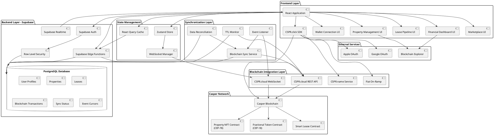
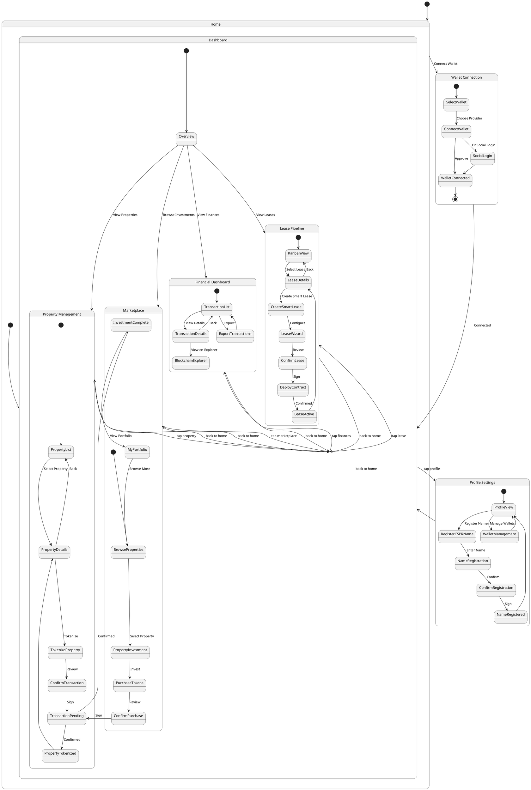
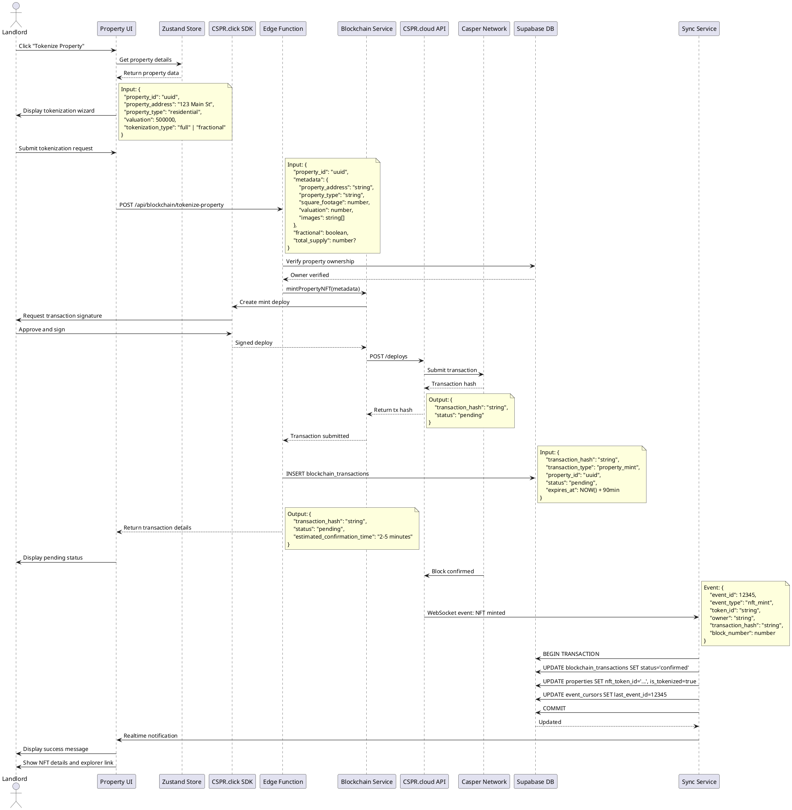
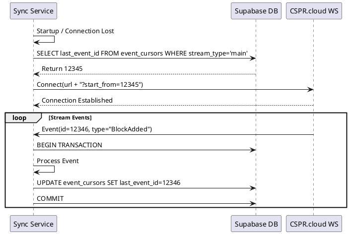
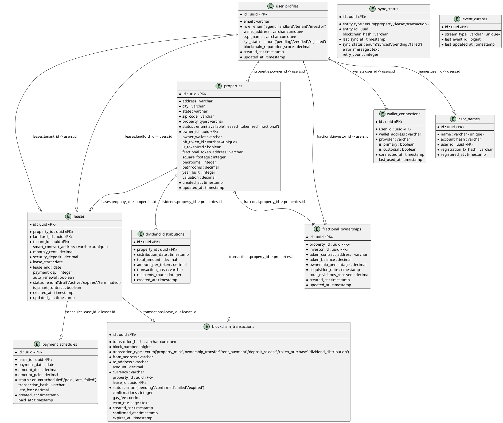

# Casper Network Integration - System Design Document

## 1. Implementation Approach

### 1.1 Overview
We will integrate Casper Network blockchain services (CSPR.cloud, CSPR.click, CSPR.name) into the existing Real Estate Management Platform using a **hybrid architecture** that combines traditional database storage (Supabase) with blockchain technology for immutable records, tokenization, and smart contracts.

### 1.2 Core Implementation Tasks

**Phase 1: Foundation & Infrastructure (Weeks 1-4)**
1. Set up CSPR.cloud API integration with REST and WebSocket endpoints
2. Integrate CSPR.click SDK for wallet connectivity and transaction signing
3. Create Supabase database schema for blockchain data synchronization
4. Implement hybrid data synchronization service between Supabase and Casper Network
5. Set up development environment with Casper testnet

**Phase 2: Core Blockchain Features (Weeks 5-10)**
1. Implement property NFT minting using CEP-78 token standard
2. Deploy smart lease contract templates for automated rent collection
3. Create blockchain transaction monitoring and logging system
4. Build wallet authentication and identity management
5. Develop real-time blockchain event streaming via WebSocket

**Phase 3: Advanced Features (Weeks 11-16)**
1. Implement fractional ownership tokens using CEP-18 standard
2. Create property marketplace for tokenized assets
3. Integrate CSPR.name for human-readable blockchain identities
4. Add social login (Google, Apple) and fiat on-ramp integration
5. Implement automated dividend distribution for fractional ownership

**Phase 4: Platform Integration (Weeks 17-20)**
1. Integrate blockchain features into existing Lease Pipeline module
2. Add blockchain transaction tracking to Financial Dashboard
3. Implement property tokenization in Property Management module
4. Create blockchain insights for AI Analytics module
5. Add blockchain-based collaboration features

**Phase 5: Security & Testing (Weeks 21-24)**
1. Conduct smart contract security audits
2. Implement comprehensive error handling and retry mechanisms
3. Perform load testing and performance optimization
4. User acceptance testing with beta users
5. Prepare for mainnet deployment

### 1.3 Technology Stack

**Frontend:**
- React 18+ with TypeScript
- Shadcn-ui components for consistent UI
- Tailwind CSS for styling
- CSPR.click SDK (@make-software/csprclick-ui) for wallet integration
- Recharts for blockchain data visualization
- Zustand for state management
- @tanstack/react-query for data fetching

**Backend:**
- Supabase (PostgreSQL) for traditional data storage
- Supabase Edge Functions for serverless API endpoints
- Supabase Realtime for live data synchronization
- Row Level Security (RLS) for data access control

**Blockchain Layer:**
- Casper Network mainnet for production
- CSPR.cloud REST API for blockchain data access
- CSPR.cloud WebSocket for real-time event streaming
- CEP-78 token standard for property NFTs
- CEP-18 token standard for fractional ownership tokens
- Custom smart contracts for lease management

**Integration Services:**
- CSPR.name for blockchain identity resolution
- Fiat on-ramp services for CSPR purchases
- Social login providers (Google, Apple)

**Development Tools:**
- Vite for build tooling
- Vitest for unit testing
- Playwright for end-to-end testing
- TypeScript for type safety

### 1.4 Open Source Libraries

- **@make-software/csprclick-ui**: Unified wallet integration SDK
- **casper-js-sdk**: Casper Network JavaScript SDK for blockchain interactions
- **axios**: HTTP client for REST API calls
- **ws**: WebSocket client for real-time blockchain events
- **zod**: Schema validation for blockchain data
- **date-fns**: Date manipulation for lease schedules
- **recharts**: Data visualization for blockchain analytics

## 2. Main User-UI Interaction Patterns

### 2.1 Wallet Connection Flow
1. User clicks "Connect Wallet" button in navigation
2. CSPR.click modal displays available wallet options (Casper Wallet, Ledger, WalletConnect, MetaMask Snap)
3. User selects preferred wallet provider
4. Wallet extension/app prompts for connection approval
5. Upon approval, user's wallet address and CSPR.name (if registered) are displayed
6. User profile is linked to blockchain identity in Supabase
7. Wallet connection persists across sessions via localStorage

**Alternative Flow: Social Login**
1. User clicks "Continue with Google/Apple"
2. Social authentication flow completes
3. CSPR.click creates custodial wallet for user
4. User can later export private keys or migrate to self-custody

### 2.2 Property Tokenization Flow
1. Agent/Landlord navigates to Property Management dashboard
2. Selects property to tokenize
3. Clicks "Tokenize Property" button
4. Wizard displays property details and tokenization options:
   - Full ownership NFT (CEP-78)
   - Fractional ownership (CEP-18) with token count and price
5. User reviews gas fees and confirms transaction
6. Wallet prompts for transaction signing
7. Transaction submitted to Casper Network
8. Real-time status updates via WebSocket
9. Upon confirmation, property NFT details displayed with blockchain explorer link
10. Property status updated to "Tokenized" in database

### 2.3 Smart Lease Creation Flow
1. Landlord navigates to Lease Pipeline
2. Clicks "Create Smart Lease" for approved tenant
3. Lease wizard collects:
   - Property selection (must be tokenized)
   - Tenant wallet address or CSPR.name
   - Monthly rent amount in CSPR
   - Security deposit amount
   - Lease start/end dates
   - Payment day of month
   - Auto-renewal preference
4. System displays lease preview with smart contract terms
5. Landlord reviews and confirms
6. Smart contract deployment transaction created
7. Wallet prompts for signing and gas fee approval
8. Contract deployed to Casper Network
9. Tenant receives notification to accept lease
10. Tenant signs acceptance transaction
11. Security deposit automatically transferred to escrow
12. Lease becomes active on start date

### 2.4 Rent Payment Flow (Automated)
1. On payment due date, smart contract automatically triggers
2. If tenant has sufficient CSPR balance and approved contract:
   - Rent amount automatically transferred from tenant to landlord
   - Transaction recorded on blockchain
   - Payment confirmation sent to both parties
3. If insufficient balance:
   - Tenant receives payment reminder notification
   - Grace period begins (configurable)
   - Late fee calculated if payment exceeds grace period
4. All payment history visible in blockchain transaction dashboard

### 2.5 Fractional Ownership Investment Flow
1. Investor navigates to Property Marketplace
2. Browses tokenized properties with fractional ownership available
3. Selects property to view details:
   - Property information and images
   - Total valuation and token price
   - Available tokens and ownership percentage
   - Historical returns and rental yield
4. Investor specifies number of tokens to purchase
5. System calculates total cost and displays transaction preview
6. Investor confirms purchase
7. Wallet prompts for payment approval
8. CEP-18 tokens transferred to investor's wallet
9. Investor becomes fractional owner with proportional rental income rights
10. Monthly dividend distributions automatically sent to token holders

### 2.6 Blockchain Transaction Monitoring
1. User navigates to Financial Dashboard
2. Blockchain Transactions tab displays real-time activity:
   - Recent transactions with status (pending/confirmed/failed)
   - Transaction type (rent payment, deposit, transfer, etc.)
   - Amount in CSPR and fiat equivalent
   - Block number and confirmation count
   - Links to blockchain explorer
3. Filters available: transaction type, date range, property, status
4. Export functionality for tax reporting (CSV, PDF)
5. Real-time updates via WebSocket streaming

### 2.7 CSPR.name Registration Flow
1. User with connected wallet navigates to Profile settings
2. Clicks "Register Blockchain Name"
3. Enters desired name (e.g., "john.cspr")
4. System checks name availability
5. If available, displays registration fee
6. User confirms registration
7. Wallet prompts for transaction signing
8. Name registered on CSPR.name contract
9. User's CSPR.name displayed throughout platform
10. Name can be used for receiving payments instead of wallet address

## 3. System Architecture



### 3.1 Architecture Layers Explanation

**Frontend Layer:**
- React application with TypeScript for type safety
- Shadcn-ui components for consistent, accessible UI
- CSPR.click SDK handles all wallet interactions
- Separate UI modules for different features (Property Management, Lease Pipeline, Financial Dashboard, Marketplace)

**State Management Layer:**
- Zustand for global application state (wallet connection, user profile, blockchain status)
- React Query for server state management and caching
- WebSocket Manager for real-time blockchain event handling

**Backend Layer (Supabase):**
- PostgreSQL database for traditional data storage
- Supabase Auth for user authentication (email/password, OAuth)
- Edge Functions for serverless API endpoints
- Realtime subscriptions for live data updates
- Row Level Security (RLS) for fine-grained access control

**Synchronization Layer:**
- **Blockchain Sync Service**: Periodically syncs blockchain data to Supabase
- **Event Listener**: Monitors blockchain events via WebSocket using `start_from` cursor for resiliency
- **Data Reconciliation**: Ensures consistency between blockchain and database
- **TTL Monitor**: Background job to check for expired or dropped transactions

**Blockchain Integration Layer:**
- CSPR.cloud REST API for querying blockchain data
- CSPR.cloud WebSocket for real-time event streaming
- CSPR.name Service for identity resolution
- Fiat On-Ramp for purchasing CSPR tokens

**Casper Network:**
- Property NFT Contract (CEP-78) for tokenized properties
- Fractional Token Contract (CEP-18) for fractional ownership
- Smart Lease Contract for automated lease management

## 4. UI Navigation Flow



## 5. Data Structures and Interfaces

```plantuml
@startuml

' Blockchain Data Models

interface IPropertyNFT {
  +token_id: string
  +owner: string
  +metadata: PropertyMetadata
  +ownership_history: OwnershipRecord[]
  +created_at: number
  +updated_at: number
}

class PropertyMetadata {
  +property_address: string
  +property_type: 'residential' | 'commercial' | 'industrial'
  +square_footage: number
  +bedrooms?: number
  +bathrooms?: number
  +year_built: number
  +valuation: number
  +valuation_currency: string
  +images: string[]
  +legal_description: string
  +parcel_id: string
}

class OwnershipRecord {
  +previous_owner: string
  +new_owner: string
  +transfer_date: number
  +transaction_hash: string
  +sale_price?: number
}

interface IFractionalToken {
  +token_name: string
  +token_symbol: string
  +total_supply: number
  +decimals: number
  +property_nft_id: string
  +token_price: number
  +currency: string
  +holders: TokenHolder[]
  +dividend_distribution: DividendRecord[]
}

class TokenHolder {
  +address: string
  +balance: number
  +percentage: number
  +acquisition_date: number
}

class DividendRecord {
  +distribution_date: number
  +total_amount: number
  +amount_per_token: number
  +transaction_hash: string
}

interface ISmartLease {
  +contract_address: string
  +property_nft_id: string
  +landlord: string
  +tenant: string
  +monthly_rent: number
  +security_deposit: number
  +lease_start: number
  +lease_end: number
  +payment_day: number
  +auto_renewal: boolean
  +payment_history: PaymentRecord[]
  +status: 'active' | 'expired' | 'terminated'
  +created_at: number
}

class PaymentRecord {
  +payment_date: number
  +amount: number
  +transaction_hash: string
  +block_number: number
  +status: 'pending' | 'confirmed' | 'failed'
  +late_fee?: number
}

' Supabase Data Models

interface IUserProfile {
  +id: string
  +email: string
  +wallet_address?: string
  +cspr_name?: string
  +role: 'agent' | 'landlord' | 'tenant' | 'investor'
  +kyc_status: 'pending' | 'verified' | 'rejected'
  +created_at: string
  +updated_at: string
  +blockchain_reputation_score?: number
}

interface IProperty {
  +id: string
  +nft_token_id?: string
  +address: string
  +city: string
  +state: string
  +zip_code: string
  +property_type: string
  +status: 'available' | 'leased' | 'tokenized' | 'fractional'
  +owner_id: string
  +owner_wallet?: string
  +is_tokenized: boolean
  +fractional_token_address?: string
  +created_at: string
  +updated_at: string
}

interface ILease {
  +id: string
  +property_id: string
  +landlord_id: string
  +tenant_id: string
  +smart_contract_address?: string
  +monthly_rent: number
  +security_deposit: number
  +lease_start: string
  +lease_end: string
  +status: 'draft' | 'active' | 'expired' | 'terminated'
  +is_smart_contract: boolean
  +created_at: string
  +updated_at: string
}

interface IBlockchainTransaction {
  +id: string
  +transaction_hash: string
  +block_number: number
  +transaction_type: TransactionType
  +from_address: string
  +to_address: string
  +amount?: number
  +currency: string
  +property_id?: string
  +lease_id?: string
  +status: 'pending' | 'confirmed' | 'failed' | 'expired'
  +confirmations: number
  +gas_fee: number
  +created_at: string
  +confirmed_at?: string
  +expires_at: string
}

enum TransactionType {
  PROPERTY_MINT
  OWNERSHIP_TRANSFER
  RENT_PAYMENT
  DEPOSIT_RELEASE
  TOKEN_PURCHASE
  DIVIDEND_DISTRIBUTION
}

interface ISyncStatus {
  +id: string
  +entity_type: 'property' | 'lease' | 'transaction'
  +entity_id: string
  +blockchain_hash?: string
  +last_sync_at: string
  +sync_status: 'synced' | 'pending' | 'failed'
  +error_message?: string
}

interface IEventCursor {
  +id: string
  +stream_type: string
  +last_event_id: number
  +last_updated_at: string
}

' Service Interfaces

interface IBlockchainService {
  +mintPropertyNFT(metadata: PropertyMetadata): Promise<string>
  +transferPropertyNFT(tokenId: string, toAddress: string): Promise<string>
  +createFractionalTokens(propertyId: string, totalSupply: number): Promise<string>
  +deploySmartLease(leaseData: ISmartLease): Promise<string>
  +processRentPayment(leaseAddress: string, amount: number): Promise<string>
  +releaseSecurityDeposit(leaseAddress: string, amount: number): Promise<string>
  +getTransactionStatus(txHash: string): Promise<TransactionStatus>
}

interface ICSPRCloudService {
  +getAccountInfo(accountHash: string): Promise<AccountInfo>
  +getNFTDetails(contractHash: string, tokenId: string): Promise<NFTDetails>
  +getTokenBalance(contractHash: string, accountHash: string): Promise<TokenBalance>
  +getTransferHistory(accountHash: string, limit: number): Promise<Transfer[]>
  +getCSPRRates(currencies: string[]): Promise<ExchangeRates>
  +subscribeToAccountEvents(accountHash: string, callback: EventCallback): void
  +subscribeToContractEvents(contractHash: string, callback: EventCallback): void
  +connectStream(startFromId?: number): void
}

interface ICSPRClickService {
  +connect(): Promise<WalletAccount>
  +disconnect(): Promise<void>
  +signTransaction(deploy: Deploy): Promise<SignedDeploy>
  +socialLogin(provider: 'google' | 'apple'): Promise<WalletAccount>
  +getConnectedAccount(): WalletAccount | null
  +onAccountChange(callback: (account: WalletAccount) => void): void
}

interface ICSPRNameService {
  +resolveName(name: string): Promise<string>
  +reverseResolve(accountHash: string): Promise<string | null>
  +registerName(name: string, accountHash: string): Promise<string>
  +isNameAvailable(name: string): Promise<boolean>
}

interface ISyncService {
  +syncPropertyToBlockchain(propertyId: string): Promise<void>
  +syncLeaseToBlockchain(leaseId: string): Promise<void>
  +syncTransactionFromBlockchain(txHash: string): Promise<void>
  +reconcileData(): Promise<ReconciliationReport>
  +handleBlockchainEvent(event: BlockchainEvent): Promise<void>
  +checkExpiredTransactions(): Promise<void>
}

' Relationships
IPropertyNFT --> PropertyMetadata
IPropertyNFT --> OwnershipRecord
IFractionalToken --> TokenHolder
IFractionalToken --> DividendRecord
ISmartLease --> PaymentRecord
IProperty --> IPropertyNFT : references
ILease --> ISmartLease : references
IBlockchainTransaction --> TransactionType

IBlockchainService ..> IPropertyNFT
IBlockchainService ..> IFractionalToken
IBlockchainService ..> ISmartLease
ICSPRCloudService ..> IBlockchainService
ICSPRClickService ..> IBlockchainService
ISyncService ..> IProperty
ISyncService ..> ILease
ISyncService ..> IBlockchainTransaction
ISyncService ..> IEventCursor

@enduml
```



## 6. Program Call Flow

### 6.1 Property Tokenization Sequence



### 6.2 Event Stream Reconnection Sequence



## 7. Database ER Diagram



### 7.1 Database Schema Details

**user_profiles**
- Primary table for user authentication and identity
- Links traditional auth (email) with blockchain identity (wallet_address, cspr_name)
- Supports multiple roles: agent, landlord, tenant, investor
- KYC status for regulatory compliance
- Blockchain reputation score for trust building

**properties**
- Hybrid model: traditional property data + blockchain references
- `nft_token_id`: CEP-78 token ID if property is tokenized
- `fractional_token_address`: CEP-18 contract address if fractional ownership enabled
- `is_tokenized`: flag for quick filtering
- `owner_wallet`: blockchain wallet address of owner

**leases**
- Traditional lease data with optional blockchain integration
- `smart_contract_address`: address of deployed smart lease contract
- `is_smart_contract`: flag to distinguish smart leases from traditional
- Links to property, landlord, and tenant

**blockchain_transactions**
- Complete log of all blockchain transactions
- Links to properties and leases for context
- Tracks confirmation status and gas fees
- `expires_at`: Timestamp for transaction TTL handling
- Used for financial reporting and audit trails

**fractional_ownerships**
- Tracks fractional ownership positions
- Links investors to properties via token contracts
- Records token balance and ownership percentage
- Tracks total dividends received

**sync_status**
- Monitors synchronization between Supabase and blockchain
- Tracks last sync time and status
- Records errors for debugging
- Enables retry logic for failed syncs

**event_cursors**
- **New Table**: Tracks the last processed event ID from the Casper event stream
- `stream_type`: Identifier for the stream (e.g., 'main', 'deploys')
- `last_event_id`: The ID of the last successfully processed event
- Essential for resuming stream consumption without data loss after disconnects

**wallet_connections**
- Supports multiple wallets per user
- Tracks wallet provider (Casper Wallet, Ledger, etc.)
- Distinguishes custodial vs. self-custody wallets
- Records connection and usage timestamps

**cspr_names**
- Maps CSPR.name aliases to users
- Stores registration transaction hash
- Enables name-based addressing

**dividend_distributions**
- Records monthly dividend distributions for fractional properties
- Links to blockchain transaction hash
- Tracks total amount and per-token amount
- Used for investor reporting

**payment_schedules**
- Tracks scheduled and completed rent payments
- Links to blockchain transaction hash when paid via smart contract
- Records late fees and payment status
- Enables payment history and reminders

### 7.2 Row Level Security (RLS) Policies

**user_profiles**
```sql
-- Users can view their own profile
CREATE POLICY "Users can view own profile"
  ON user_profiles FOR SELECT
  USING (auth.uid() = id);

-- Users can update their own profile
CREATE POLICY "Users can update own profile"
  ON user_profiles FOR UPDATE
  USING (auth.uid() = id);
```

**properties**
```sql
-- Property owners can view and update their properties
CREATE POLICY "Owners can manage properties"
  ON properties FOR ALL
  USING (auth.uid() = owner_id);

-- Agents can view all properties
CREATE POLICY "Agents can view properties"
  ON properties FOR SELECT
  USING (
    EXISTS (
      SELECT 1 FROM user_profiles
      WHERE id = auth.uid() AND role = 'agent'
    )
  );

-- Investors can view tokenized properties
CREATE POLICY "Investors can view tokenized properties"
  ON properties FOR SELECT
  USING (is_tokenized = true);
```

**leases**
```sql
-- Landlords can manage their leases
CREATE POLICY "Landlords can manage leases"
  ON leases FOR ALL
  USING (auth.uid() = landlord_id);

-- Tenants can view their leases
CREATE POLICY "Tenants can view leases"
  ON leases FOR SELECT
  USING (auth.uid() = tenant_id);
```

**blockchain_transactions**
```sql
-- Users can view transactions they're involved in
CREATE POLICY "Users can view own transactions"
  ON blockchain_transactions FOR SELECT
  USING (
    EXISTS (
      SELECT 1 FROM user_profiles
      WHERE id = auth.uid()
      AND (wallet_address = from_address OR wallet_address = to_address)
    )
  );
```

**fractional_ownerships**
```sql
-- Investors can view their fractional ownerships
CREATE POLICY "Investors can view own investments"
  ON fractional_ownerships FOR SELECT
  USING (auth.uid() = investor_id);

-- Property owners can view all fractional owners
CREATE POLICY "Owners can view fractional owners"
  ON fractional_ownerships FOR SELECT
  USING (
    EXISTS (
      SELECT 1 FROM properties
      WHERE id = fractional_ownerships.property_id
      AND owner_id = auth.uid()
    )
  );
```

## 8. API Endpoint Design

### 8.1 Internal API Endpoints (Supabase Edge Functions)

#### 8.1.1 Blockchain Integration Endpoints

**POST /api/blockchain/tokenize-property**
- Mint property NFT on Casper Network
- Request body:
```typescript
{
  property_id: string;
  metadata: PropertyMetadata;
  fractional: boolean;
  total_supply?: number;
}
```
- Response:
```typescript
{
  transaction_hash: string;
  status: 'pending';
  estimated_confirmation_time: string;
}
```

**POST /api/blockchain/create-smart-lease**
- Deploy smart lease contract
- Request body:
```typescript
{
  property_id: string;
  tenant_id: string;
  lease_terms: {
    monthly_rent: number;
    security_deposit: number;
    lease_start: string;
    lease_end: string;
    payment_day: number;
    auto_renewal: boolean;
  };
}
```
- Response:
```typescript
{
  contract_address: string;
  transaction_hash: string;
  status: 'confirmed';
}
```

**POST /api/blockchain/purchase-tokens**
- Purchase fractional ownership tokens
- Request body:
```typescript
{
  property_id: string;
  token_contract_address: string;
  token_quantity: number;
  total_amount: number;
}
```
- Response:
```typescript
{
  transaction_hash: string;
  tokens_purchased: number;
  new_balance: number;
  ownership_percentage: number;
}
```

**GET /api/blockchain/transaction-status/:txHash**
- Get transaction status and details
- Response:
```typescript
{
  transaction_hash: string;
  status: 'pending' | 'confirmed' | 'failed';
  confirmations: number;
  block_number?: number;
  error_message?: string;
}
```

**POST /api/blockchain/accept-lease**
- Tenant accepts smart lease
- Request body:
```typescript
{
  lease_id: string;
  contract_address: string;
}
```
- Response:
```typescript
{
  transaction_hash: string;
  status: 'confirmed';
  lease_status: 'active';
}
```

**POST /api/blockchain/release-deposit**
- Release security deposit from escrow
- Request body:
```typescript
{
  lease_id: string;
  contract_address: string;
  amount: number;
  recipient: string;
}
```
- Response:
```typescript
{
  transaction_hash: string;
  amount_released: number;
  recipient: string;
}
```

#### 8.1.2 Wallet and Authentication Endpoints

**POST /api/auth/link-wallet**
- Link wallet address to user profile
- Request body:
```typescript
{
  user_id: string;
  wallet_address: string;
  cspr_name?: string;
}
```
- Response:
```typescript
{
  success: boolean;
  user_profile: UserProfile;
}
```

**POST /api/auth/social-login**
- Authenticate via social login and create custodial wallet
- Request body:
```typescript
{
  oauth_token: string;
  provider: 'google' | 'apple';
  wallet_address: string;
}
```
- Response:
```typescript
{
  user_id: string;
  email: string;
  wallet_address: string;
  session_token: string;
}
```

**GET /api/auth/wallet-info/:walletAddress**
- Get wallet information and CSPR.name
- Response:
```typescript
{
  wallet_address: string;
  cspr_name?: string;
  balance: number;
  nfts: NFT[];
  tokens: Token[];
}
```

#### 8.1.3 CSPR.name Endpoints

**GET /api/cspr-name/resolve/:name**
- Resolve CSPR.name to wallet address
- Response:
```typescript
{
  name: string;
  account_hash: string;
  wallet_address: string;
}
```

**GET /api/cspr-name/reverse/:accountHash**
- Reverse resolve wallet address to CSPR.name
- Response:
```typescript
{
  account_hash: string;
  name?: string;
}
```

**POST /api/cspr-name/register**
- Register new CSPR.name
- Request body:
```typescript
{
  name: string;
  account_hash: string;
}
```
- Response:
```typescript
{
  transaction_hash: string;
  name: string;
  status: 'pending';
}
```

**GET /api/cspr-name/check-availability/:name**
- Check if CSPR.name is available
- Response:
```typescript
{
  name: string;
  available: boolean;
}
```

#### 8.1.4 Marketplace Endpoints

**GET /api/marketplace/properties**
- Get tokenized properties available for investment
- Query params: `?page=1&limit=20&sort=yield&filter=residential`
- Response:
```typescript
{
  properties: Array<{
    id: string;
    address: string;
    valuation: number;
    token_symbol: string;
    token_price: number;
    available_tokens: number;
    total_tokens: number;
    annual_yield: number;
    images: string[];
  }>;
  total: number;
  page: number;
  limit: number;
}
```

**GET /api/marketplace/property/:id**
- Get detailed property information
- Response:
```typescript
{
  property: Property;
  nft_details: PropertyNFT;
  fractional_token_details?: FractionalToken;
  ownership_history: OwnershipRecord[];
  financial_performance: {
    monthly_income: number;
    occupancy_rate: number;
    annual_return: number;
  };
}
```

**GET /api/marketplace/portfolio/:userId**
- Get investor's fractional ownership portfolio
- Response:
```typescript
{
  total_investment: number;
  total_properties: number;
  monthly_income: number;
  total_returns: number;
  positions: Array<{
    property_id: string;
    property_address: string;
    token_balance: number;
    ownership_percentage: number;
    current_value: number;
    total_dividends: number;
  }>;
}
```

#### 8.1.5 Financial Reporting Endpoints

**GET /api/financial/transactions**
- Get blockchain transaction history
- Query params: `?user_id=uuid&type=rent_payment&start_date=2025-01-01&end_date=2025-12-31`
- Response:
```typescript
{
  transactions: BlockchainTransaction[];
  total: number;
  summary: {
    total_amount: number;
    transaction_count: number;
    by_type: Record<TransactionType, number>;
  };
}
```

**GET /api/financial/export**
- Export transactions for tax reporting
- Query params: `?user_id=uuid&year=2025&format=csv`
- Response: CSV or PDF file download

**GET /api/financial/dividend-history/:propertyId**
- Get dividend distribution history
- Response:
```typescript
{
  property_id: string;
  distributions: Array<{
    distribution_date: string;
    total_amount: number;
    amount_per_token: number;
    recipients_count: number;
    transaction_hash: string;
  }>;
  total_distributed: number;
}
```

### 8.2 CSPR.cloud API Integration

**Base URL**: `https://api.cspr.cloud`

**Authentication**: Bearer token in Authorization header

#### 8.2.1 Account Endpoints

**GET /accounts/:accountHash**
- Get account information
- Response:
```typescript
{
  account_hash: string;
  balance: number;
  tokens: Token[];
  nfts: NFT[];
}
```

**GET /accounts/:accountHash/transfers**
- Get transfer history
- Query params: `?limit=50&offset=0&type=all`
- Response:
```typescript
{
  transfers: Transfer[];
  total: number;
}
```

#### 8.2.2 NFT Endpoints

**GET /nfts/:contractHash/:tokenId**
- Get NFT details
- Response:
```typescript
{
  token_id: string;
  owner: string;
  metadata: object;
  contract_hash: string;
  token_standard: 'CEP-47' | 'CEP-78';
}
```

**GET /nfts/:contractHash/tokens**
- Get all tokens for contract
- Response:
```typescript
{
  tokens: NFT[];
  total: number;
}
```

#### 8.2.3 Token Endpoints

**GET /tokens/:contractHash/balances/:accountHash**
- Get token balance
- Response:
```typescript
{
  balance: number;
  decimals: number;
  symbol: string;
}
```

**GET /tokens/:contractHash/holders**
- Get token holders
- Response:
```typescript
{
  holders: TokenHolder[];
  total_supply: number;
}
```

#### 8.2.4 Exchange Rate Endpoints

**GET /rates/cspr**
- Get CSPR exchange rates
- Query params: `?currencies=USD,EUR,GBP`
- Response:
```typescript
{
  cspr_usd: number;
  cspr_eur: number;
  cspr_gbp: number;
  timestamp: number;
}
```

#### 8.2.5 Deploy Endpoints

**POST /deploys**
- Submit signed deploy to network
- Request body: Signed deploy object
- Response:
```typescript
{
  deploy_hash: string;
}
```

**GET /deploys/:deployHash**
- Get deploy status
- Response:
```typescript
{
  deploy_hash: string;
  status: 'pending' | 'executed' | 'failed';
  block_hash?: string;
  execution_result?: object;
}
```

### 8.3 CSPR.cloud WebSocket API

**WebSocket URL**: `wss://streaming.cspr.cloud`

#### 8.3.1 Connection and Subscription

```typescript
const ws = new WebSocket('wss://streaming.cspr.cloud?start_from=12345'); // Use start_from for resiliency

ws.onopen = () => {
  // Subscribe to account events
  ws.send(JSON.stringify({
    action: 'subscribe',
    topic: 'account',
    account_hash: userAccountHash
  }));
  
  // Subscribe to contract events
  ws.send(JSON.stringify({
    action: 'subscribe',
    topic: 'contract',
    contract_hash: leaseContractHash
  }));
};

ws.onmessage = (event) => {
  const data = JSON.parse(event.data);
  handleBlockchainEvent(data);
};
```

#### 8.3.2 Event Types

**Transfer Event**
```typescript
{
  event_type: 'transfer';
  from: string;
  to: string;
  amount: number;
  transaction_hash: string;
  block_number: number;
  timestamp: number;
}
```

**NFT Mint Event**
```typescript
{
  event_type: 'nft_mint';
  contract_hash: string;
  token_id: string;
  owner: string;
  metadata: object;
  transaction_hash: string;
  block_number: number;
}
```

**NFT Transfer Event**
```typescript
{
  event_type: 'nft_transfer';
  contract_hash: string;
  token_id: string;
  from: string;
  to: string;
  transaction_hash: string;
  block_number: number;
}
```

**Contract Event (CES)**
```typescript
{
  event_type: 'contract_event';
  contract_hash: string;
  event_name: string;
  event_data: object;
  transaction_hash: string;
  block_number: number;
}
```

**Block Event**
```typescript
{
  event_type: 'block';
  block_hash: string;
  block_number: number;
  timestamp: number;
  transaction_count: number;
}
```

## 9. Security Considerations

### 9.1 Private Key Management

**Never Store Private Keys**
- Private keys must NEVER be stored on servers or in databases
- All key management handled client-side by CSPR.click SDK
- Custodial wallets (social login) managed by CSPR.click infrastructure
- Hardware wallet support (Ledger) for high-security users

**Key Security Best Practices**
- Educate users on wallet security and backup procedures
- Provide warnings before transaction signing
- Implement session timeouts for wallet connections
- Support hardware wallets for institutional users
- Offer wallet recovery options for custodial accounts

### 9.2 Transaction Signing Security

**Transaction Confirmation UI**
- Always display clear transaction details before signing:
  - Transaction type (mint NFT, transfer, payment, etc.)
  - Amount and currency
  - Recipient address or contract
  - Estimated gas fees
  - Total cost
- Require explicit user approval for each transaction
- Show transaction status updates in real-time
- Provide transaction history for audit trails

**Smart Contract Interaction**
- Display contract address and verification status
- Show contract function being called
- Warn users about unverified contracts
- Implement transaction simulation to preview outcomes
- Rate limit contract interactions to prevent abuse

### 9.3 API Key Storage and Rotation

**CSPR.cloud API Key Management**
- Store API keys in environment variables, never in code
- Use Supabase Vault for encrypted secret storage
- Implement API key rotation every 90 days
- Monitor API usage for anomalies
- Use different keys for development, staging, and production

**Supabase Service Role Key**
- Restrict service role key to backend Edge Functions only
- Never expose service role key to frontend
- Use Row Level Security (RLS) for all database access
- Implement audit logging for service role key usage

### 9.4 Rate Limiting and Error Handling

**API Rate Limiting**
- Implement rate limiting on all API endpoints:
  - Blockchain endpoints: 100 requests/minute per user
  - CSPR.cloud proxy: 500 requests/minute per API key
  - Authentication endpoints: 10 requests/minute per IP
- Use exponential backoff for failed requests
- Queue blockchain transactions to prevent network congestion
- Implement circuit breakers for external service failures

**Error Handling**
- Catch and log all blockchain errors
- Provide user-friendly error messages
- Implement retry logic for transient failures:
  - Network errors: retry up to 3 times with exponential backoff
  - Insufficient gas: prompt user to increase gas fee
  - Nonce errors: re-fetch nonce and retry
- Never expose internal error details to users
- Monitor error rates and alert on anomalies

**Transaction Failure Handling**
- Detect failed transactions via WebSocket events
- Update database status to 'failed'
- Notify users of failure with actionable guidance
- Provide option to retry with adjusted parameters
- Refund gas fees when possible (platform-subsidized transactions)

### 9.5 Smart Contract Security

**Pre-Deployment Security**
- Mandatory third-party security audits for all smart contracts
- Implement comprehensive unit and integration tests
- Use formal verification for critical contract logic
- Follow Casper smart contract best practices
- Implement emergency pause functionality

**Post-Deployment Monitoring**
- Monitor contract events for suspicious activity
- Implement anomaly detection for unusual transaction patterns
- Set up alerts for large value transfers
- Regular security reviews and updates
- Bug bounty program for vulnerability disclosure

### 9.6 Data Privacy and Compliance

**Blockchain Transparency vs. Privacy**
- Store sensitive personal data off-chain in Supabase
- Use wallet addresses (pseudonymous) on-chain
- Implement data encryption for PII in database
- Provide users control over data sharing preferences
- Comply with GDPR, CCPA, and other privacy regulations

**KYC/AML Compliance**
- Implement KYC verification for high-value transactions
- Monitor transactions for suspicious activity
- Maintain audit trails for regulatory compliance
- Implement transaction limits for unverified users
- Partner with compliant KYC/AML service providers

### 9.7 Access Control

**Role-Based Access Control (RBAC)**
- Implement granular permissions for each role:
  - Agents: View all properties, create listings
  - Landlords: Manage own properties and leases
  - Tenants: View own leases and make payments
  - Investors: View tokenized properties and portfolio
- Enforce permissions at database level via RLS policies
- Validate permissions in Edge Functions
- Audit permission changes

**Multi-Signature Support**
- Implement multi-sig wallets for high-value properties
- Require multiple approvals for large transactions
- Support time-locked transactions for added security
- Provide multi-sig management UI

### 9.8 Monitoring and Incident Response

**Security Monitoring**
- Log all blockchain transactions and API calls
- Monitor for unusual patterns (e.g., rapid transactions, large transfers)
- Set up alerts for security events:
  - Failed authentication attempts
  - Unusual transaction volumes
  - Smart contract errors
  - API rate limit violations
- Implement real-time security dashboards

**Incident Response Plan**
- Define clear escalation procedures
- Maintain emergency contact list
- Implement emergency pause for smart contracts
- Prepare communication templates for users
- Conduct regular security drills
- Post-incident analysis and improvements

## 10. Unclear Aspects and Assumptions

### 10.1 Regulatory and Legal Uncertainties

**Question**: What are the specific regulatory requirements for tokenizing real estate in different U.S. states and international jurisdictions?

**Assumption**: We will start with jurisdictions that have clearer regulatory frameworks (e.g., Wyoming, Delaware) and expand gradually. We assume fractional ownership tokens may need to be registered as securities in some jurisdictions.

**Mitigation**: Engage legal counsel specializing in blockchain and real estate law before launch. Implement geographic restrictions if necessary.

---

**Question**: How should we handle disputes when smart contracts execute automatically but parties disagree with the outcome?

**Assumption**: We will implement a hybrid approach with smart contracts for automation but maintain off-chain dispute resolution mechanisms. Emergency pause functionality will be available for critical issues.

**Mitigation**: Include clear terms of service explaining smart contract behavior. Provide customer support for dispute resolution. Consider implementing on-chain arbitration mechanisms in future versions.

### 10.2 Technical Uncertainties

**Question**: What is the optimal gas fee strategy for user transactions? Should we subsidize gas fees during the initial launch period?

**Assumption**: We will implement a tiered gas fee subsidy program:
- First 5 transactions per user: 100% subsidized
- Next 20 transactions: 50% subsidized
- After that: users pay full gas fees

**Mitigation**: Monitor gas fee costs and user feedback. Adjust subsidy program based on adoption rates and budget constraints.

---

**Question**: How should we handle blockchain network congestion or downtime?

**Assumption**: We will implement a queue system for transactions during congestion and maintain traditional functionality as a fallback. CSPR.cloud caching layer will help mitigate blockchain unavailability.

**Mitigation**: Implement comprehensive error handling and retry logic. Provide clear status updates to users. Maintain hybrid architecture so core features work without blockchain.

### 10.3 Business and Product Uncertainties

**Question**: What should be the minimum and maximum number of fractional tokens per property?

**Assumption**: 
- Minimum: 100 tokens per property (to ensure sufficient liquidity)
- Maximum: 10,000 tokens per property (to prevent over-fragmentation)
- Minimum investment: $250 per investor (1-10 tokens depending on property)

**Mitigation**: Monitor market feedback and adjust token economics based on investor preferences and liquidity needs.

---

**Question**: How should we handle property appreciation, depreciation, and major capital improvements in fractional token valuation?

**Assumption**: Token prices will be market-determined on the marketplace. Property valuations will be updated quarterly by certified appraisers. Major capital improvements will be funded through special assessments to token holders (proportional to ownership).

**Mitigation**: Implement transparent valuation methodology. Provide regular property performance reports. Allow token holders to vote on major capital improvements.

---

**Question**: Should we implement wallet recovery mechanisms for users who lose access to their wallets?

**Assumption**: For custodial wallets (social login), CSPR.click provides recovery mechanisms. For self-custody wallets, users are responsible for their own key management. We will provide education and warnings but no recovery mechanism.

**Mitigation**: Strongly encourage users to backup their keys. Provide detailed wallet security guides. Consider implementing social recovery mechanisms in future versions for high-value accounts.

### 10.4 Migration and Adoption Uncertainties

**Question**: For existing properties and leases in the platform, should we offer automatic tokenization or require manual opt-in?

**Assumption**: We will require manual opt-in for tokenization to ensure informed consent and proper legal documentation. We will provide migration tools and incentives (e.g., waived tokenization fees for early adopters).

**Mitigation**: Create comprehensive migration guides. Offer one-on-one support for high-value properties. Provide clear benefits comparison between traditional and tokenized properties.

---

**Question**: How should we balance blockchain transparency with tenant/landlord privacy requirements?

**Assumption**: We will store sensitive personal information (names, SSN, credit reports) off-chain in Supabase with encryption. Only wallet addresses and transaction amounts will be on-chain. Property addresses will be on-chain but can be pseudonymized if needed.

**Mitigation**: Implement granular privacy controls. Allow users to choose what information is public. Comply with all privacy regulations. Provide clear privacy policy explaining data handling.

### 10.5 Integration and Compatibility Uncertainties

**Question**: Should we plan for future integration with other blockchain networks beyond Casper?

**Assumption**: We will focus exclusively on Casper Network for the initial launch (12-18 months). Cross-chain compatibility will be evaluated based on user demand and technical feasibility.

**Mitigation**: Design architecture with abstraction layers to facilitate future multi-chain support. Monitor developments in blockchain interoperability protocols.

---

**Question**: How should we handle smart contract upgrades and versioning?

**Assumption**: We will use proxy patterns for upgradeable smart contracts. All upgrades will require thorough testing and security audits. Users will be notified of upgrades with clear change logs.

**Mitigation**: Implement comprehensive testing procedures. Maintain backward compatibility when possible. Provide migration paths for breaking changes. Consider implementing on-chain governance for major upgrades.

## 11. Implementation Roadmap

### Phase 1: Foundation (Weeks 1-4)
- Set up CSPR.cloud API integration
- Implement CSPR.click SDK for wallet connectivity
- Create Supabase database schema
- Develop hybrid data synchronization service
- Set up development environment with Casper testnet

### Phase 2: Core Features (Weeks 5-10)
- Implement property NFT minting (CEP-78)
- Deploy smart lease contract templates
- Create blockchain transaction monitoring
- Build wallet authentication and identity management
- Develop real-time blockchain event streaming

### Phase 3: Advanced Features (Weeks 11-16)
- Implement fractional ownership tokens (CEP-18)
- Create property marketplace
- Integrate CSPR.name for identity management
- Add social login and fiat on-ramp
- Implement automated dividend distribution

### Phase 4: Integration & Testing (Weeks 17-20)
- Integrate blockchain features into existing modules
- Comprehensive security testing
- User acceptance testing
- Performance optimization
- Prepare for mainnet deployment

### Phase 5: Launch & Iteration (Weeks 21-24)
- Mainnet deployment
- User onboarding and training
- Monitor and optimize
- Gather feedback and iterate
- Scale to broader user base

## 12. Success Metrics

**Adoption Metrics:**
- Properties tokenized: Target 1,000 in Year 1
- Active wallet connections: Target 5,000 users
- Smart lease contracts deployed: Target 2,500
- Fractional ownership transactions: Target $10M volume

**Engagement Metrics:**
- Wallet connection rate: >60% of new users
- Smart lease adoption: >40% of new leases
- Fractional investment participation: >25% of investors
- Monthly active blockchain transactions: >10,000

**Business Metrics:**
- Transaction fee revenue from tokenization
- Smart contract deployment fees
- Fractional ownership marketplace commission (2-3%)
- Premium blockchain features subscription

**User Satisfaction:**
- Net Promoter Score (NPS): Target >50
- Blockchain feature satisfaction: Target >4.2/5
- User education effectiveness: >80% completion rate
- Support ticket resolution: <24 hours average

---

**Document Version**: 1.1  
**Last Updated**: 2025-12-13  
**Author**: Bob (System Architect)  
**Status**: Ready for Review