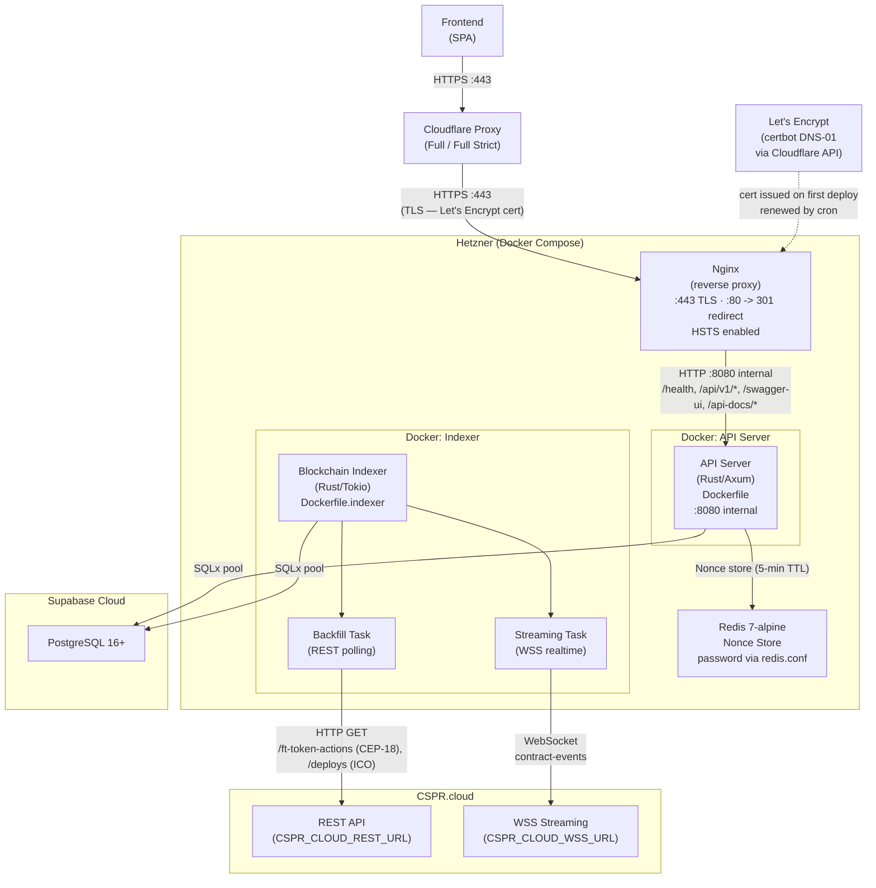
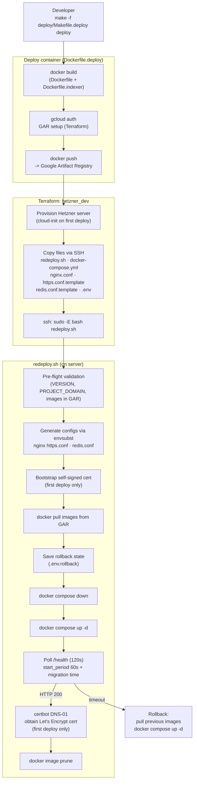

# Deployment Architecture & Cost Diagram

## Overview

This document describes the container topology and estimated monthly infrastructure costs for the LeaseFi platform (Rust API, Blockchain Indexer, and supporting services including frontend).

Deployment is fully automated: `make -f deploy/Makefile.deploy deploy` builds Docker images, pushes them to Google Artifact Registry, provisions the Hetzner server via Terraform, and runs `redeploy.sh` over SSH. Build/test CI (lint, fmt, unit/integration tests) is not yet configured as a GitHub Actions workflow; it currently runs locally via `make ci`.

---

## Architecture Diagram

---

## CI/CD Flow

---

## Monthly Cost Breakdown

| Service | Tier | Cost/mo | Notes |
|---|---|---|---|
| **Vercel** | Free -> Pro | $0 -> ~$20 | Free: 100 GB bandwidth, custom domain, no SLA; Pro adds team + SLA |
| **Supabase** | Free -> Pro | $0 -> ~$25 | Free: 500 MB DB, 1 GB storage (500 MB cap is the binding constraint — indexer continuous writes prevent inactivity pause); Pro: 8 GB DB, daily backups |
| **Hetzner** (API + Redis + Indexer) | CX23 · 2 vCPU / 4 GB / 40 GB SSD | $4.09 | Docker Compose on a single server; IPv4 $0.60/mo already included in $4.09 total |
| **Stripe** | Pay-per-use | 2.9% + $0.30/tx | **Planned — not yet integrated.** No monthly base fee; test mode is free |
| **Resend** | Free -> Pro | $0 -> ~$20 | **Planned — not yet integrated.** Free: 3 000 emails/mo, 100/day; Pro: 50 000/mo |
| **Cloudflare** | Free | $0 | DNS, reverse proxy, DDoS protection. Full / Full (Strict) SSL — Cloudflare validates the Let's Encrypt cert; both legs are TLS |
| **CSPR.cloud** | Pay-per-use | ~$0–50 | Free: 100 000 API req/mo budget; daily cap 6 000/day (two independent limits — first reached applies), 3 simultaneous streaming connections; cost scales above those limits |
| **Google Artifact Registry** | Pay-per-use | ~$0–2 | Storage ~$0.10/GB/mo; egress billed on pulls. Terraform managed; used by the deployment pipeline |
| **Google Cloud Storage** | Pay-per-use | ~$0 | Terraform remote state backend. Standard storage ~$0.02/GB/mo; negligible for state files |
| **Domain + SSL** | — | ~$1.25 | ~$15/yr billed annually; TLS terminated by Nginx (Let's Encrypt) and Vercel (frontend) |

**Estimated total: ~$5.35/mo** on free tiers (dev/MVP) -> **~$70–120/mo** production (paid plans)
