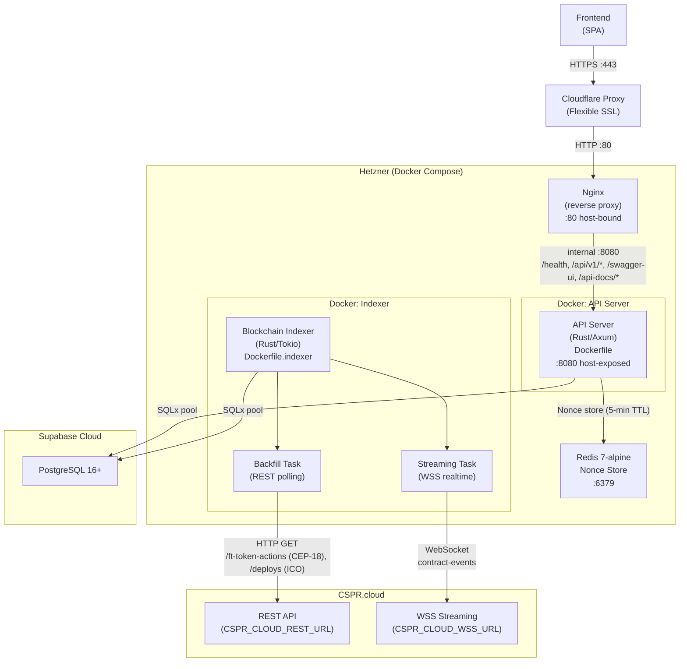

# Deployment Architecture & Cost Diagram

## Overview

This document describes the container topology and estimated monthly infrastructure costs for the LeaseFi platform (Rust API, Blockchain Indexer, and supporting services including frontend). Deployment CI is managed externally (not yet implemented) — it builds Docker images, pushes to GAR, and deploys to Hetzner via SSH. Build/test CI (lint, fmt, unit/integration tests) is not yet configured as a GitHub Actions workflow.

> **Note:** This document reflects the **planned** deployment architecture. Nothing has been deployed to production yet. Some details (e.g. GAR configuration, workflow execution order) may change during implementation.

---

> **Security note:** Cloudflare **Flexible** SSL is configured — Cloudflare terminates TLS with the browser; traffic from Cloudflare to the Hetzner origin is plain HTTP on port 80. **Upgrade path:** switch to Full (Strict) by adding `listen 443 ssl;` to Nginx with a valid origin certificate (Let's Encrypt / certbot) and mapping port `443:443` in Compose.

---

## Architecture Diagram

---

## Monthly Cost Breakdown

| Service | Tier | Cost/mo | Notes |
|---|---|---|---|
| **Vercel** | Free -> Pro | $0 -> ~$20 | Free: 100 GB bandwidth, custom domain, no SLA; Pro adds team + SLA |
| **Supabase** | Free -> Pro | $0 -> ~$25 | Free: 500 MB DB, 1 GB storage (500 MB cap is the binding constraint — indexer continuous writes prevent inactivity pause); Pro: 8 GB DB, daily backups |
| **Hetzner** (API + Redis + Indexer) | CX23 · 2 vCPU / 4 GB / 40 GB SSD | $4.09 | Docker Compose on a single server; IPv4 $0.60/mo already included in $4.09 total |
| **Stripe** | Pay-per-use | 2.9% + $0.30/tx | **Planned — not yet integrated.** No monthly base fee; test mode is free |
| **Resend** | Free -> Pro | $0 -> ~$20 | **Planned — not yet integrated.** Free: 3 000 emails/mo, 100/day; Pro: 50 000/mo |
| **Cloudflare** | Free | $0 | DNS, reverse proxy, DDoS protection, Flexible SSL termination (browser->CF = HTTPS; CF->Hetzner = HTTP :80) |
| **CSPR.cloud** | Pay-per-use | ~$0–50 | Free: 100 000 API req/mo budget; daily cap 6 000/day (two independent limits — first reached applies), 3 simultaneous streaming connections; cost scales above those limits |
| **Google Artifact Registry** | Pay-per-use | ~$0–2 | Storage ~$0.10/GB/mo; egress billed on pulls. Terraform managed (not yet implemented); used by the external deployment CI workflow |
| **Google Cloud Storage** | Pay-per-use | ~$0 | Terraform remote state backend (not yet implemented). Standard storage ~$0.02/GB/mo; negligible for state files |
| **Domain + SSL** | — | ~$1.25 | ~$15/yr billed annually; SSL terminated by Cloudflare (backend) and Vercel (frontend) |

**Estimated total: ~$5.35/mo** on free tiers (dev/MVP) -> **~$70–120/mo** production (paid plans)

---

## CI/CD Flow

**Deployment CI** is managed externally (not yet implemented) — it authenticates to GCP, builds Docker images, pushes them to Google Artifact Registry, and deploys to the Hetzner server via SSH.

**Build/test CI** (lint, fmt, unit/integration tests) is not yet configured as a GitHub Actions workflow. Currently runs locally via `make ci` (check -> fmt + prepare + lint + openapi; then test).

> **TBD:** CI/CD pipeline diagram — to be added once build/test and deployment workflows are implemented.
