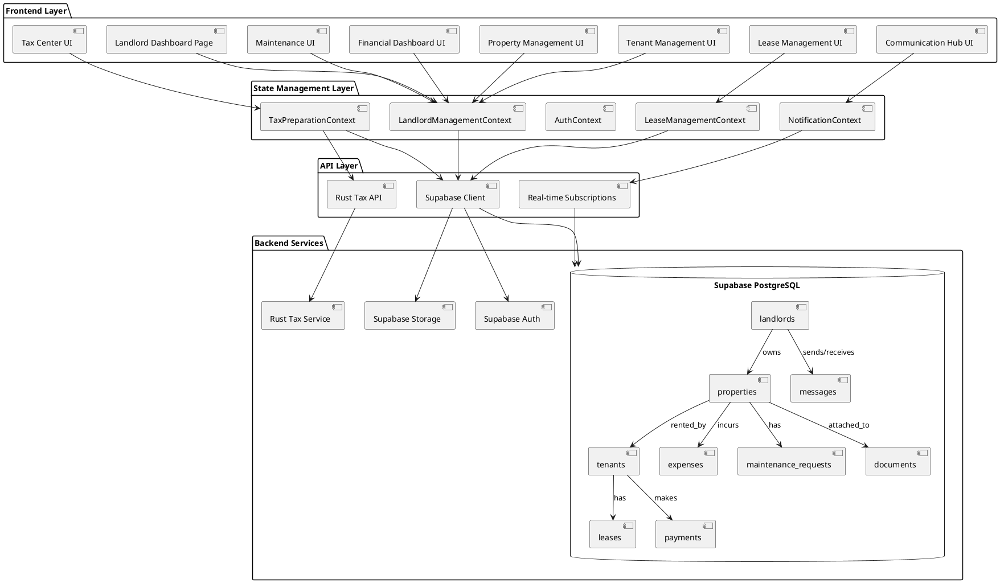
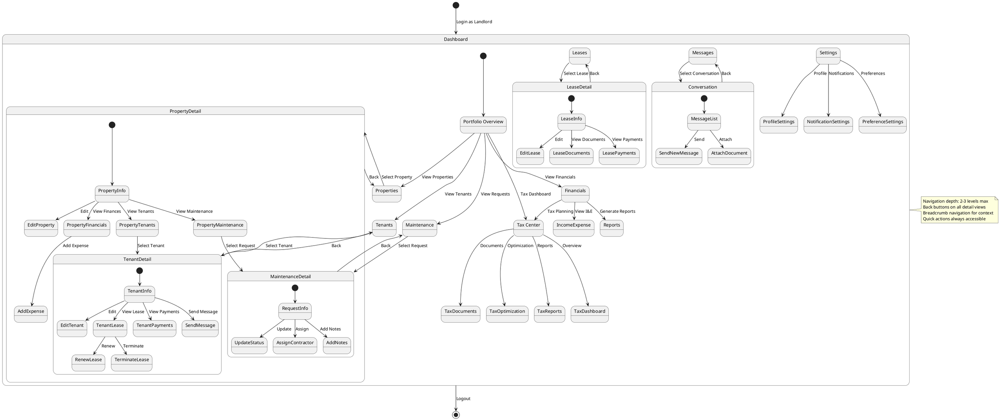
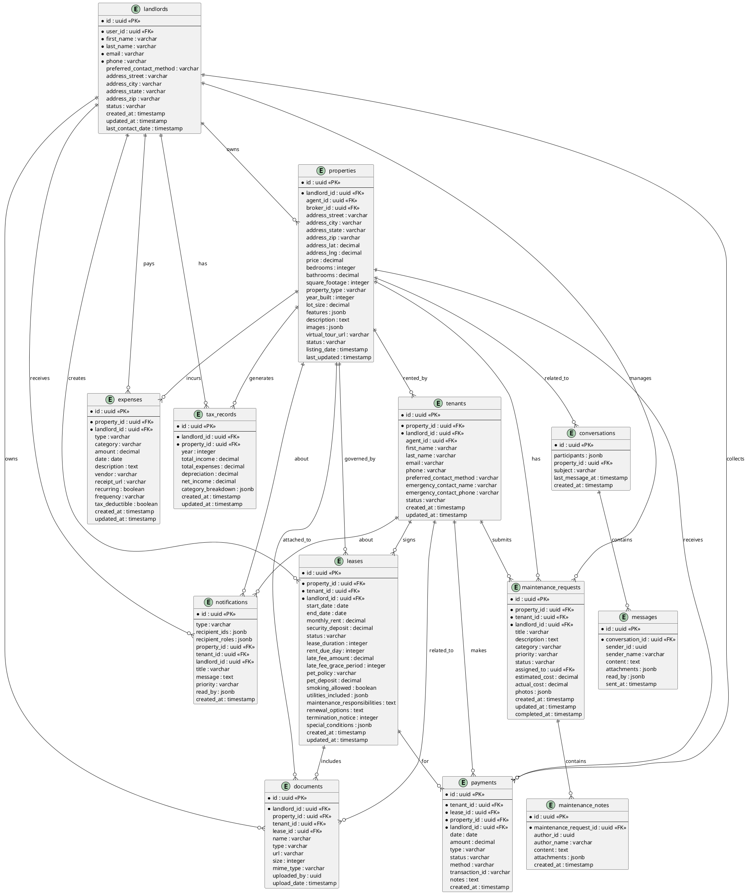

# Landlord Dashboard System Design
**KeyChain Real Estate CRM Platform**

## 1. Implementation Approach

### Overview
The Landlord Dashboard is a comprehensive property management interface designed for landlords to manage multiple rental properties, tenants, leases, maintenance requests, and financial analytics. The dashboard integrates seamlessly with the existing Tax Center and provides real-time insights into portfolio performance.

### Key Technical Decisions

1. **Component Architecture**: Modular, reusable components following atomic design principles
2. **State Management**: React Context API (LandlordManagementContext, TaxPreparationContext) for global state
3. **Data Fetching**: Supabase real-time subscriptions for live updates
4. **Routing**: Next.js App Router with role-based access control
5. **Styling**: Tailwind CSS with Shadcn-ui components for consistency
6. **Backend Integration**: Rust API for tax calculations, Supabase for data persistence

### Critical Requirements

1. **Multi-Property Support**: Landlords can manage multiple properties simultaneously
2. **Real-Time Updates**: Live notifications for tenant activities, payment status, and maintenance requests
3. **Financial Analytics**: Comprehensive income/expense tracking with tax optimization
4. **Tenant Communication**: Integrated messaging system with document sharing
5. **Maintenance Workflow**: Request tracking from submission to completion
6. **Tax Integration**: Seamless connection to Tax Center for year-round tax planning

### Technology Stack

- **Frontend**: React 18, Next.js 14, TypeScript
- **UI Components**: Shadcn-ui, Radix UI, Tailwind CSS
- **State Management**: React Context API
- **Backend**: Supabase (PostgreSQL, Auth, Storage, Real-time)
- **Tax Engine**: Rust API for calculations
- **Charts**: Recharts for data visualization
- **Forms**: React Hook Form with Zod validation
- **Date Handling**: date-fns

## 2. Main User-UI Interaction Patterns

### Primary User Flows

1. **Dashboard Overview Access**
   - Landlord logs in → Redirected to dashboard home
   - Views portfolio summary with key metrics
   - Accesses quick actions for common tasks

2. **Property Management**
   - Views all properties in grid/list view
   - Clicks property card → Opens detailed property view
   - Edits property details, adds photos, updates status
   - Assigns/removes tenants from properties

3. **Tenant Management**
   - Views all tenants across properties
   - Filters by property, lease status, payment status
   - Clicks tenant → Opens tenant profile with lease details
   - Sends messages, views payment history, manages documents

4. **Lease Management**
   - Views active, expiring, and expired leases
   - Creates new lease from template
   - Renews existing lease with updated terms
   - Terminates lease and processes move-out

5. **Financial Operations**
   - Records rent payments (manual or automated)
   - Tracks expenses by property and category
   - Generates financial reports (P&L, cash flow)
   - Exports data for tax preparation

6. **Maintenance Requests**
   - Views all maintenance requests by status
   - Assigns requests to contractors
   - Updates request status and adds notes
   - Uploads photos and completion documentation

7. **Tax Center Integration**
   - Accesses tax dashboard from main navigation
   - Reviews year-to-date income and deductions
   - Receives AI-powered tax optimization suggestions
   - Generates Schedule E and other tax forms

8. **Communication**
   - Sends messages to tenants (individual or broadcast)
   - Receives notifications for important events
   - Shares documents securely with tenants
   - Maintains communication history

### Interaction Patterns

- **Card-Based Navigation**: Primary content displayed in interactive cards
- **Modal Dialogs**: Forms and detailed views open in modals for quick actions
- **Slide-Over Panels**: Property/tenant details slide from right for context
- **Inline Editing**: Click-to-edit for quick updates without page reload
- **Drag-and-Drop**: Reorder properties, upload documents
- **Contextual Actions**: Right-click or three-dot menus for item-specific actions

## 3. System Architecture



## 4. UI Navigation Flow



## 5. Data Structures and Interfaces

```plantuml
@startuml

interface ILandlordDashboardProps {
  +landlordId: string
  +onNavigate?: (route: string) => void
}

interface IPropertyCardProps {
  +property: Property
  +tenants: Tenant[]
  +onClick: () => void
  +onEdit: () => void
  +onViewFinancials: () => void
}

interface ITenantCardProps {
  +tenant: Tenant
  +property: Property
  +lease: Lease
  +onClick: () => void
  +onMessage: () => void
}

interface IMaintenanceRequestProps {
  +request: MaintenanceRequest
  +property: Property
  +onStatusChange: (status: string) => void
  +onAssign: (contractorId: string) => void
}

interface IFinancialSummaryProps {
  +landlordId: string
  +properties: Property[]
  +dateRange: DateRange
  +onExport: () => void
}

class LandlordDashboard {
  +landlordId: string
  +properties: Property[]
  +tenants: Tenant[]
  +leases: Lease[]
  +maintenanceRequests: MaintenanceRequest[]
  +financialMetrics: FinancialMetrics
  +render(): JSX.Element
}

class PropertyManagementPanel {
  +properties: Property[]
  +viewMode: 'grid' | 'list'
  +filterBy: PropertyFilter
  +sortBy: string
  +renderPropertyCard(property: Property): JSX.Element
  +handlePropertyClick(propertyId: string): void
  +handleAddProperty(): void
}

class TenantManagementPanel {
  +tenants: Tenant[]
  +filterBy: TenantFilter
  +sortBy: string
  +renderTenantCard(tenant: Tenant): JSX.Element
  +handleTenantClick(tenantId: string): void
  +handleSendMessage(tenantId: string): void
}

class LeaseManagementPanel {
  +leases: Lease[]
  +expiringLeases: Lease[]
  +filterBy: LeaseFilter
  +renderLeaseCard(lease: Lease): JSX.Element
  +handleRenewLease(leaseId: string): void
  +handleCreateLease(): void
}

class MaintenancePanel {
  +requests: MaintenanceRequest[]
  +filterBy: MaintenanceFilter
  +groupBy: 'status' | 'property' | 'priority'
  +renderRequestCard(request: MaintenanceRequest): JSX.Element
  +handleStatusUpdate(requestId: string, status: string): void
  +handleAssignContractor(requestId: string, contractorId: string): void
}

class FinancialDashboard {
  +landlordId: string
  +dateRange: DateRange
  +incomeData: IncomeData[]
  +expenseData: ExpenseData[]
  +metrics: FinancialMetrics
  +renderIncomeChart(): JSX.Element
  +renderExpenseBreakdown(): JSX.Element
  +renderCashFlowChart(): JSX.Element
  +handleExportReport(): void
}

class TaxCenterIntegration {
  +landlordId: string
  +taxYear: number
  +taxSummary: TaxSummary
  +optimizationSuggestions: Suggestion[]
  +renderTaxDashboard(): JSX.Element
  +handleGenerateScheduleE(): void
  +handleExportTaxData(): void
}

class CommunicationHub {
  +landlordId: string
  +conversations: Conversation[]
  +unreadCount: number
  +renderConversationList(): JSX.Element
  +handleSendMessage(recipientId: string, message: string): void
  +handleBroadcastMessage(recipientIds: string[], message: string): void
}

' Relationships
LandlordDashboard *-- PropertyManagementPanel
LandlordDashboard *-- TenantManagementPanel
LandlordDashboard *-- LeaseManagementPanel
LandlordDashboard *-- MaintenancePanel
LandlordDashboard *-- FinancialDashboard
LandlordDashboard *-- TaxCenterIntegration
LandlordDashboard *-- CommunicationHub

PropertyManagementPanel ..> IPropertyCardProps
TenantManagementPanel ..> ITenantCardProps
MaintenancePanel ..> IMaintenanceRequestProps
FinancialDashboard ..> IFinancialSummaryProps

@enduml
```



### Core Type Definitions

```typescript
// Dashboard Types
interface LandlordDashboardMetrics {
  totalProperties: number;
  occupiedProperties: number;
  vacantProperties: number;
  totalTenants: number;
  monthlyIncome: number;
  monthlyExpenses: number;
  netCashFlow: number;
  occupancyRate: number;
  averageRent: number;
  maintenanceRequestsPending: number;
  leasesExpiringThisMonth: number;
  overduePayments: number;
}

// Property Types
interface Property {
  id: string;
  landlordId: string;
  agentId: string;
  brokerId: string;
  tenantIds: string[];
  details: PropertyDetails;
  status: 'available' | 'rented' | 'maintenance' | 'sold';
  listingDate: Date;
  lastUpdated: Date;
  financialInfo: PropertyFinancialInfo;
}

interface PropertyFinancialInfo {
  monthlyIncome?: number;
  expenses: PropertyExpense[];
  taxInfo?: TaxInformation;
  mortgageInfo?: MortgageInfo;
}

// Maintenance Types
interface MaintenanceRequest {
  id: string;
  propertyId: string;
  tenantId: string;
  landlordId: string;
  title: string;
  description: string;
  category: 'plumbing' | 'electrical' | 'hvac' | 'appliance' | 'structural' | 'other';
  priority: 'low' | 'medium' | 'high' | 'urgent';
  status: 'submitted' | 'acknowledged' | 'in-progress' | 'completed' | 'cancelled';
  assignedTo?: string;
  estimatedCost?: number;
  actualCost?: number;
  photos: string[];
  notes: MaintenanceNote[];
  createdAt: Date;
  updatedAt: Date;
  completedAt?: Date;
}

interface MaintenanceNote {
  id: string;
  authorId: string;
  authorName: string;
  content: string;
  createdAt: Date;
  attachments?: string[];
}

// Lease Types
interface Lease {
  id: string;
  propertyId: string;
  tenantId: string;
  landlordId: string;
  startDate: Date;
  endDate: Date;
  monthlyRent: number;
  securityDeposit: number;
  status: 'active' | 'expiring' | 'expired' | 'terminated';
  terms: LeaseTerms;
  documents: LeaseDocument[];
  renewalHistory: LeaseRenewal[];
  createdAt: Date;
  updatedAt: Date;
}

interface LeaseTerms {
  leaseDuration: number; // months
  rentDueDay: number; // day of month
  lateFeeAmount: number;
  lateFeeGracePeriod: number; // days
  petPolicy: 'allowed' | 'not-allowed' | 'conditional';
  petDeposit?: number;
  smokingAllowed: boolean;
  utilitiesIncluded: string[];
  maintenanceResponsibilities: string;
  renewalOptions: string;
  terminationNotice: number; // days
  specialConditions: string[];
}

// Financial Types
interface FinancialMetrics {
  totalIncome: number;
  totalExpenses: number;
  netIncome: number;
  cashFlow: number;
  roi: number;
  capRate: number;
  expenseRatio: number;
  vacancyRate: number;
}

interface IncomeData {
  propertyId: string;
  month: string;
  rentIncome: number;
  otherIncome: number;
  totalIncome: number;
}

interface ExpenseData {
  propertyId: string;
  category: string;
  amount: number;
  date: Date;
  description: string;
  recurring: boolean;
}

// Communication Types
interface Conversation {
  id: string;
  participants: string[];
  propertyId?: string;
  subject: string;
  messages: Message[];
  unreadCount: number;
  lastMessageAt: Date;
  createdAt: Date;
}

interface Message {
  id: string;
  conversationId: string;
  senderId: string;
  senderName: string;
  content: string;
  attachments: MessageAttachment[];
  readBy: string[];
  sentAt: Date;
}

interface MessageAttachment {
  id: string;
  name: string;
  url: string;
  type: string;
  size: number;
}
```

## 6. Program Call Flow

```plantuml
@startuml
actor Landlord
participant "LandlordDashboard" as Dashboard
participant "LandlordManagementContext" as Context
participant "SupabaseClient" as Supabase
participant "RustTaxAPI" as RustAPI
database "PostgreSQL" as DB

== Dashboard Initialization ==
Landlord -> Dashboard: Access dashboard
activate Dashboard
Dashboard -> Context: useLandlordManagement()
activate Context
Context -> Supabase: fetchLandlordData(landlordId)
activate Supabase
Supabase -> DB: SELECT * FROM landlords WHERE id = ?
note right
  Input: {
    "landlordId": "string"
  }
end note
DB --> Supabase: landlord data
Supabase --> Context: landlord object
deactivate Supabase

Context -> Supabase: fetchProperties(landlordId)
activate Supabase
Supabase -> DB: SELECT * FROM properties WHERE landlord_id = ?
DB --> Supabase: properties array
Supabase --> Context: properties[]
deactivate Supabase

Context -> Supabase: fetchTenants(propertyIds)
activate Supabase
Supabase -> DB: SELECT * FROM tenants WHERE property_id IN (?)
DB --> Supabase: tenants array
Supabase --> Context: tenants[]
deactivate Supabase

Context -> Supabase: fetchLeases(propertyIds)
activate Supabase
Supabase -> DB: SELECT * FROM leases WHERE property_id IN (?)
DB --> Supabase: leases array
Supabase --> Context: leases[]
deactivate Supabase

Context --> Dashboard: {properties, tenants, leases, loading: false}
note right
  Output: {
    "properties": Property[],
    "tenants": Tenant[],
    "leases": Lease[],
    "metrics": DashboardMetrics,
    "loading": boolean
  }
end note
deactivate Context

Dashboard -> Dashboard: calculateMetrics()
Dashboard --> Landlord: Display dashboard
deactivate Dashboard

== Property Management ==
Landlord -> Dashboard: Click "Add Property"
activate Dashboard
Dashboard -> Dashboard: openPropertyModal()
Dashboard --> Landlord: Show property form
Landlord -> Dashboard: Submit property data
Dashboard -> Context: createProperty(propertyData)
activate Context
Context -> Supabase: insertProperty(propertyData)
activate Supabase
Supabase -> DB: INSERT INTO properties VALUES (...)
note right
  Input: {
    "landlordId": "string",
    "details": {
      "address": Address,
      "price": number,
      "bedrooms": number,
      "bathrooms": number,
      "squareFootage": number,
      "propertyType": string,
      "features": string[]
    },
    "status": "available"
  }
end note
DB --> Supabase: new property id
Supabase --> Context: property object
deactivate Supabase

Context -> Context: updatePropertiesList()
Context --> Dashboard: {success: true, property}
note right
  Output: {
    "success": boolean,
    "property": Property
  }
end note
deactivate Context
Dashboard -> Dashboard: refreshDashboard()
Dashboard --> Landlord: Show success message
deactivate Dashboard

== Maintenance Request Handling ==
Landlord -> Dashboard: View maintenance requests
activate Dashboard
Dashboard -> Context: getMaintenanceRequests(landlordId)
activate Context
Context -> Supabase: fetchMaintenanceRequests(landlordId)
activate Supabase
Supabase -> DB: SELECT * FROM maintenance_requests WHERE landlord_id = ?
DB --> Supabase: requests array
Supabase --> Context: maintenanceRequests[]
deactivate Supabase
Context --> Dashboard: maintenanceRequests[]
deactivate Context
Dashboard --> Landlord: Display requests

Landlord -> Dashboard: Update request status
Dashboard -> Context: updateMaintenanceRequest(requestId, updates)
activate Context
Context -> Supabase: updateRequest(requestId, updates)
activate Supabase
Supabase -> DB: UPDATE maintenance_requests SET status = ?, updated_at = ? WHERE id = ?
note right
  Input: {
    "requestId": "string",
    "updates": {
      "status": "in-progress" | "completed",
      "assignedTo": "string",
      "actualCost": number,
      "notes": string
    }
  }
end note
DB --> Supabase: updated request
Supabase --> Context: request object
deactivate Supabase

Context -> Supabase: createNotification(notification)
activate Supabase
Supabase -> DB: INSERT INTO notifications VALUES (...)
DB --> Supabase: notification id
Supabase --> Context: notification created
deactivate Supabase

Context --> Dashboard: {success: true, request}
note right
  Output: {
    "success": boolean,
    "request": MaintenanceRequest
  }
end note
deactivate Context
Dashboard --> Landlord: Show updated request
deactivate Dashboard

== Financial Analytics ==
Landlord -> Dashboard: View financial dashboard
activate Dashboard
Dashboard -> Context: getFinancialData(landlordId, dateRange)
activate Context
Context -> Supabase: fetchIncomeData(landlordId, dateRange)
activate Supabase
Supabase -> DB: SELECT * FROM payments WHERE landlord_id = ? AND date BETWEEN ? AND ?
DB --> Supabase: income records
Supabase --> Context: incomeData[]
deactivate Supabase

Context -> Supabase: fetchExpenseData(landlordId, dateRange)
activate Supabase
Supabase -> DB: SELECT * FROM expenses WHERE landlord_id = ? AND date BETWEEN ? AND ?
DB --> Supabase: expense records
Supabase --> Context: expenseData[]
deactivate Supabase

Context -> Context: calculateFinancialMetrics()
Context --> Dashboard: {income, expenses, metrics}
note right
  Output: {
    "income": IncomeData[],
    "expenses": ExpenseData[],
    "metrics": {
      "totalIncome": number,
      "totalExpenses": number,
      "netIncome": number,
      "cashFlow": number,
      "roi": number
    }
  }
end note
deactivate Context
Dashboard --> Landlord: Display financial charts
deactivate Dashboard

== Tax Center Integration ==
Landlord -> Dashboard: Navigate to Tax Center
activate Dashboard
Dashboard -> Context: loadTaxYearSummary(landlordId, taxYear)
activate Context
Context -> Supabase: fetchTaxData(landlordId, taxYear)
activate Supabase
Supabase -> DB: SELECT * FROM tax_records WHERE landlord_id = ? AND year = ?
DB --> Supabase: tax records
Supabase --> Context: taxData
deactivate Supabase

Context -> RustAPI: calculateTaxLiability(taxData)
activate RustAPI
RustAPI -> RustAPI: processTaxCalculations()
RustAPI --> Context: taxReport
note right
  Output: {
    "fiscal_year": number,
    "total_taxable_income": number,
    "total_deductions": number,
    "estimated_tax": number,
    "breakdown": CategoryBreakdown[]
  }
end note
deactivate RustAPI

Context --> Dashboard: {taxSummary, taxReport}
deactivate Context
Dashboard --> Landlord: Display tax dashboard
deactivate Dashboard

== Real-time Updates ==
DB -> Supabase: Tenant payment received
activate Supabase
Supabase -> Context: Real-time subscription event
activate Context
Context -> Context: updatePaymentHistory()
Context -> Dashboard: Trigger re-render
activate Dashboard
Dashboard --> Landlord: Show notification + updated data
deactivate Dashboard
deactivate Context
deactivate Supabase

@enduml
```



## 7. Database ER Diagram



## 8. Component Specifications

### 8.1 LandlordDashboard (Main Component)

**Purpose**: Root dashboard component that orchestrates all sub-components

**Props**:
```typescript
interface LandlordDashboardProps {
  landlordId: string;
}
```

**State**:
- `activeView`: 'overview' | 'properties' | 'tenants' | 'leases' | 'financials' | 'maintenance' | 'tax' | 'messages'
- `selectedProperty`: Property | null
- `selectedTenant`: Tenant | null
- `dateRange`: { start: Date; end: Date }

**Key Methods**:
- `handleNavigate(view: string): void`
- `handlePropertySelect(property: Property): void`
- `handleTenantSelect(tenant: Tenant): void`
- `refreshDashboard(): Promise<void>`

### 8.2 PortfolioOverview

**Purpose**: Display high-level metrics and quick actions

**Features**:
- Total properties count (occupied/vacant)
- Monthly income/expenses
- Occupancy rate
- Pending maintenance requests
- Expiring leases alert
- Quick action buttons

### 8.3 PropertyManagementPanel

**Purpose**: Manage all properties owned by landlord

**Features**:
- Grid/list view toggle
- Property cards with key info
- Filter by status, type, location
- Sort by various criteria
- Add new property button
- Bulk actions (export, update status)

### 8.4 TenantManagementPanel

**Purpose**: Manage all tenants across properties

**Features**:
- Tenant cards with photo and key info
- Filter by property, lease status, payment status
- Search by name, email, phone
- Quick message button
- View payment history
- Lease renewal reminders

### 8.5 LeaseManagementPanel

**Purpose**: Track and manage all leases

**Features**:
- Active leases list
- Expiring leases (30/60/90 days)
- Lease renewal workflow
- Lease templates
- Document generation (PDF)
- E-signature integration

### 8.6 MaintenanceRequestPanel

**Purpose**: Handle maintenance requests from tenants

**Features**:
- Kanban board (submitted/in-progress/completed)
- Priority indicators
- Photo attachments
- Contractor assignment
- Cost tracking
- Status updates with notifications

### 8.7 FinancialDashboard

**Purpose**: Track income, expenses, and profitability

**Features**:
- Income vs. Expenses chart
- Cash flow timeline
- Expense breakdown by category
- Property-level P&L
- ROI calculator
- Export to CSV/Excel

### 8.8 TaxCenterIntegration

**Purpose**: Seamless access to tax features

**Features**:
- Year-to-date summary
- Deduction tracker
- Schedule E generation
- AI tax optimization
- CPA collaboration portal
- Document vault

### 8.9 CommunicationHub

**Purpose**: Centralized messaging with tenants

**Features**:
- Conversation threads
- Broadcast messages
- Document sharing
- Read receipts
- Message templates
- Notification preferences

## 9. Role-Based Access Control

### Landlord Permissions

**Full Access**:
- View all owned properties
- Manage tenants for owned properties
- Create/edit/delete leases
- Record payments and expenses
- View financial reports
- Access tax center
- Send messages to tenants
- Manage maintenance requests

**Restricted**:
- Cannot access other landlords' data
- Cannot modify agent/broker assignments
- Cannot access system administration

### Implementation

```typescript
// middleware/auth.ts
export async function checkLandlordAccess(
  userId: string,
  resourceType: 'property' | 'tenant' | 'lease',
  resourceId: string
): Promise<boolean> {
  const { data: landlord } = await supabase
    .from('landlords')
    .select('id')
    .eq('user_id', userId)
    .single();

  if (!landlord) return false;

  switch (resourceType) {
    case 'property':
      const { data: property } = await supabase
        .from('properties')
        .select('landlord_id')
        .eq('id', resourceId)
        .single();
      return property?.landlord_id === landlord.id;

    case 'tenant':
      const { data: tenant } = await supabase
        .from('tenants')
        .select('landlord_id')
        .eq('id', resourceId)
        .single();
      return tenant?.landlord_id === landlord.id;

    case 'lease':
      const { data: lease } = await supabase
        .from('leases')
        .select('landlord_id')
        .eq('id', resourceId)
        .single();
      return lease?.landlord_id === landlord.id;

    default:
      return false;
  }
}
```

### Row-Level Security (Supabase)

```sql
-- Properties table RLS
CREATE POLICY "Landlords can view own properties"
  ON properties FOR SELECT
  USING (landlord_id IN (
    SELECT id FROM landlords WHERE user_id = auth.uid()
  ));

CREATE POLICY "Landlords can update own properties"
  ON properties FOR UPDATE
  USING (landlord_id IN (
    SELECT id FROM landlords WHERE user_id = auth.uid()
  ));

-- Tenants table RLS
CREATE POLICY "Landlords can view own tenants"
  ON tenants FOR SELECT
  USING (landlord_id IN (
    SELECT id FROM landlords WHERE user_id = auth.uid()
  ));

-- Leases table RLS
CREATE POLICY "Landlords can manage own leases"
  ON leases FOR ALL
  USING (landlord_id IN (
    SELECT id FROM landlords WHERE user_id = auth.uid()
  ));

-- Payments table RLS
CREATE POLICY "Landlords can view own payments"
  ON payments FOR SELECT
  USING (landlord_id IN (
    SELECT id FROM landlords WHERE user_id = auth.uid()
  ));

-- Expenses table RLS
CREATE POLICY "Landlords can manage own expenses"
  ON expenses FOR ALL
  USING (landlord_id IN (
    SELECT id FROM landlords WHERE user_id = auth.uid()
  ));
```

## 10. Integration Points

### 10.1 Property Management Module
- **Data Flow**: LandlordManagementContext ↔ Supabase properties table
- **Components**: PropertyManagementPanel, PropertyCard, PropertyDetailModal
- **Actions**: Create, Read, Update, Delete properties

### 10.2 Lease Management Module
- **Data Flow**: LeaseManagementContext ↔ Supabase leases table
- **Components**: LeaseManagementPanel, LeaseCard, LeaseRenewalWizard
- **Actions**: Create leases, renew leases, terminate leases, generate documents

### 10.3 Tenant Management Module
- **Data Flow**: LandlordManagementContext ↔ Supabase tenants table
- **Components**: TenantManagementPanel, TenantCard, TenantDetailModal
- **Actions**: Add tenants, update tenant info, view payment history

### 10.4 Tax Center
- **Data Flow**: TaxPreparationContext ↔ Rust API + Supabase
- **Components**: TaxDashboard, TaxDocumentGenerator, AITaxAssistant
- **Actions**: Calculate tax liability, generate Schedule E, optimize deductions

### 10.5 Analytics Module
- **Data Flow**: Aggregated data from payments, expenses, properties
- **Components**: FinancialDashboard, IncomeExpenseChart, ROICalculator
- **Actions**: Generate reports, export data, visualize trends

### 10.6 Notification System
- **Data Flow**: NotificationContext ↔ Supabase real-time subscriptions
- **Components**: NotificationBell, NotificationList, NotificationPreferences
- **Actions**: Create notifications, mark as read, configure preferences

## 11. Performance Considerations

### Optimization Strategies

1. **Data Pagination**: Limit initial load to 20 properties/tenants
2. **Lazy Loading**: Load detailed data only when needed
3. **Caching**: Cache frequently accessed data in Context
4. **Real-time Subscriptions**: Use selective subscriptions for critical updates
5. **Image Optimization**: Use Next.js Image component with lazy loading
6. **Code Splitting**: Lazy load heavy components (charts, PDF generators)
7. **Debouncing**: Debounce search and filter inputs
8. **Memoization**: Use React.memo for expensive components

### Monitoring

- Track page load times
- Monitor API response times
- Log slow queries
- Track user interactions
- Monitor error rates

## 12. Security Considerations

### Data Protection

1. **Authentication**: Supabase Auth with JWT tokens
2. **Authorization**: Row-level security policies
3. **Data Encryption**: HTTPS for all communications
4. **File Storage**: Secure Supabase Storage with access policies
5. **Input Validation**: Zod schemas for all forms
6. **XSS Prevention**: React's built-in escaping
7. **CSRF Protection**: Supabase CSRF tokens

### Privacy

- PII encryption at rest
- Audit logs for sensitive operations
- Data retention policies
- GDPR compliance features
- User consent management

## 13. Testing Strategy

### Unit Tests
- Component rendering
- State management logic
- Utility functions
- Data transformations

### Integration Tests
- Context providers
- API interactions
- Form submissions
- Navigation flows

### E2E Tests (Playwright)
- Complete user workflows
- Multi-property management
- Lease creation and renewal
- Payment recording
- Maintenance request handling

## 14. Deployment Considerations

### Environment Variables
```env
NEXT_PUBLIC_SUPABASE_URL=
NEXT_PUBLIC_SUPABASE_ANON_KEY=
RUST_API_URL=
NEXT_PUBLIC_APP_URL=
```

### Build Configuration
- Next.js production build
- Environment-specific configs
- CDN integration for static assets
- Database migration scripts

### Monitoring & Logging
- Sentry for error tracking
- Vercel Analytics for performance
- Custom logging for business events
- Real-time alerting for critical issues

## 15. Future Enhancements

### Phase 2 Features
1. Mobile app (React Native)
2. Automated rent collection
3. Tenant screening integration
4. Smart home integration
5. Predictive maintenance AI
6. Market analysis tools
7. Multi-language support
8. White-label options

### Scalability
- Microservices architecture
- GraphQL API layer
- Redis caching
- Load balancing
- Database sharding

## 16. Unclear Aspects / Assumptions

### Clarifications Needed

1. **Payment Processing**: Which payment gateway should be integrated? (Stripe, PayPal, Square?)
2. **Document Storage Limits**: What are the storage limits per landlord?
3. **Contractor Management**: Should contractors have their own portal access?
4. **Tenant Portal**: Should tenants have a separate login to view their lease and make payments?
5. **Multi-Currency Support**: Is international property management required?
6. **Compliance**: Are there specific regional regulations to comply with (e.g., rent control laws)?
7. **Backup & Recovery**: What is the disaster recovery plan and backup frequency?
8. **API Rate Limits**: What are the rate limits for Rust API and Supabase?

### Assumptions Made

1. **Single Landlord View**: Dashboard designed for individual landlord use (not property management companies)
2. **US Market Focus**: Date formats, currency, and regulations assume US market
3. **English Language**: Initial release in English only
4. **Modern Browsers**: Supports latest versions of Chrome, Firefox, Safari, Edge
5. **Internet Connectivity**: Requires stable internet connection (no offline mode in MVP)
6. **Property Limit**: Assumes landlords manage 1-50 properties (not enterprise scale)
7. **Supabase Tier**: Assumes Pro tier or higher for production use
8. **Tax Compliance**: Tax calculations are estimates; users should consult tax professionals

---

**Document Version**: 1.0  
**Last Updated**: 2025-12-09  
**Author**: Bob (System Architect)  
**Review Status**: Ready for Development