# Visual Documentation Guide

**Document Version:** 1.0  
**Created:** January 6, 2026  
**Author:** Emma (Product Manager)  
**Purpose:** Comprehensive visual elements to enhance platform documentation

---

## Table of Contents

1. [User Journey Diagrams](#1-user-journey-diagrams)
2. [Workflow Diagrams](#2-workflow-diagrams)
3. [Architecture Diagrams](#3-architecture-diagrams)
4. [Feature Screenshots Guide](#4-feature-screenshots-guide)
5. [UI Component Diagrams](#5-ui-component-diagrams)
6. [Data Flow Diagrams](#6-data-flow-diagrams)

---

## 1. User Journey Diagrams

### 1.1 Landlord Onboarding Journey

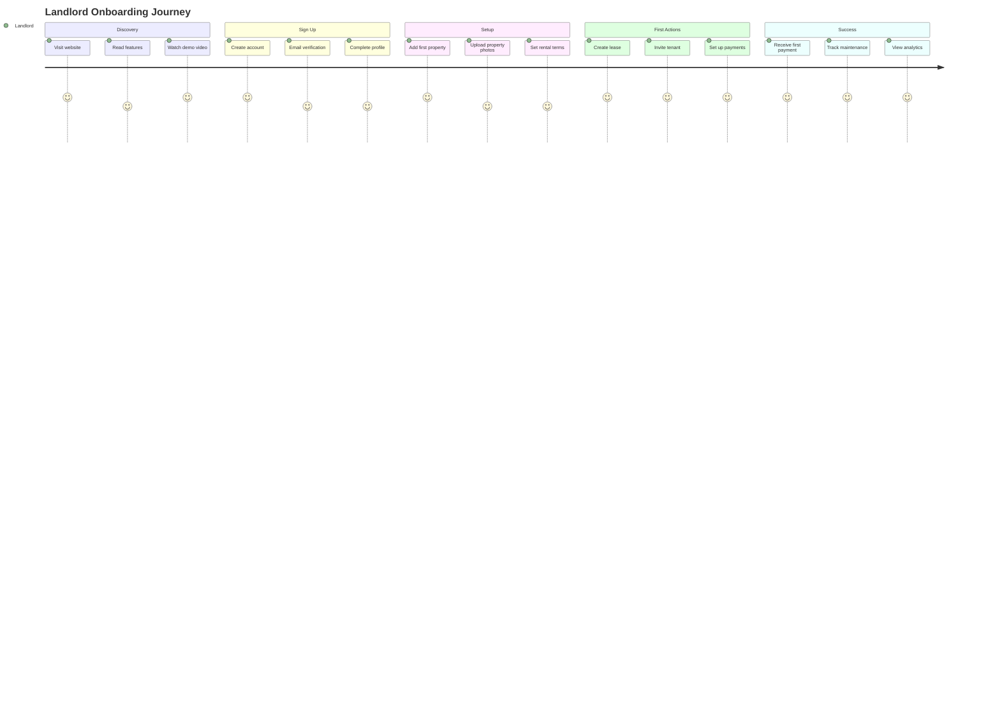

### 1.2 Tenant Onboarding Journey

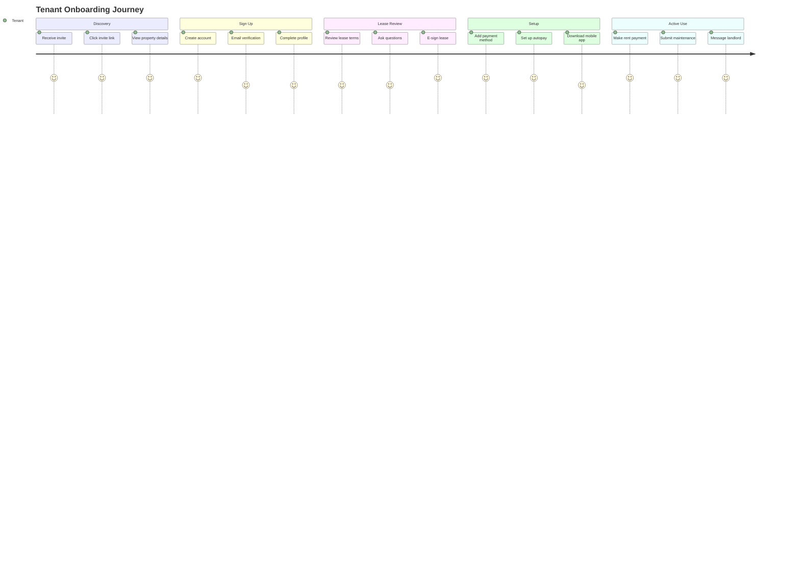

### 1.3 Property Manager Journey

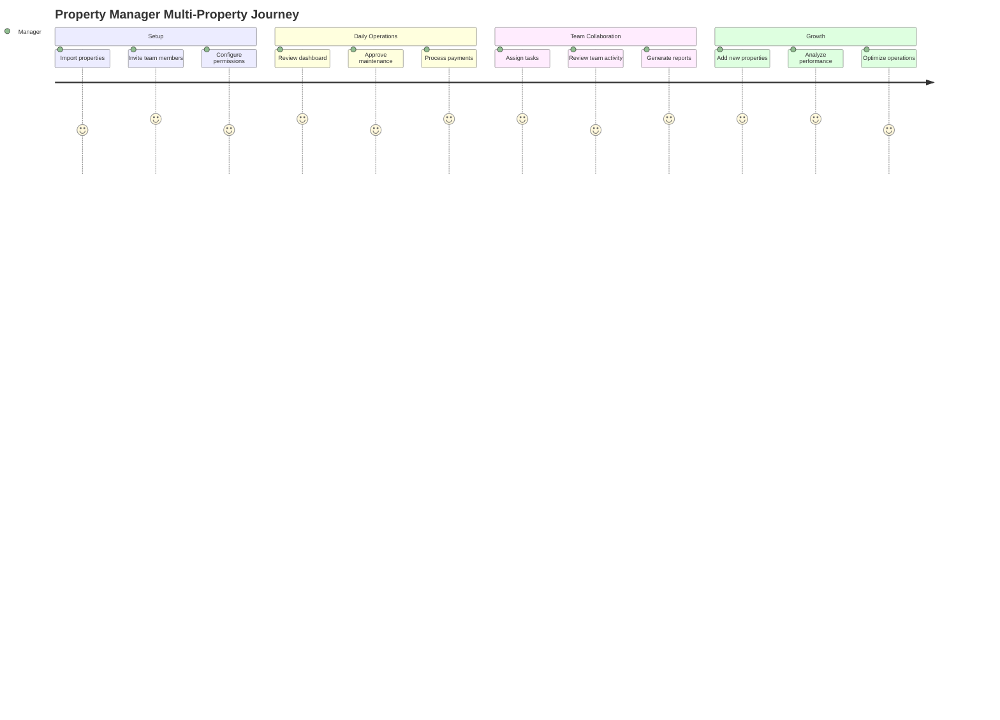

---

## 2. Workflow Diagrams

### 2.1 Lease Creation Workflow

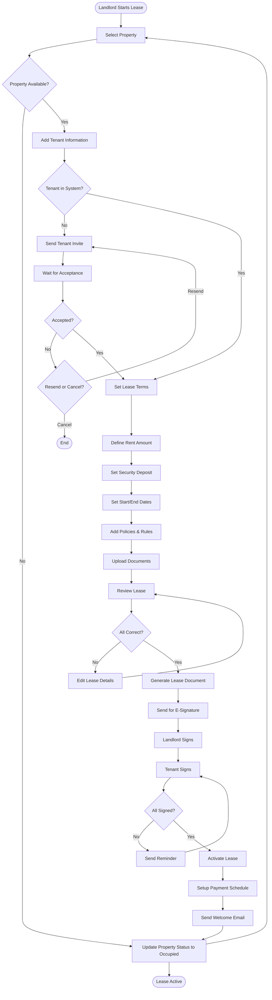

### 2.2 Maintenance Request Workflow

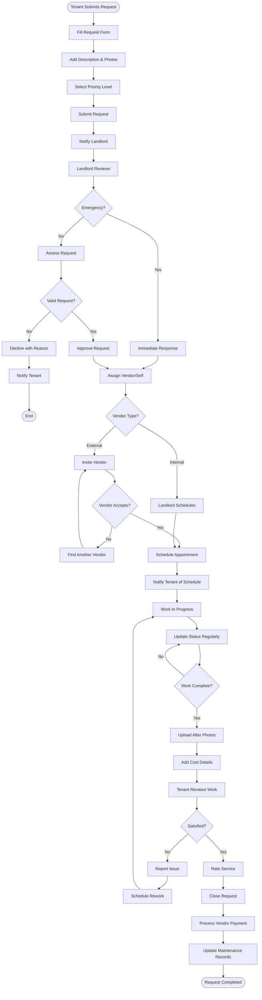

### 2.3 Payment Processing Workflow

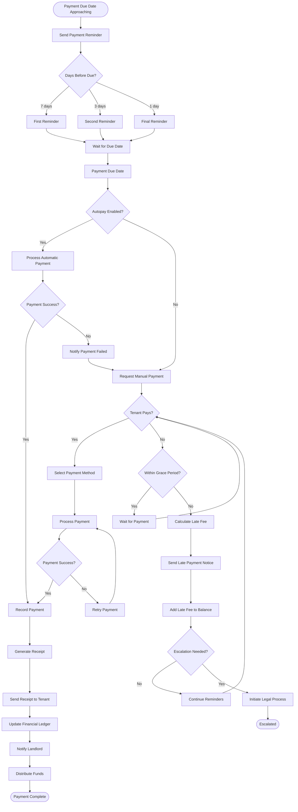

### 2.4 Lease Renewal Workflow

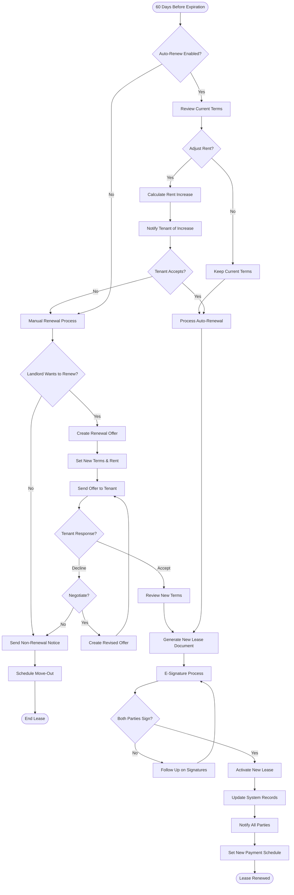

---

## 3. Architecture Diagrams

### 3.1 System Architecture Overview

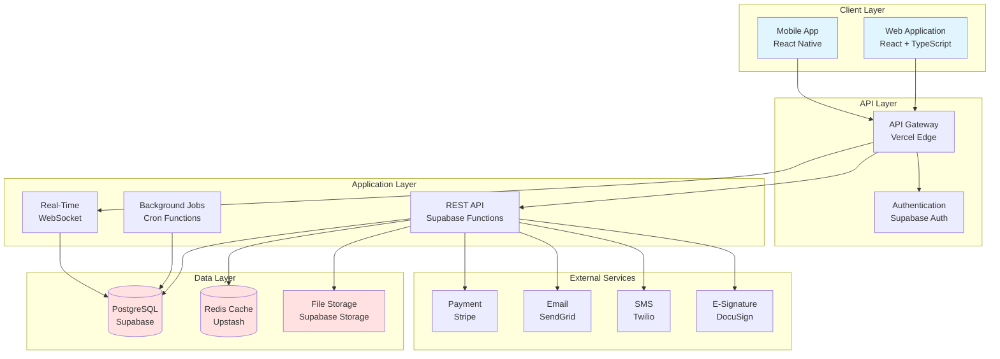

### 3.2 Database Schema Overview

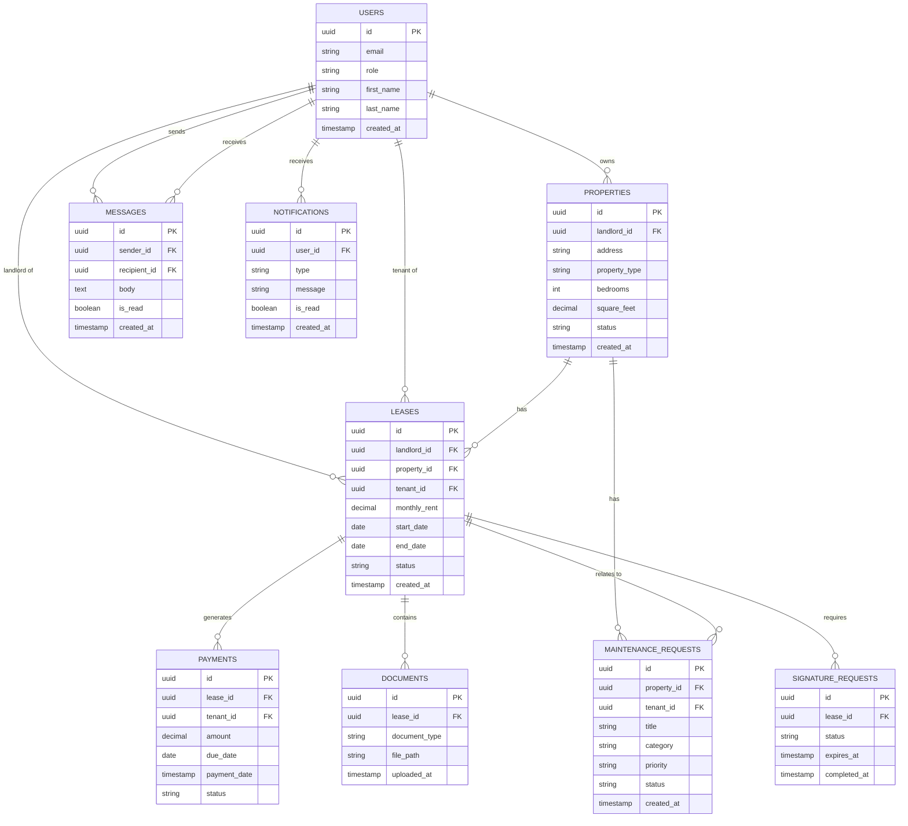

### 3.3 Authentication Flow

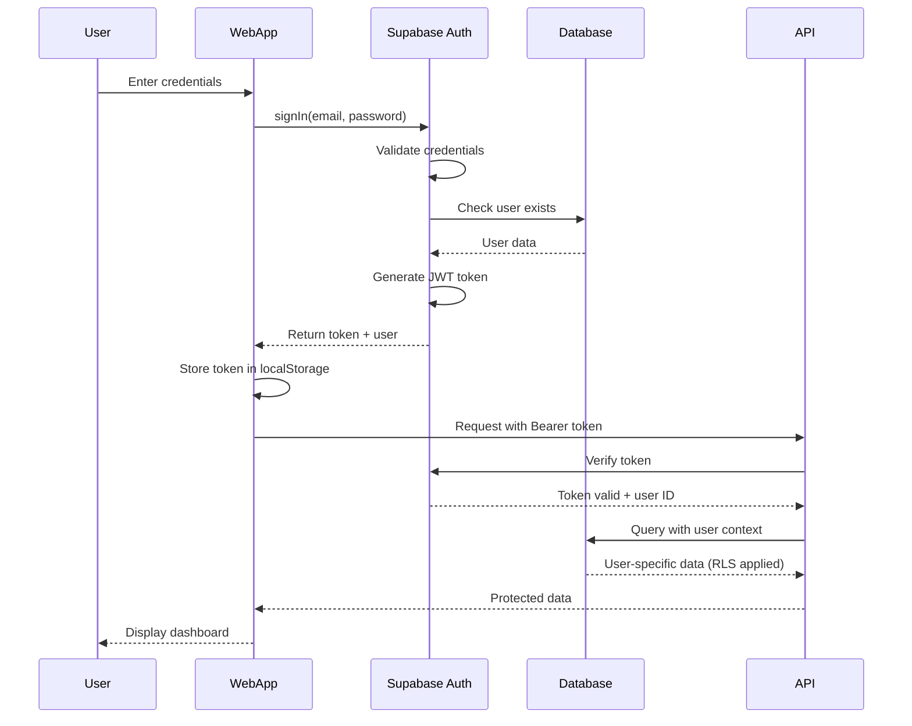

### 3.4 Payment Processing Flow

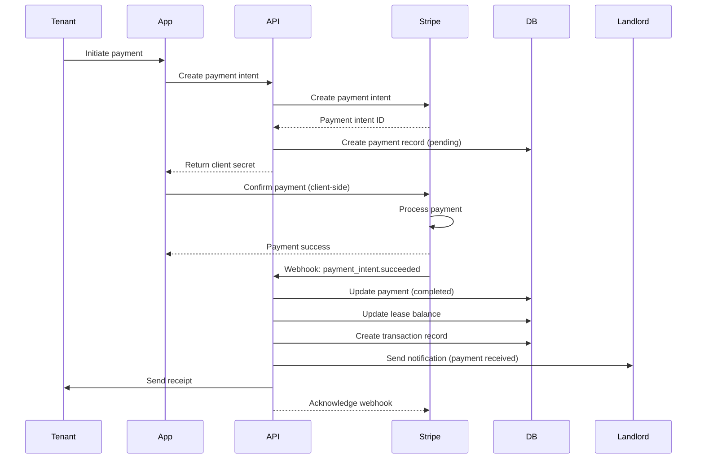

### 3.5 Real-Time Notification Flow

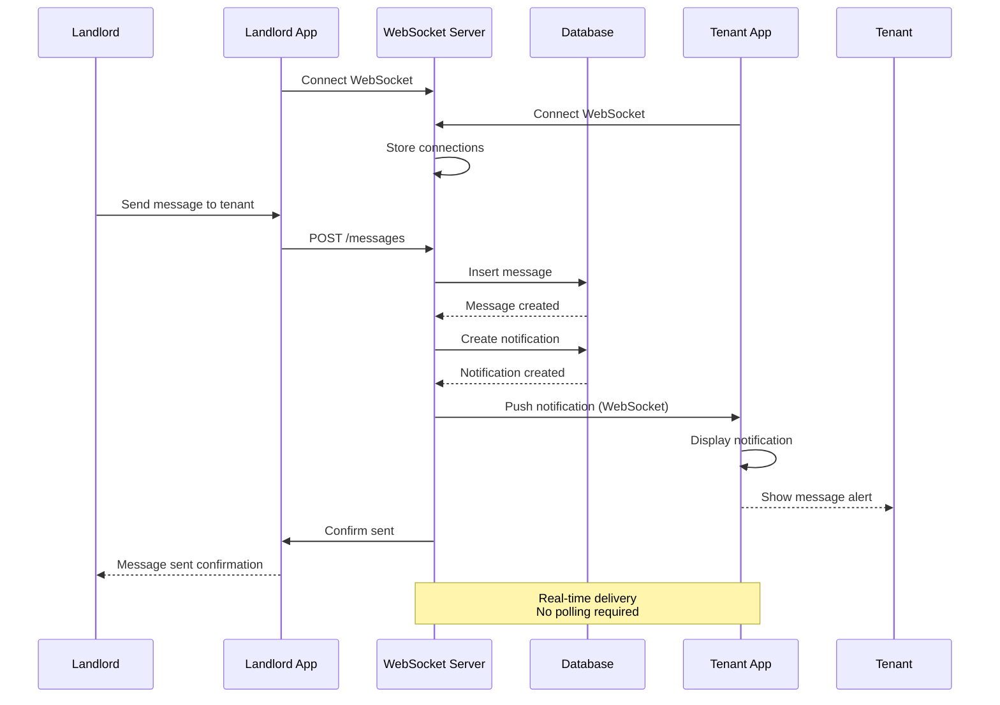

---

## 4. Feature Screenshots Guide

### 4.1 Screenshot Requirements

**Technical Specifications:**
- Resolution: 1920x1080 (desktop), 375x812 (mobile)
- Format: PNG with transparency where applicable
- File size: < 500KB per image (optimized)
- Naming convention: `feature-name-view-type.png`
- Location: `/workspace/shadcn-ui/docs/images/screenshots/`

**Screenshot Categories:**

1. **Dashboard Views** (10 screenshots)
   - Landlord dashboard overview
   - Tenant dashboard overview
   - Property manager dashboard
   - Agent dashboard
   - Analytics dashboard
   - Financial dashboard
   - Maintenance dashboard
   - Notifications center
   - Settings page
   - Mobile dashboard view

2. **Property Management** (8 screenshots)
   - Property list view
   - Property detail page
   - Add property wizard (steps 1-3)
   - Property edit form
   - Property photos gallery
   - Property status management
   - Property search and filters

3. **Lease Management** (10 screenshots)
   - Lease list view
   - Lease detail page
   - Create lease wizard (steps 1-4)
   - Lease terms editor
   - E-signature interface
   - Lease renewal flow
   - Lease termination process
   - Lease timeline view
   - Lease document viewer

4. **Payment Processing** (6 screenshots)
   - Payment dashboard
   - Make payment form
   - Payment history
   - Payment receipt
   - Autopay setup
   - Late payment notice

5. **Maintenance Requests** (6 screenshots)
   - Maintenance request list
   - Create request form
   - Request detail page
   - Vendor assignment
   - Work in progress view
   - Completed request with photos

6. **Communication** (5 screenshots)
   - Message inbox
   - Conversation thread
   - Compose message
   - Notification settings
   - Email templates

7. **Documents** (4 screenshots)
   - Document library
   - Document upload
   - Document viewer
   - Document sharing

8. **Reports & Analytics** (5 screenshots)
   - Financial reports
   - Occupancy reports
   - Maintenance analytics
   - Custom report builder
   - Export options

### 4.2 Screenshot Capture Process

**Step 1: Prepare Environment**
```bash
# Set up test data
npm run seed:demo-data

# Start application
npm run dev

# Open browser in specific size
# Chrome DevTools > Toggle Device Toolbar > Responsive
```

**Step 2: Capture Screenshots**
```bash
# Use browser screenshot tool or
# Install screenshot extension

# For consistent captures:
# 1. Clear browser cache
# 2. Use incognito mode
# 3. Disable browser extensions
# 4. Use consistent zoom level (100%)
```

**Step 3: Optimize Images**
```bash
# Install image optimization tool
npm install -g sharp-cli

# Optimize all screenshots
sharp -i screenshots/*.png -o optimized/ --format png --quality 90
```

**Step 4: Add to Documentation**
```markdown
# In documentation files:


*Figure 1: Landlord Dashboard showing property overview, recent activity, and quick actions*
```

### 4.3 Screenshot Annotations

**Annotation Guidelines:**
- Use red arrows for important UI elements
- Add numbered callouts for step-by-step guides
- Highlight key features with colored boxes
- Add text labels for clarity
- Keep annotations minimal and clear

**Tools for Annotation:**
- Figma (recommended)
- Adobe Photoshop
- Snagit
- Skitch
- CloudApp

---

## 5. UI Component Diagrams

### 5.1 Dashboard Layout Structure

```mermaid
graph TD
    subgraph "Dashboard Layout"
        Header[Header Navigation]
        Sidebar[Sidebar Menu]
        Main[Main Content Area]
        Footer[Footer]
    end
    
    subgraph "Header Components"
        Logo[Logo]
        Search[Global Search]
        Notifications[Notifications Bell]
        Profile[User Profile Menu]
    end
    
    subgraph "Sidebar Components"
        Nav1[Dashboard]
        Nav2[Properties]
        Nav3[Leases]
        Nav4[Payments]
        Nav5[Maintenance]
        Nav6[Messages]
        Nav7[Reports]
        Nav8[Settings]
    end
    
    subgraph "Main Content"
        Breadcrumb[Breadcrumb]
        PageTitle[Page Title]
        Actions[Action Buttons]
        Content[Dynamic Content]
        Pagination[Pagination]
    end
    
    Header --> Logo
    Header --> Search
    Header --> Notifications
    Header --> Profile
    
    Sidebar --> Nav1
    Sidebar --> Nav2
    Sidebar --> Nav3
    Sidebar --> Nav4
    Sidebar --> Nav5
    Sidebar --> Nav6
    Sidebar --> Nav7
    Sidebar --> Nav8
    
    Main --> Breadcrumb
    Main --> PageTitle
    Main --> Actions
    Main --> Content
    Main --> Pagination
```

### 5.2 Property Card Component

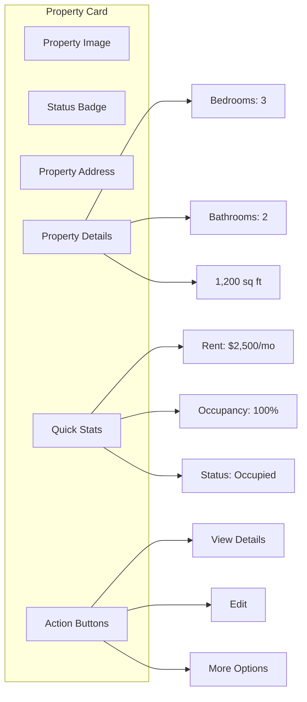

### 5.3 Lease Wizard Steps

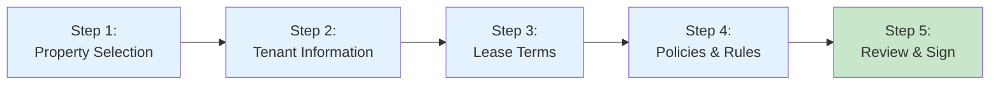

---

## 6. Data Flow Diagrams

### 6.1 Lease Creation Data Flow

```mermaid
flowchart LR
    User[User Input] --> Validation[Client-Side Validation]
    Validation --> API[API Request]
    API --> Auth[Authentication Check]
    Auth --> RLS[Row-Level Security]
    RLS --> Transaction[Database Transaction]
    
    Transaction --> CreateLease[Create Lease Record]
    CreateLease --> CreateSchedule[Create Payment Schedule]
    CreateSchedule --> UpdateProperty[Update Property Status]
    UpdateProperty --> CreateNotification[Create Notifications]
    CreateNotification --> SendEmail[Send Email Notifications]
    
    SendEmail --> Response[API Response]
    Response --> UI[Update UI]
    UI --> Success[Success Message]
```

### 6.2 Payment Processing Data Flow

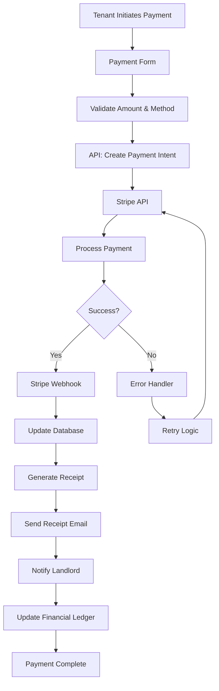

### 6.3 Real-Time Notification Data Flow

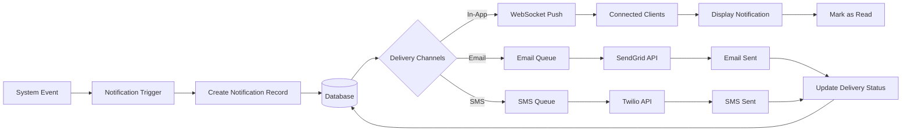

---

## 7. Integration with Existing Documentation

### 7.1 User Guide Enhancements

**File: `/workspace/shadcn-ui/docs/user-guide/landlord-guide.md`**

Add visual elements to these sections:

1. **Dashboard Overview** (Line 50)
   - Add: Dashboard screenshot with annotations
   - Add: Quick stats explanation diagram
   - Add: Navigation flow diagram

2. **Property Management** (Line 150)
   - Add: Property list screenshot
   - Add: Add property wizard screenshots (3 steps)
   - Add: Property detail page screenshot

3. **Lease Management** (Line 350)
   - Add: Lease creation workflow diagram
   - Add: E-signature process screenshots
   - Add: Lease timeline visualization

4. **Payment Processing** (Line 550)
   - Add: Payment dashboard screenshot
   - Add: Payment processing flow diagram
   - Add: Receipt example

5. **Maintenance Requests** (Line 750)
   - Add: Maintenance workflow diagram
   - Add: Request form screenshot
   - Add: Status tracking visualization

**File: `/workspace/shadcn-ui/docs/user-guide/tenant-guide.md`**

Add visual elements to these sections:

1. **Getting Started** (Line 40)
   - Add: Tenant onboarding journey diagram
   - Add: Dashboard screenshot
   - Add: Mobile app screenshots

2. **Making Payments** (Line 200)
   - Add: Payment form screenshot
   - Add: Autopay setup guide with screenshots
   - Add: Payment history view

3. **Maintenance Requests** (Line 350)
   - Add: Request submission flow diagram
   - Add: Form screenshots
   - Add: Status tracking example

### 7.2 Technical Documentation Enhancements

**File: `/workspace/shadcn-ui/docs/database_schema_design.md`**

Add visual elements:

1. **Entity Relationship Diagram** (Line 50)
   - ✅ Already included (Mermaid ERD)
   - Enhance with color coding by module

2. **Data Flow Diagrams** (Add new section)
   - Add: Lease creation data flow
   - Add: Payment processing data flow
   - Add: Authentication flow

**File: `/workspace/shadcn-ui/docs/architecture/state_management_architecture.md`**

Add visual elements:

1. **State Management Flow** (Line 100)
   - Add: React Query data flow diagram
   - Add: Zustand store structure diagram
   - Add: Context API usage diagram

### 7.3 Performance Documentation Enhancements

**File: `/workspace/shadcn-ui/docs/performance-reports/FINAL_PERFORMANCE_SUMMARY.md`**

Add visual elements:

1. **Performance Metrics** (Line 50)
   - Add: Performance comparison chart
   - Add: Load time visualization
   - Add: Cache hit rate diagram

2. **Architecture Diagram** (Line 200)
   - Add: System architecture overview
   - Add: Caching layers diagram
   - Add: Database optimization visualization

---

## 8. Screenshot Checklist

### Priority 1: Essential Screenshots (Due: Week 1)

- [ ] Landlord dashboard overview
- [ ] Tenant dashboard overview
- [ ] Property list view
- [ ] Property detail page
- [ ] Create lease wizard (all steps)
- [ ] Payment form
- [ ] Maintenance request form
- [ ] Message inbox
- [ ] Mobile dashboard view

### Priority 2: Feature Screenshots (Due: Week 2)

- [ ] Property manager dashboard
- [ ] Agent dashboard
- [ ] Analytics dashboard
- [ ] Financial reports
- [ ] Lease timeline
- [ ] E-signature interface
- [ ] Document library
- [ ] Settings page
- [ ] Notification center

### Priority 3: Advanced Screenshots (Due: Week 3)

- [ ] Custom report builder
- [ ] Vendor management
- [ ] Team collaboration
- [ ] Advanced search
- [ ] Bulk operations
- [ ] API documentation
- [ ] Integration settings
- [ ] White-label options

---

## 9. Diagram Creation Tools

**Recommended Tools:**

1. **Mermaid** (Primary - Already used in docs)
   - Pros: Text-based, version control friendly, renders in markdown
   - Cons: Limited styling options
   - Use for: Flowcharts, sequence diagrams, ERDs

2. **Figma** (For complex designs)
   - Pros: Professional quality, collaboration features
   - Cons: Requires design skills
   - Use for: UI mockups, detailed wireframes, annotations

3. **Excalidraw** (For quick sketches)
   - Pros: Hand-drawn style, easy to use
   - Cons: Less professional appearance
   - Use for: Brainstorming, rough concepts

4. **Draw.io / Diagrams.net** (For technical diagrams)
   - Pros: Free, comprehensive shapes library
   - Cons: Can be complex for simple diagrams
   - Use for: Architecture diagrams, network diagrams

---

## 10. Implementation Timeline

**Week 1: Core Visuals**
- Day 1-2: Create all workflow diagrams (Mermaid)
- Day 3-4: Capture essential screenshots (Priority 1)
- Day 5: Add visuals to landlord guide

**Week 2: Extended Visuals**
- Day 1-2: Create architecture diagrams
- Day 3-4: Capture feature screenshots (Priority 2)
- Day 5: Add visuals to tenant guide and technical docs

**Week 3: Advanced Visuals**
- Day 1-2: Create data flow diagrams
- Day 3-4: Capture advanced screenshots (Priority 3)
- Day 5: Final review and optimization

---

## 11. Quality Standards

**All Visuals Must:**
- Be clear and easy to understand
- Use consistent styling and colors
- Include descriptive captions
- Be optimized for web (< 500KB)
- Work in both light and dark modes
- Be accessible (alt text, high contrast)

**Color Palette:**
- Primary: #3B82F6 (Blue)
- Success: #10B981 (Green)
- Warning: #F59E0B (Orange)
- Error: #EF4444 (Red)
- Neutral: #6B7280 (Gray)

**Typography:**
- Headings: Inter, 16-24px, Bold
- Body: Inter, 14px, Regular
- Code: Fira Code, 12px, Monospace

---

**Document Status:** Complete  
**Next Steps:** Begin screenshot capture and diagram creation  
**Owner:** Emma (Product Manager)  
**Review Date:** After Week 1 completion

---

**End of Visual Documentation Guide**