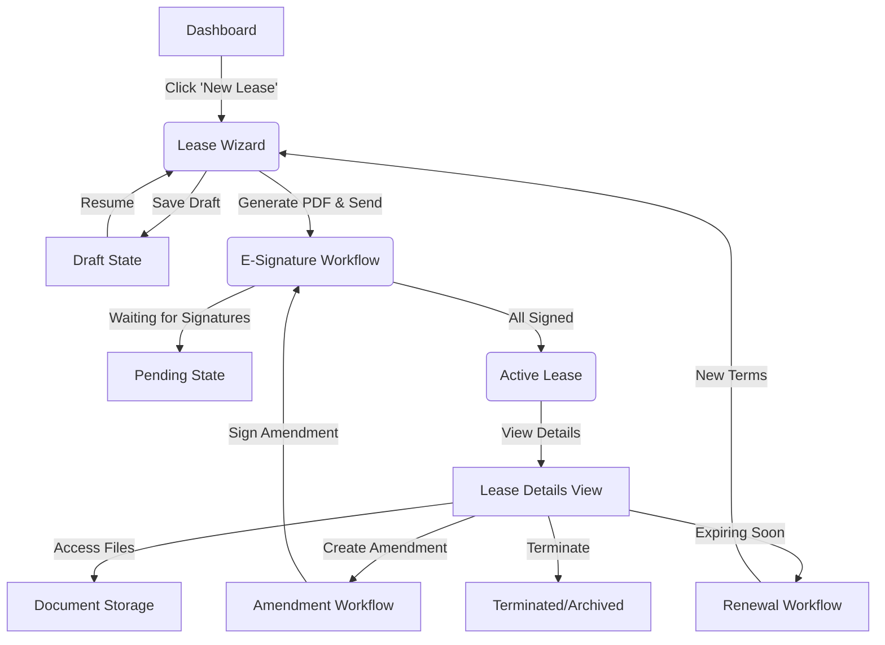

# Lease Pipeline Navigation & User Journey PRD

## 1. Language & Project Info
- **Language:** English
- **Project Name:** `lease_pipeline_navigation`
- **Version:** 1.0
- **Status:** Draft

## 2. Product Definition

### 2.1 Product Goals
1.  **Unified Workflow:** Create a seamless, linear experience that connects independent components (Wizard, Dashboard, E-Sign, Storage) into a single "Lease Lifecycle."
2.  **Intuitive Navigation:** Implement a clear global navigation and breadcrumb system that allows users to understand their context within the application at all times.
3.  **Action-Oriented State Transitions:** Ensure that moving between stages (e.g., Draft -> Sent -> Active) is driven by clear, accessible actions within the UI.

### 2.2 User Stories
-   **As a Property Manager**, I want to start a lease from the Dashboard and be taken directly to the Lease Wizard so that I can quickly onboard a new tenant.
-   **As a Landlord**, I want to see the status of a lease (Draft, Out for Signature, Active) on the Dashboard and click to resume the relevant task (e.g., "Continue Editing" or "View Signatures").
-   **As a User**, I want a consistent sidebar and breadcrumb trail so that I can easily navigate back to the main list or property details from a specific lease document.
-   **As a Manager**, I want to access all documents (signed leases, amendments) for a specific active lease from a single "Lease Details" view.

### 2.3 Competitive Analysis
| Feature | Our Pipeline | Competitor A (Generic CRM) | Competitor B (DocuSign only) |
| :--- | :--- | :--- | :--- |
| **End-to-End Flow** | Seamless (Draft -> Sign -> Manage) | Fragmented (CRM separate from Docs) | Good for signing, poor for management |
| **Contextual Nav** | Breadcrumbs + Status-aware actions | Standard Sidebar only | Document-centric lists |
| **State Visibility** | Dashboard Cards with Status Colors | List views | Folder views |

### 2.4 User Journey Map (The Lease Pipeline)

The user journey follows a linear pipeline with cyclic loops for renewals.



## 3. Navigation Architecture

### 3.1 Global Navigation (Sidebar)
The sidebar remains persistent across all views to provide high-level context switching.

*   **Dashboard** (Home)
    *   Overview Cards (Active, Pending, Revenue)
*   **Properties**
    *   Property List -> Property Details
*   **Leases** (The Pipeline Hub)
    *   **All Leases** (List View)
    *   **Drafts** (In Progress)
    *   **Signatures** (Pending Action)
    *   **Active** (Current Tenants)
    *   **Renewals** (Upcoming Expirations)
*   **Tenants**
    *   Tenant Directory
*   **Documents** (Global Repository)
*   **Settings**

### 3.2 Contextual Navigation (Breadcrumbs)
Breadcrumbs must be implemented on every page deeper than the root level.

*   **Wizard:** `Home > Leases > New Lease > [Step Name]`
*   **Signing:** `Home > Leases > [Lease ID] > Signature Status`
*   **Details:** `Home > Properties > [Property Name] > [Unit] > Lease #[ID]`
*   **Storage:** `Home > Leases > [Lease ID] > Documents`

### 3.3 Top Navigation Bar
*   **Left:** Breadcrumbs
*   **Right:** Global Actions (Notifications, User Profile) & Context Actions (e.g., "Save Draft" inside Wizard).

## 4. Detailed Component Integration

### 4.1 Dashboard -> Lease Wizard
*   **Entry Point:** "Create Lease" button on the Dashboard or Leases List.
*   **Behavior:** Opens `/leases/new`.
*   **Exit:** Upon completion (Review Step), user clicks "Generate & Send".
*   **Transition:** Redirects to `/leases/[id]/signing` or returns to Dashboard with "Draft" status.

### 4.2 Dashboard -> E-Signature System
*   **Entry Point:** Clicking a lease with status "Pending Signature" in the Dashboard list.
*   **Behavior:** Opens `/leases/[id]/signing` (SignatureWorkflowManager).
*   **Exit:** When all signatures are collected.
*   **Transition:** Auto-updates status to "Active" and redirects to `/leases/[id]/details`.

### 4.3 Dashboard -> Lease Details & Storage
*   **Entry Point:** Clicking an "Active" lease.
*   **Behavior:** Opens `/leases/[id]/details` (LeaseDetailModal/Page).
*   **Sub-Navigation:** The Details view contains tabs:
    *   *Overview* (Terms, Dates)
    *   *Documents* (Integrated Storage Component)
    *   *Financials* (Rent, Ledger)
    *   *History* (Audit Log)
*   **Storage Integration:** The "Documents" tab renders the `DocumentList` component filtered by this Lease ID.

### 4.4 Active Lease -> Renewal/Termination
*   **Entry Point:** "Actions" dropdown on the Lease Details page.
*   **Renewal:** Opens `RenewalManager` (Modal or Wizard).
    *   *Output:* Creates a new draft lease linked to the previous one.
*   **Termination:** Opens `TerminationDialog`.
    *   *Output:* Updates status to "Terminated" and moves to Archive.

## 5. Technical Specifications

### 5.1 Route Structure (React Router)
```typescript
/dashboard              // Main Overview
/leases                 // Lease List (Filterable)
/leases/new             // EnhancedLeaseWizard (Create)
/leases/:id             // Lease Details Layout
  /overview             // Read-only details
  /edit                 // LeaseEditForm
  /documents            // DocumentStorage Component
  /signing              // SignatureWorkflowManager
  /renewal              // RenewalManager
```

### 5.2 State Management Requirements
*   **Context:** Need a `LeaseContext` to hold the current Lease ID and Status when navigating sub-routes.
*   **Persistance:** Wizard progress must be saved to `localStorage` or Backend Drafts to prevent data loss on navigation.

### 5.3 UI/UX Requirements
*   **Loading States:** Use Skeleton Loaders when transitioning between Dashboard and Detail views.
*   **Error Boundaries:** Wrap the Route Outlet to catch navigation errors.
*   **Mobile:** Sidebar collapses to Hamburger menu; Breadcrumbs shorten to `... > Current Page`.

## 6. Open Questions
*   Should the "Lease Details" be a full page or a heavy modal?
    *   *Recommendation:* Full page for deep linking and better mobile experience, but `LeaseDetailModal` suggests a modal approach. We should refactor to a Page-based layout for the "Pipeline" feel, or keep the Modal for quick edits. **Decision: Full Page for "Lease Details", Modal for "Quick View".**