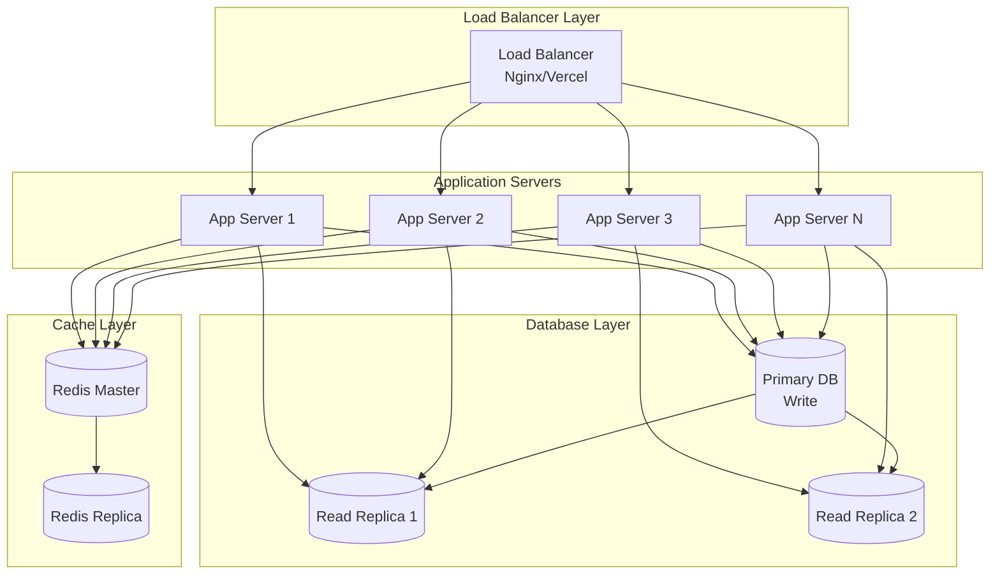
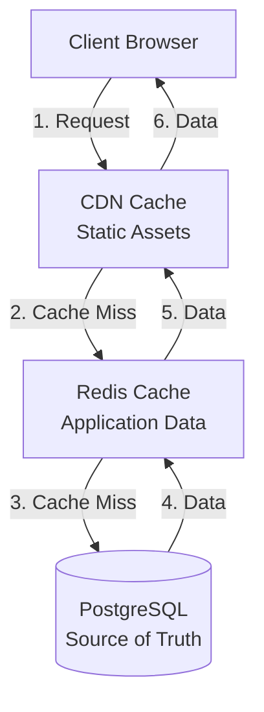
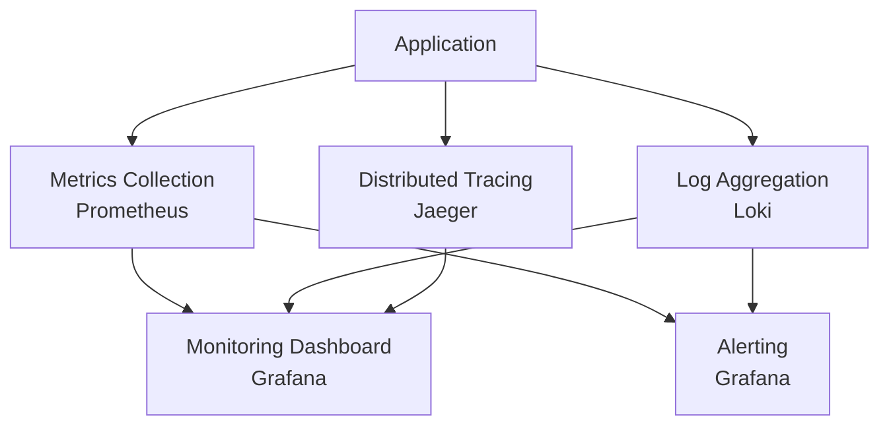
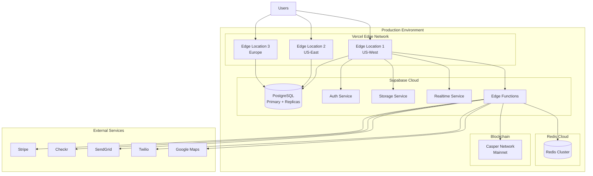
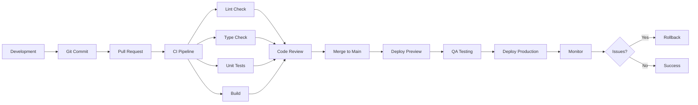

# Property-Tenant Matching Marketplace - System Architecture (Part 2)

## 9. Scalability Design

### 9.1 Horizontal Scaling Strategy

#### 9.1.1 Application Layer Scaling



**Scaling Approach:**
- **Stateless Application Servers**: All application servers are stateless, enabling easy horizontal scaling
- **Session Management**: Sessions stored in Redis, accessible by all app servers
- **Auto-scaling**: Scale based on CPU usage (>70%), memory usage (>80%), or request rate
- **Health Checks**: Regular health checks to remove unhealthy instances
- **Graceful Shutdown**: Drain connections before terminating instances

**Scaling Metrics:**
- Target: Handle 10,000 concurrent users
- Response time: <200ms for 95th percentile
- Throughput: 1,000 requests/second per server
- Scale up: Add server when average CPU >70% for 5 minutes
- Scale down: Remove server when average CPU <30% for 15 minutes

### 9.2 Database Sharding and Replication

#### 9.2.1 Read Replica Strategy

```sql
-- Configure read replicas in Supabase
-- Primary database: All write operations
-- Read replicas: Read-only queries (property searches, match calculations)

-- Connection pooling configuration
-- Primary pool: 20 connections (writes)
-- Replica pool: 50 connections per replica (reads)
```

**Read/Write Splitting:**
```typescript
class DatabaseRouter {
  async executeQuery(query: string, params: any[], isWrite: boolean = false) {
    const connection = isWrite ? this.primaryConnection : this.replicaConnection;
    return await connection.query(query, params);
  }
  
  // Write operations go to primary
  async insert(table: string, data: any) {
    return this.executeQuery(`INSERT INTO ${table}...`, [data], true);
  }
  
  // Read operations go to replica
  async select(table: string, conditions: any) {
    return this.executeQuery(`SELECT * FROM ${table}...`, [conditions], false);
  }
}
```

#### 9.2.2 Sharding Strategy (Future)

**Sharding Key Selection:**
- **Geographic Sharding**: Shard by location (US-West, US-East, Europe, Asia)
- **User-Based Sharding**: Shard by user_id hash
- **Hybrid Approach**: Combine geographic and user-based sharding

**Shard Distribution:**
```typescript
interface ShardConfig {
  shard_id: string;
  region: string;
  database_url: string;
  user_range: [number, number]; // Hash range
}

const shards: ShardConfig[] = [
  {
    shard_id: 'shard_1',
    region: 'us-west',
    database_url: 'postgres://shard1...',
    user_range: [0, 25]
  },
  {
    shard_id: 'shard_2',
    region: 'us-east',
    database_url: 'postgres://shard2...',
    user_range: [26, 50]
  },
  // ... more shards
];

function getShardForUser(userId: string): ShardConfig {
  const hash = hashFunction(userId) % 100;
  return shards.find(s => hash >= s.user_range[0] && hash <= s.user_range[1])!;
}
```

### 9.3 Caching Strategy

#### 9.3.1 Multi-Layer Caching



**Cache Layers:**

1. **Browser Cache** (Client-side)
   - Static assets: 1 year
   - API responses: 5 minutes (with ETag validation)
   - Property images: 7 days

2. **CDN Cache** (Edge)
   - Static files: 1 year
   - Property images: 30 days
   - API responses: 1 minute (for public endpoints)

3. **Redis Cache** (Application)
   - Property listings: 1 hour
   - Tenant profiles: 6 hours
   - Match results: 24 hours
   - Search results: 30 minutes
   - User sessions: Session duration
   - Rate limit counters: 1 minute/1 hour/1 day

**Cache Implementation:**

```typescript
class CacheManager {
  private redis: Redis;
  
  async get<T>(key: string): Promise<T | null> {
    const cached = await this.redis.get(key);
    return cached ? JSON.parse(cached) : null;
  }
  
  async set(key: string, value: any, ttl: number) {
    await this.redis.setex(key, ttl, JSON.stringify(value));
  }
  
  async invalidate(pattern: string) {
    const keys = await this.redis.keys(pattern);
    if (keys.length > 0) {
      await this.redis.del(...keys);
    }
  }
  
  // Cache-aside pattern
  async getOrFetch<T>(
    key: string,
    fetchFn: () => Promise<T>,
    ttl: number
  ): Promise<T> {
    let data = await this.get<T>(key);
    
    if (!data) {
      data = await fetchFn();
      await this.set(key, data, ttl);
    }
    
    return data;
  }
}

// Usage example
const cacheManager = new CacheManager();

async function getProperty(propertyId: string) {
  return cacheManager.getOrFetch(
    `property:${propertyId}`,
    async () => {
      const { data } = await supabase
        .from('properties')
        .select('*')
        .eq('id', propertyId)
        .single();
      return data;
    },
    3600 // 1 hour TTL
  );
}
```

**Cache Invalidation Strategy:**

```typescript
// Invalidate cache on updates
async function updateProperty(propertyId: string, updates: any) {
  // Update database
  const { data } = await supabase
    .from('properties')
    .update(updates)
    .eq('id', propertyId)
    .select()
    .single();
  
  // Invalidate related caches
  await cacheManager.invalidate(`property:${propertyId}`);
  await cacheManager.invalidate(`property:${propertyId}:*`);
  await cacheManager.invalidate(`landlord:${data.landlord_id}:properties`);
  await cacheManager.invalidate(`search:*`); // Invalidate search results
  
  return data;
}
```

### 9.4 CDN Strategy

#### 9.4.1 Asset Distribution

**CDN Configuration:**
- **Provider**: Vercel Edge Network (automatic with Vercel deployment)
- **Regions**: Global edge locations (200+ locations)
- **Cache Control**: Aggressive caching for static assets

**Asset Types:**
```typescript
const cdnConfig = {
  static_assets: {
    path: '/assets/*',
    cache_control: 'public, max-age=31536000, immutable',
    compression: 'gzip, brotli'
  },
  property_images: {
    path: '/images/properties/*',
    cache_control: 'public, max-age=2592000', // 30 days
    compression: 'gzip',
    image_optimization: true
  },
  user_uploads: {
    path: '/uploads/*',
    cache_control: 'private, max-age=86400', // 1 day
    compression: 'gzip'
  }
};
```

#### 9.4.2 Image Optimization

```typescript
// Automatic image optimization via Vercel
// Supports WebP, AVIF, responsive images

interface ImageOptimizationConfig {
  quality: number; // 1-100
  width?: number;
  height?: number;
  format?: 'webp' | 'avif' | 'auto';
}

function getOptimizedImageUrl(
  originalUrl: string,
  config: ImageOptimizationConfig
): string {
  const params = new URLSearchParams({
    url: originalUrl,
    q: config.quality.toString(),
    ...(config.width && { w: config.width.toString() }),
    ...(config.height && { h: config.height.toString() }),
    ...(config.format && { fm: config.format })
  });
  
  return `/_next/image?${params.toString()}`;
}

// Usage
const thumbnailUrl = getOptimizedImageUrl(property.photo_url, {
  quality: 75,
  width: 400,
  height: 300,
  format: 'webp'
});
```

### 9.5 Load Balancing

#### 9.5.1 Load Balancer Configuration

**Vercel Edge Network (Automatic):**
- Automatic load balancing across edge locations
- Geographic routing (route to nearest edge)
- Automatic failover
- DDoS protection

**Custom Load Balancing (if needed):**
```typescript
// Weighted round-robin algorithm
class LoadBalancer {
  private servers: Array<{ url: string; weight: number; active: boolean }>;
  private currentIndex: number = 0;
  
  selectServer(): string {
    const activeServers = this.servers.filter(s => s.active);
    
    // Weighted round-robin
    const totalWeight = activeServers.reduce((sum, s) => sum + s.weight, 0);
    let random = Math.random() * totalWeight;
    
    for (const server of activeServers) {
      random -= server.weight;
      if (random <= 0) {
        return server.url;
      }
    }
    
    return activeServers[0].url;
  }
  
  async healthCheck() {
    for (const server of this.servers) {
      try {
        const response = await fetch(`${server.url}/health`);
        server.active = response.ok;
      } catch (error) {
        server.active = false;
      }
    }
  }
}
```

### 9.6 Performance Monitoring and Optimization

#### 9.6.1 Monitoring Stack



**Key Metrics to Monitor:**

1. **Application Metrics**
   - Request rate (requests/second)
   - Response time (p50, p95, p99)
   - Error rate (4xx, 5xx)
   - Active users
   - API endpoint performance

2. **Database Metrics**
   - Query execution time
   - Connection pool usage
   - Slow queries (>1 second)
   - Cache hit rate
   - Replication lag

3. **Infrastructure Metrics**
   - CPU usage
   - Memory usage
   - Disk I/O
   - Network throughput
   - Instance health

4. **Business Metrics**
   - New user registrations
   - Property listings created
   - Applications submitted
   - Matches generated
   - Payments processed

**Monitoring Implementation:**

```typescript
// Custom metrics tracking
class MetricsCollector {
  private metrics: Map<string, number> = new Map();
  
  increment(metric: string, value: number = 1) {
    const current = this.metrics.get(metric) || 0;
    this.metrics.set(metric, current + value);
  }
  
  timing(metric: string, duration: number) {
    // Record timing metric
    this.metrics.set(`${metric}.duration`, duration);
  }
  
  gauge(metric: string, value: number) {
    // Record gauge metric
    this.metrics.set(metric, value);
  }
  
  async flush() {
    // Send metrics to monitoring service
    await fetch('https://metrics.example.com/api/metrics', {
      method: 'POST',
      body: JSON.stringify(Object.fromEntries(this.metrics))
    });
    
    this.metrics.clear();
  }
}

// Usage with middleware
async function metricsMiddleware(req: Request, res: Response, next: Function) {
  const startTime = Date.now();
  
  res.on('finish', () => {
    const duration = Date.now() - startTime;
    metrics.timing(`api.${req.path}`, duration);
    metrics.increment(`api.${req.path}.${res.statusCode}`);
  });
  
  next();
}
```

#### 9.6.2 Performance Optimization Techniques

**1. Database Query Optimization**

```sql
-- Create indexes for frequently queried columns
CREATE INDEX CONCURRENTLY idx_properties_location_rent 
ON properties USING GIST(location) 
WHERE status = 'active' AND monthly_rent BETWEEN 1000 AND 5000;

-- Materialized view for expensive aggregations
CREATE MATERIALIZED VIEW property_stats AS
SELECT 
  property_type,
  AVG(monthly_rent) as avg_rent,
  COUNT(*) as total_count,
  AVG(view_count) as avg_views
FROM properties
WHERE status = 'active'
GROUP BY property_type;

-- Refresh materialized view periodically
REFRESH MATERIALIZED VIEW CONCURRENTLY property_stats;
```

**2. Query Result Pagination**

```typescript
// Cursor-based pagination for better performance
interface PaginationCursor {
  id: string;
  created_at: string;
}

async function getPaginatedProperties(
  cursor?: PaginationCursor,
  limit: number = 20
) {
  let query = supabase
    .from('properties')
    .select('*')
    .eq('status', 'active')
    .order('created_at', { ascending: false })
    .limit(limit);
  
  if (cursor) {
    query = query
      .lt('created_at', cursor.created_at)
      .neq('id', cursor.id);
  }
  
  const { data, error } = await query;
  
  const nextCursor = data && data.length === limit
    ? { id: data[data.length - 1].id, created_at: data[data.length - 1].created_at }
    : null;
  
  return { data, nextCursor };
}
```

**3. Lazy Loading and Code Splitting**

```typescript
// React lazy loading
import { lazy, Suspense } from 'react';

const PropertyDetail = lazy(() => import('./components/PropertyDetail'));
const ApplicationForm = lazy(() => import('./components/ApplicationForm'));
const PaymentForm = lazy(() => import('./components/PaymentForm'));

function App() {
  return (
    <Suspense fallback={<LoadingSpinner />}>
      <Routes>
        <Route path="/property/:id" element={<PropertyDetail />} />
        <Route path="/apply/:id" element={<ApplicationForm />} />
        <Route path="/payment" element={<PaymentForm />} />
      </Routes>
    </Suspense>
  );
}
```

**4. Request Batching**

```typescript
// Batch multiple API requests
class RequestBatcher {
  private queue: Array<{ key: string; resolve: Function; reject: Function }> = [];
  private timer: NodeJS.Timeout | null = null;
  
  async fetch(key: string): Promise<any> {
    return new Promise((resolve, reject) => {
      this.queue.push({ key, resolve, reject });
      
      if (!this.timer) {
        this.timer = setTimeout(() => this.flush(), 10); // 10ms batch window
      }
    });
  }
  
  private async flush() {
    const batch = this.queue.splice(0);
    this.timer = null;
    
    if (batch.length === 0) return;
    
    try {
      const keys = batch.map(item => item.key);
      const results = await this.batchFetch(keys);
      
      batch.forEach((item, index) => {
        item.resolve(results[index]);
      });
    } catch (error) {
      batch.forEach(item => item.reject(error));
    }
  }
  
  private async batchFetch(keys: string[]): Promise<any[]> {
    const { data } = await supabase
      .from('properties')
      .select('*')
      .in('id', keys);
    
    return keys.map(key => data?.find(item => item.id === key));
  }
}
```

---

## 10. Integration Points

### 10.1 Supabase Integration

#### 10.1.1 Database Integration

```typescript
import { createClient } from '@supabase/supabase-js';

const supabase = createClient(
  process.env.NEXT_PUBLIC_SUPABASE_URL!,
  process.env.NEXT_PUBLIC_SUPABASE_ANON_KEY!
);

// Database operations
async function createProperty(propertyData: any) {
  const { data, error } = await supabase
    .from('properties')
    .insert(propertyData)
    .select()
    .single();
  
  if (error) throw error;
  return data;
}

// Real-time subscriptions
const channel = supabase
  .channel('property-changes')
  .on(
    'postgres_changes',
    {
      event: 'INSERT',
      schema: 'public',
      table: 'properties'
    },
    (payload) => {
      console.log('New property:', payload.new);
    }
  )
  .subscribe();
```

#### 10.1.2 Authentication Integration

```typescript
// Sign up
async function signUp(email: string, password: string, role: string) {
  const { data, error } = await supabase.auth.signUp({
    email,
    password,
    options: {
      data: {
        role: role // landlord or tenant
      }
    }
  });
  
  if (error) throw error;
  return data;
}

// Sign in
async function signIn(email: string, password: string) {
  const { data, error } = await supabase.auth.signInWithPassword({
    email,
    password
  });
  
  if (error) throw error;
  return data;
}

// Get current user
async function getCurrentUser() {
  const { data: { user } } = await supabase.auth.getUser();
  return user;
}

// Auth state listener
supabase.auth.onAuthStateChange((event, session) => {
  if (event === 'SIGNED_IN') {
    console.log('User signed in:', session?.user);
  } else if (event === 'SIGNED_OUT') {
    console.log('User signed out');
  }
});
```

#### 10.1.3 Storage Integration

```typescript
// Upload file
async function uploadFile(file: File, bucket: string, path: string) {
  const { data, error } = await supabase.storage
    .from(bucket)
    .upload(path, file, {
      cacheControl: '3600',
      upsert: false
    });
  
  if (error) throw error;
  return data;
}

// Get public URL
function getPublicUrl(bucket: string, path: string): string {
  const { data } = supabase.storage
    .from(bucket)
    .getPublicUrl(path);
  
  return data.publicUrl;
}

// Upload property photos
async function uploadPropertyPhotos(propertyId: string, files: File[]) {
  const uploadPromises = files.map((file, index) => {
    const path = `properties/${propertyId}/${Date.now()}_${index}.jpg`;
    return uploadFile(file, 'property-photos', path);
  });
  
  const results = await Promise.all(uploadPromises);
  
  return results.map(result => 
    getPublicUrl('property-photos', result.path)
  );
}
```

#### 10.1.4 Edge Functions Integration

```typescript
// Edge function for complex operations
// File: supabase/functions/calculate-matches/index.ts

import { serve } from 'https://deno.land/std@0.168.0/http/server.ts';
import { createClient } from 'https://esm.sh/@supabase/supabase-js@2';

serve(async (req) => {
  const supabase = createClient(
    Deno.env.get('SUPABASE_URL')!,
    Deno.env.get('SUPABASE_SERVICE_ROLE_KEY')!
  );
  
  const { tenant_id } = await req.json();
  
  // Fetch tenant profile
  const { data: profile } = await supabase
    .from('tenant_profiles')
    .select('*')
    .eq('user_id', tenant_id)
    .single();
  
  // Fetch active properties
  const { data: properties } = await supabase
    .from('properties')
    .select('*')
    .eq('status', 'active');
  
  // Calculate matches
  const matches = properties.map(property => ({
    property_id: property.id,
    tenant_id: tenant_id,
    match_score: calculateMatchScore(profile, property),
    compatibility_metrics: calculateCompatibility(profile, property)
  }));
  
  // Store matches
  await supabase
    .from('matches')
    .upsert(matches, { onConflict: 'property_id,tenant_id' });
  
  return new Response(
    JSON.stringify({ success: true, matches_count: matches.length }),
    { headers: { 'Content-Type': 'application/json' } }
  );
});
```

### 10.2 Blockchain Integration (Casper Network)

#### 10.2.1 CSPR.cloud Integration

```typescript
import { CasperClient, CLPublicKey, DeployUtil } from 'casper-js-sdk';

class CasperService {
  private client: CasperClient;
  private apiUrl: string = 'https://api.cspr.cloud';
  
  constructor() {
    this.client = new CasperClient('https://rpc.mainnet.casperlabs.io/rpc');
  }
  
  // Property tokenization
  async tokenizeProperty(propertyData: {
    property_id: string;
    owner_public_key: string;
    metadata: any;
  }) {
    const deploy = DeployUtil.makeDeploy(
      new DeployUtil.DeployParams(
        CLPublicKey.fromHex(propertyData.owner_public_key),
        'casper-test'
      ),
      DeployUtil.ExecutableDeployItem.newStoredContractByName(
        'property_nft_contract',
        'mint',
        DeployUtil.RuntimeArgs.fromMap({
          property_id: CLValueBuilder.string(propertyData.property_id),
          metadata: CLValueBuilder.string(JSON.stringify(propertyData.metadata))
        })
      ),
      DeployUtil.standardPayment(5000000000) // 5 CSPR
    );
    
    const deployHash = await this.client.putDeploy(deploy);
    return deployHash;
  }
  
  // Smart lease contract
  async createSmartLease(leaseData: {
    property_id: string;
    tenant_public_key: string;
    landlord_public_key: string;
    monthly_rent: number;
    start_date: string;
    end_date: string;
  }) {
    const deploy = DeployUtil.makeDeploy(
      new DeployUtil.DeployParams(
        CLPublicKey.fromHex(leaseData.landlord_public_key),
        'casper-test'
      ),
      DeployUtil.ExecutableDeployItem.newStoredContractByName(
        'smart_lease_contract',
        'create_lease',
        DeployUtil.RuntimeArgs.fromMap({
          property_id: CLValueBuilder.string(leaseData.property_id),
          tenant: CLValueBuilder.key(CLPublicKey.fromHex(leaseData.tenant_public_key)),
          monthly_rent: CLValueBuilder.u512(leaseData.monthly_rent),
          start_date: CLValueBuilder.string(leaseData.start_date),
          end_date: CLValueBuilder.string(leaseData.end_date)
        })
      ),
      DeployUtil.standardPayment(10000000000) // 10 CSPR
    );
    
    const deployHash = await this.client.putDeploy(deploy);
    return deployHash;
  }
  
  // Process rent payment
  async processRentPayment(paymentData: {
    lease_contract_hash: string;
    payer_public_key: string;
    amount: number;
  }) {
    const deploy = DeployUtil.makeDeploy(
      new DeployUtil.DeployParams(
        CLPublicKey.fromHex(paymentData.payer_public_key),
        'casper-test'
      ),
      DeployUtil.ExecutableDeployItem.newStoredContractByHash(
        paymentData.lease_contract_hash,
        'pay_rent',
        DeployUtil.RuntimeArgs.fromMap({
          amount: CLValueBuilder.u512(paymentData.amount)
        })
      ),
      DeployUtil.standardPayment(3000000000) // 3 CSPR
    );
    
    const deployHash = await this.client.putDeploy(deploy);
    return deployHash;
  }
  
  // Get transaction status
  async getTransactionStatus(deployHash: string) {
    const result = await this.client.getDeploy(deployHash);
    return result;
  }
}
```

#### 10.2.2 Wallet Integration (CSPR.click)

```typescript
import { CasperWalletProvider } from 'casper-wallet-provider';

class WalletManager {
  private provider: CasperWalletProvider | null = null;
  
  async connect(): Promise<string> {
    this.provider = new CasperWalletProvider();
    
    await this.provider.requestConnection();
    const publicKey = await this.provider.getActivePublicKey();
    
    return publicKey;
  }
  
  async disconnect() {
    if (this.provider) {
      await this.provider.disconnectFromSite();
      this.provider = null;
    }
  }
  
  async signMessage(message: string): Promise<string> {
    if (!this.provider) {
      throw new Error('Wallet not connected');
    }
    
    const signature = await this.provider.signMessage(message);
    return signature;
  }
  
  async getBalance(): Promise<number> {
    if (!this.provider) {
      throw new Error('Wallet not connected');
    }
    
    const publicKey = await this.provider.getActivePublicKey();
    const balance = await this.provider.getAccountBalance(publicKey);
    
    return balance;
  }
}
```

### 10.3 Third-Party Service Integrations

#### 10.3.1 Payment Processing (Stripe)

```typescript
import Stripe from 'stripe';

const stripe = new Stripe(process.env.STRIPE_SECRET_KEY!, {
  apiVersion: '2023-10-16'
});

// Create payment intent
async function createPaymentIntent(amount: number, currency: string = 'usd') {
  const paymentIntent = await stripe.paymentIntents.create({
    amount: Math.round(amount * 100), // Convert to cents
    currency,
    automatic_payment_methods: {
      enabled: true
    }
  });
  
  return paymentIntent;
}

// Create customer
async function createStripeCustomer(email: string, name: string) {
  const customer = await stripe.customers.create({
    email,
    name
  });
  
  return customer;
}

// Setup ACH payment
async function setupACHPayment(customerId: string) {
  const setupIntent = await stripe.setupIntents.create({
    customer: customerId,
    payment_method_types: ['us_bank_account']
  });
  
  return setupIntent;
}

// Process recurring payment
async function createSubscription(
  customerId: string,
  priceId: string
) {
  const subscription = await stripe.subscriptions.create({
    customer: customerId,
    items: [{ price: priceId }],
    payment_behavior: 'default_incomplete',
    expand: ['latest_invoice.payment_intent']
  });
  
  return subscription;
}

// Webhook handler
async function handleStripeWebhook(
  payload: string,
  signature: string
) {
  const event = stripe.webhooks.constructEvent(
    payload,
    signature,
    process.env.STRIPE_WEBHOOK_SECRET!
  );
  
  switch (event.type) {
    case 'payment_intent.succeeded':
      const paymentIntent = event.data.object;
      await handlePaymentSuccess(paymentIntent);
      break;
    
    case 'payment_intent.payment_failed':
      const failedPayment = event.data.object;
      await handlePaymentFailure(failedPayment);
      break;
    
    case 'customer.subscription.updated':
      const subscription = event.data.object;
      await handleSubscriptionUpdate(subscription);
      break;
  }
}
```

#### 10.3.2 Background Check Service (Checkr)

```typescript
import axios from 'axios';

class CheckrService {
  private apiKey: string;
  private baseUrl: string = 'https://api.checkr.com/v1';
  
  constructor() {
    this.apiKey = process.env.CHECKR_API_KEY!;
  }
  
  // Create candidate
  async createCandidate(candidateData: {
    first_name: string;
    last_name: string;
    email: string;
    phone: string;
    dob: string;
    ssn: string;
    zipcode: string;
  }) {
    const response = await axios.post(
      `${this.baseUrl}/candidates`,
      candidateData,
      {
        auth: {
          username: this.apiKey,
          password: ''
        }
      }
    );
    
    return response.data;
  }
  
  // Create background check
  async createBackgroundCheck(candidateId: string, package_slug: string = 'tenant_screening') {
    const response = await axios.post(
      `${this.baseUrl}/reports`,
      {
        candidate_id: candidateId,
        package: package_slug
      },
      {
        auth: {
          username: this.apiKey,
          password: ''
        }
      }
    );
    
    return response.data;
  }
  
  // Get report
  async getReport(reportId: string) {
    const response = await axios.get(
      `${this.baseUrl}/reports/${reportId}`,
      {
        auth: {
          username: this.apiKey,
          password: ''
        }
      }
    );
    
    return response.data;
  }
  
  // Webhook handler
  async handleWebhook(payload: any) {
    const { type, data } = payload;
    
    switch (type) {
      case 'report.completed':
        await this.processCompletedReport(data.object);
        break;
      
      case 'report.dispute':
        await this.handleDispute(data.object);
        break;
    }
  }
  
  private async processCompletedReport(report: any) {
    // Store screening results in database
    await supabase.from('screening_results').insert({
      application_id: report.metadata.application_id,
      provider: 'checkr',
      credit_report: report.credit,
      background_check: report.criminal_search,
      eviction_history: report.eviction_search,
      credit_score: report.credit?.score,
      approved: report.adjudication === 'engaged',
      completed_at: new Date().toISOString()
    });
  }
}
```

#### 10.3.3 Email Service (SendGrid)

```typescript
import sgMail from '@sendgrid/mail';

sgMail.setApiKey(process.env.SENDGRID_API_KEY!);

class EmailService {
  async sendEmail(to: string, subject: string, html: string, text?: string) {
    const msg = {
      to,
      from: 'noreply@marketplace.example.com',
      subject,
      text: text || '',
      html
    };
    
    await sgMail.send(msg);
  }
  
  async sendTemplateEmail(
    to: string,
    templateId: string,
    dynamicData: any
  ) {
    const msg = {
      to,
      from: 'noreply@marketplace.example.com',
      templateId,
      dynamicTemplateData: dynamicData
    };
    
    await sgMail.send(msg);
  }
  
  // Send welcome email
  async sendWelcomeEmail(email: string, name: string, role: string) {
    await this.sendTemplateEmail(
      email,
      'd-welcome-template-id',
      {
        name,
        role,
        dashboard_url: `https://marketplace.example.com/${role}/dashboard`
      }
    );
  }
  
  // Send application status update
  async sendApplicationStatusEmail(
    email: string,
    propertyAddress: string,
    status: string
  ) {
    await this.sendTemplateEmail(
      email,
      'd-application-status-template-id',
      {
        property_address: propertyAddress,
        status,
        application_url: 'https://marketplace.example.com/applications'
      }
    );
  }
}
```

#### 10.3.4 SMS Service (Twilio)

```typescript
import twilio from 'twilio';

class SMSService {
  private client: twilio.Twilio;
  private fromNumber: string;
  
  constructor() {
    this.client = twilio(
      process.env.TWILIO_ACCOUNT_SID!,
      process.env.TWILIO_AUTH_TOKEN!
    );
    this.fromNumber = process.env.TWILIO_PHONE_NUMBER!;
  }
  
  async sendSMS(to: string, message: string) {
    const result = await this.client.messages.create({
      body: message,
      from: this.fromNumber,
      to
    });
    
    return result;
  }
  
  // Send verification code
  async sendVerificationCode(phone: string, code: string) {
    await this.sendSMS(
      phone,
      `Your verification code is: ${code}. Valid for 10 minutes.`
    );
  }
  
  // Send payment reminder
  async sendPaymentReminder(phone: string, amount: number, dueDate: string) {
    await this.sendSMS(
      phone,
      `Reminder: Rent payment of $${amount} is due on ${dueDate}. Pay now at https://marketplace.example.com/payments`
    );
  }
}
```

#### 10.3.5 Mapping Service (Google Maps)

```typescript
import { Client } from '@googlemaps/google-maps-services-js';

class MapsService {
  private client: Client;
  
  constructor() {
    this.client = new Client({});
  }
  
  // Geocode address
  async geocodeAddress(address: string) {
    const response = await this.client.geocode({
      params: {
        address,
        key: process.env.GOOGLE_MAPS_API_KEY!
      }
    });
    
    const result = response.data.results[0];
    
    return {
      lat: result.geometry.location.lat,
      lng: result.geometry.location.lng,
      formatted_address: result.formatted_address
    };
  }
  
  // Calculate distance
  async calculateDistance(
    origin: { lat: number; lng: number },
    destination: { lat: number; lng: number }
  ) {
    const response = await this.client.distancematrix({
      params: {
        origins: [`${origin.lat},${origin.lng}`],
        destinations: [`${destination.lat},${destination.lng}`],
        key: process.env.GOOGLE_MAPS_API_KEY!
      }
    });
    
    const element = response.data.rows[0].elements[0];
    
    return {
      distance_meters: element.distance.value,
      distance_text: element.distance.text,
      duration_seconds: element.duration.value,
      duration_text: element.duration.text
    };
  }
  
  // Get nearby places
  async getNearbyPlaces(
    location: { lat: number; lng: number },
    type: string,
    radius: number = 1000
  ) {
    const response = await this.client.placesNearby({
      params: {
        location: `${location.lat},${location.lng}`,
        radius,
        type,
        key: process.env.GOOGLE_MAPS_API_KEY!
      }
    });
    
    return response.data.results;
  }
}
```

---

## 11. Technology Stack

### 11.1 Frontend Stack

```typescript
// package.json
{
  "dependencies": {
    // Core Framework
    "react": "^18.2.0",
    "react-dom": "^18.2.0",
    "next": "^14.0.0",
    "typescript": "^5.3.0",
    
    // UI Components
    "@radix-ui/react-dialog": "^1.0.5",
    "@radix-ui/react-dropdown-menu": "^2.0.6",
    "@radix-ui/react-select": "^2.0.0",
    "@radix-ui/react-tabs": "^1.0.4",
    "class-variance-authority": "^0.7.0",
    "clsx": "^2.0.0",
    "tailwind-merge": "^2.2.0",
    
    // Styling
    "tailwindcss": "^3.4.0",
    "autoprefixer": "^10.4.16",
    "postcss": "^8.4.32",
    
    // State Management
    "zustand": "^4.4.7",
    "@tanstack/react-query": "^5.17.0",
    
    // Forms
    "react-hook-form": "^7.49.0",
    "zod": "^3.22.4",
    "@hookform/resolvers": "^3.3.3",
    
    // Backend Integration
    "@supabase/supabase-js": "^2.39.0",
    "@supabase/auth-helpers-nextjs": "^0.8.7",
    
    // Blockchain
    "casper-js-sdk": "^2.15.0",
    "casper-wallet-provider": "^1.0.0",
    
    // Maps
    "@react-google-maps/api": "^2.19.2",
    
    // Date/Time
    "date-fns": "^3.0.0",
    
    // Utilities
    "axios": "^1.6.2",
    "lodash": "^4.17.21",
    "uuid": "^9.0.1"
  },
  "devDependencies": {
    "@types/react": "^18.2.45",
    "@types/node": "^20.10.5",
    "eslint": "^8.56.0",
    "prettier": "^3.1.1"
  }
}
```

### 11.2 Backend Stack

```typescript
// Supabase Edge Functions (Deno)
// import_map.json
{
  "imports": {
    "supabase": "https://esm.sh/@supabase/supabase-js@2",
    "postgres": "https://deno.land/x/postgres@v0.17.0/mod.ts",
    "oak": "https://deno.land/x/oak@v12.6.1/mod.ts",
    "stripe": "https://esm.sh/stripe@14.10.0",
    "sendgrid": "https://esm.sh/@sendgrid/mail@7.7.0"
  }
}
```

### 11.3 Database and Caching

```yaml
# Database
database:
  primary: PostgreSQL 15 (Supabase)
  extensions:
    - postgis # Geographic data
    - pg_trgm # Full-text search
    - uuid-ossp # UUID generation
    - pgcrypto # Encryption

# Caching
cache:
  primary: Redis 7.0
  use_cases:
    - Session storage
    - Rate limiting
    - Search result caching
    - Match score caching
    - Real-time data
```

### 11.4 Infrastructure and DevOps

```yaml
# Hosting and Deployment
hosting:
  frontend: Vercel
  backend: Supabase
  cdn: Vercel Edge Network
  
# CI/CD
ci_cd:
  platform: GitHub Actions
  workflows:
    - lint
    - type-check
    - test
    - build
    - deploy
    
# Monitoring
monitoring:
  application: Sentry
  analytics: Vercel Analytics
  logging: Supabase Logs
  uptime: Better Uptime
  
# Version Control
version_control:
  platform: GitHub
  branching: Git Flow
  
# Security
security:
  secrets: GitHub Secrets / Vercel Environment Variables
  ssl: Automatic (Vercel)
  firewall: Supabase Network Restrictions
```

### 11.5 Development Tools

```json
{
  "tools": {
    "ide": "VS Code",
    "extensions": [
      "ESLint",
      "Prettier",
      "Tailwind CSS IntelliSense",
      "GitLens",
      "Thunder Client"
    ],
    "api_testing": "Postman / Thunder Client",
    "database_client": "Supabase Studio / pgAdmin",
    "design": "Figma",
    "documentation": "Notion / Markdown"
  }
}
```

---

## 12. Deployment Architecture

### 12.1 Deployment Diagram



### 12.2 Deployment Pipeline



### 12.3 Environment Configuration

```typescript
// Environment variables structure

// Development (.env.local)
NEXT_PUBLIC_SUPABASE_URL=https://dev-project.supabase.co
NEXT_PUBLIC_SUPABASE_ANON_KEY=dev_anon_key
SUPABASE_SERVICE_ROLE_KEY=dev_service_role_key

NEXT_PUBLIC_CASPER_NETWORK=casper-test
NEXT_PUBLIC_CASPER_RPC_URL=https://rpc.testnet.casperlabs.io/rpc

STRIPE_SECRET_KEY=sk_test_...
STRIPE_WEBHOOK_SECRET=whsec_test_...

REDIS_URL=redis://localhost:6379

// Staging (.env.staging)
NEXT_PUBLIC_SUPABASE_URL=https://staging-project.supabase.co
NEXT_PUBLIC_SUPABASE_ANON_KEY=staging_anon_key
SUPABASE_SERVICE_ROLE_KEY=staging_service_role_key

NEXT_PUBLIC_CASPER_NETWORK=casper-test
NEXT_PUBLIC_CASPER_RPC_URL=https://rpc.testnet.casperlabs.io/rpc

STRIPE_SECRET_KEY=sk_test_...
STRIPE_WEBHOOK_SECRET=whsec_test_...

REDIS_URL=redis://staging-redis.example.com:6379

// Production (.env.production)
NEXT_PUBLIC_SUPABASE_URL=https://prod-project.supabase.co
NEXT_PUBLIC_SUPABASE_ANON_KEY=prod_anon_key
SUPABASE_SERVICE_ROLE_KEY=prod_service_role_key

NEXT_PUBLIC_CASPER_NETWORK=casper
NEXT_PUBLIC_CASPER_RPC_URL=https://rpc.mainnet.casperlabs.io/rpc

STRIPE_SECRET_KEY=sk_live_...
STRIPE_WEBHOOK_SECRET=whsec_live_...

REDIS_URL=redis://prod-redis.example.com:6379
```

### 12.4 Continuous Integration Configuration

```yaml
# .github/workflows/ci.yml
name: CI/CD Pipeline

on:
  push:
    branches: [main, develop]
  pull_request:
    branches: [main, develop]

jobs:
  lint:
    runs-on: ubuntu-latest
    steps:
      - uses: actions/checkout@v3
      - uses: actions/setup-node@v3
        with:
          node-version: '18'
      - run: npm ci
      - run: npm run lint

  type-check:
    runs-on: ubuntu-latest
    steps:
      - uses: actions/checkout@v3
      - uses: actions/setup-node@v3
        with:
          node-version: '18'
      - run: npm ci
      - run: npm run type-check

  test:
    runs-on: ubuntu-latest
    steps:
      - uses: actions/checkout@v3
      - uses: actions/setup-node@v3
        with:
          node-version: '18'
      - run: npm ci
      - run: npm run test

  build:
    runs-on: ubuntu-latest
    needs: [lint, type-check, test]
    steps:
      - uses: actions/checkout@v3
      - uses: actions/setup-node@v3
        with:
          node-version: '18'
      - run: npm ci
      - run: npm run build

  deploy-preview:
    runs-on: ubuntu-latest
    needs: build
    if: github.event_name == 'pull_request'
    steps:
      - uses: actions/checkout@v3
      - uses: amondnet/vercel-action@v20
        with:
          vercel-token: ${{ secrets.VERCEL_TOKEN }}
          vercel-org-id: ${{ secrets.VERCEL_ORG_ID }}
          vercel-project-id: ${{ secrets.VERCEL_PROJECT_ID }}

  deploy-production:
    runs-on: ubuntu-latest
    needs: build
    if: github.ref == 'refs/heads/main'
    steps:
      - uses: actions/checkout@v3
      - uses: amondnet/vercel-action@v20
        with:
          vercel-token: ${{ secrets.VERCEL_TOKEN }}
          vercel-org-id: ${{ secrets.VERCEL_ORG_ID }}
          vercel-project-id: ${{ secrets.VERCEL_PROJECT_ID }}
          vercel-args: '--prod'
```

### 12.5 Rollback Strategy

```typescript
// Rollback procedure

// 1. Identify issue
// Monitor alerts, error rates, user reports

// 2. Quick rollback via Vercel
// Option A: Revert to previous deployment via Vercel dashboard
// Option B: Revert git commit and redeploy

// 3. Database rollback (if needed)
// Run migration rollback scripts
await supabase.rpc('rollback_migration', { version: 'previous_version' });

// 4. Cache invalidation
await redis.flushall(); // Clear all caches

// 5. Notify stakeholders
await sendAlert({
  severity: 'high',
  message: 'Production rollback initiated',
  details: 'Rolled back to version X.Y.Z'
});

// 6. Post-mortem
// Document issue, root cause, and prevention measures
```

---

## 13. Conclusion

This architecture document provides a comprehensive blueprint for building a scalable, secure, and feature-rich property-tenant matching marketplace. The system leverages modern technologies including:

- **Supabase** for backend infrastructure (database, authentication, storage, real-time)
- **Casper Network** for blockchain features (property tokenization, smart contracts)
- **Vercel** for frontend hosting and edge network
- **Redis** for caching and session management
- **Third-party services** for payments, background checks, and communications

### Key Architectural Highlights

1. **Scalability**: Horizontal scaling, database replication, multi-layer caching
2. **Security**: End-to-end encryption, RBAC, PCI compliance, GDPR compliance
3. **Real-time**: WebSocket communication, presence tracking, instant notifications
4. **AI-Powered**: Advanced matching algorithm with machine learning integration
5. **Blockchain**: Transparent property records, smart lease contracts, crypto payments
6. **Performance**: <200ms response time, 99.9% uptime, global CDN distribution

### Next Steps

1. **Phase 1**: Core MVP features (property listings, tenant profiles, basic matching)
2. **Phase 2**: Advanced features (real-time messaging, payment processing, reviews)
3. **Phase 3**: Blockchain integration (property tokenization, smart contracts)
4. **Phase 4**: AI/ML enhancements (improved matching, predictive analytics)
5. **Phase 5**: Scale and optimize (performance tuning, advanced caching, microservices)

This architecture is designed to evolve with the platform's growth, supporting thousands of concurrent users, millions of properties, and billions of dollars in transactions.

---

**Document Version**: 1.0  
**Last Updated**: December 13, 2024  
**Status**: Ready for Implementation